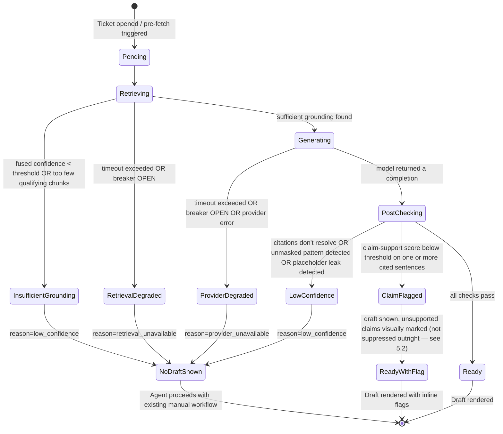

# Architecture Document: Support Ticket Deflection & Reply Drafting

**Author:** Engineering Architecture (design review)
**Status:** Draft for architecture review
**Date:** 2026-08-13
**Company:** Use Case Studio
**Inputs:** [PRD: Support Ticket Deflection & Reply Drafting](../PRD.md) (Product, 2026-08-13); [Build plan + independent critic audit](../repo-drop/docs/build-kickoff/sample-plans/support-ticket-deflection-reply-drafting.md)
**Companion deliverable still outstanding:** dedicated security/privacy review (PRD §9, items 1–4). This document assumes that review exists and gates Phase 1 as the PRD requires; it does not substitute for it.

## 0. Purpose and how to read this document

The PRD deliberately left six items unresolved and assigned them to "a dedicated architecture/technical design review" (PRD §9, items 5–10). This document's job is to resolve those six items with concrete, buildable technical designs, not to restate that they're open. It also specifies the oversight/no-auto-send enforcement mechanism the PRD flagged as needing architectural (not just policy) specification, and it makes the technology-shape decisions the build plan left implicit (what "hybrid retrieval" means operationally, how redaction is actually implemented, what the audit log contains).

This is not a vendor selection document. Where a decision genuinely depends on information this document doesn't have (the compliance review's answer on third-party inference, the ticketing platform's actual API surface, corpus size after curation), that dependency is named explicitly in §9 ("What this document is not deciding") rather than papered over with a plausible-sounding default.

Consistent with the PRD's and critic audit's tone, this document avoids absolute claims. Where a control is mechanically enforced (e.g., a service holding no credential for a given API), it's stated as a guarantee. Where a control is a measured, imperfect risk reduction (redaction, claim-support checking, hybrid retrieval), it's stated as such, with its known failure mode named.

---

## 1. System Architecture Overview

### 1.1 Components

| Component | Responsibility | Trust boundary notes |
|---|---|---|
| **Ingestion & redaction pipeline** | Batch: pulls help centre, macros, resolved tickets; cleans, redacts, chunks, tags metadata, embeds, writes to indices. Also exposes a synchronous redaction function reused at request time. | Only component with access to raw (unredacted) source PII. Writes redacted content downstream; raw source stays in the source system / a short-lived staging store, not in the serving path. |
| **Index (lexical + vector)** | Serves retrieval queries against curated, redacted, metadata-tagged content. | Contains no unredacted ticket PII (ticket exemplars are redacted before indexing). |
| **Retrieval service** | Executes hybrid queries against both indices, applies metadata filters (staleness, product area, locale), fuses and ranks results, computes a grounding-confidence score. | Read-only against the index; no write path to source systems. |
| **Generation service** | Assembles the versioned prompt from retrieved chunks + redacted live ticket text, calls the model provider, runs deterministic post-checks and the claim-support check, returns a draft object or a structured no-draft reason. | **No network credential capable of reaching the ticketing platform's send or write-ticket API.** This is the core of the oversight enforcement design (§10). |
| **Console integration layer** | Thin client inside the ticketing platform's app surface. Calls a single internal "compose draft" endpoint, renders the result (or no-draft state) into the reply editor, captures reviewer action, and emits the draft/sent telemetry pair. | Only component with a ticketing-platform credential, and that credential is scoped to *read* ticket content and *populate the editor field* — not to send. |
| **Telemetry / audit store** | Append-only record of every draft-generation attempt (successful, degraded, or refused), reviewer action, and cost/latency data. Feeds the dashboard, the cost gate, and the golden-set failure pipeline. | Receives redaction summaries and text pointers, not raw unredacted PII (see §3.6 for what's actually stored). |

### 1.2 Component diagram

```mermaid
flowchart TB
    subgraph Sources
        HC[Help Centre]
        MC[Macro Library]
        TK[Resolved Tickets - Zendesk export]
    end

    subgraph Batch["Ingestion & Redaction Pipeline (batch, scheduled per source cadence)"]
        EX[Extract / strip boilerplate]
        CUR[Macro triage: current / needs-rewrite / retired]
        RED[Redaction: pattern + NER layer]
        CHK[Chunk + attach metadata]
        EMB[Embed]
    end

    subgraph Indices["Index"]
        LEX[Lexical index - BM25]
        VEC[Vector index - ANN]
    end

    HC --> EX
    MC --> CUR --> RED
    TK --> RED
    EX --> RED
    RED --> CHK --> EMB --> LEX
    EMB --> VEC

    subgraph Runtime["Interactive request path"]
        AGENT[Agent opens/assigned ticket]
        CIL[Console Integration Layer<br/>thin client]
        RT_RED[Request-time redaction<br/>same lib as batch]
        RETR[Retrieval Service<br/>hybrid fuse + filter + confidence score]
        GEN[Generation Service<br/>prompt assembly + model call<br/>+ post-checks + claim-support check]
        MODEL[(Model provider)]
    end

    AGENT --> CIL --> RT_RED --> RETR
    RETR <-- query --> LEX
    RETR <-- query --> VEC
    RETR -->|chunks + scores| GEN
    GEN <--> MODEL
    GEN -->|draft OR no-draft reason| CIL
    CIL -->|render editor / no-draft state| AGENT

    subgraph Audit["Telemetry / Audit Store"]
        AUD[(Append-only audit log)]
    end

    CIL -->|draft render event, reviewer action, sent text| AUD
    RETR -->|retrieval-miss events| AUD
    GEN -->|cost, latency, degraded-reason events| AUD
    AUD -->|content-gap backlog| HC

    CIL -.->|"agent's own send action<br/>(native platform send path)"| PLATFORM[Ticketing platform<br/>outbound send API]

    style GEN fill:#3a1a1a,stroke:#c0392b
    style PLATFORM fill:#1a3a1a,stroke:#27ae60
```

The dotted line from the console integration layer to the platform's outbound send API is deliberate: it represents the agent's own action inside the ticketing platform's native UI, not an API call this system makes. Nothing in the generation service or console integration layer's code initiates that call. See §10.

---

## 2. Request path (interactive)

1. Agent opens or is assigned a ticket. Console integration layer sends ticket subject/body/thread context to the internal API gateway.
2. **Request-time redaction** (same detection library as batch ingestion, invoked synchronously) masks names, order identifiers, and card-like patterns with stable per-request placeholders before the text crosses into retrieval or generation.
3. **Retrieval**: hybrid lexical + vector query, metadata-filtered, fused, scored for grounding confidence (§3.2).
4. If grounding confidence is below threshold or too few qualifying chunks survive the staleness filter → **short-circuit to no-draft, without calling the generation model** (saves cost, see §6's cost gate).
5. **Prompt assembly**: versioned template + retrieved chunks with identifiers + house-style/refusal rules.
6. **Generation**: model call, response includes inline citation markers.
7. **Post-checks**: (a) deterministic — citations resolve to retrieved chunk IDs, no unmasked sensitive-looking patterns, no placeholder leakage; (b) probabilistic — claim-support scoring per cited sentence (§5.2).
8. Placeholders re-hydrated locally in the console layer only (never sent back through the model).
9. Draft (or a specific no-draft/degraded state) rendered into the editor with clickable citations.
10. Reviewer action captured; if sent, final sent text captured and paired with the rendered draft text in the audit store.

---

## 3. Concrete technology-shape decisions

The build plan left these open ("hybrid retrieval," "redaction as an engineered component," "a place the audit log lives"). Below are concrete, buildable shapes.

### 3.1 Redaction as a pipeline stage, not a prompt instruction

Redaction is a **library**, invoked in two places by the same code path, not two different implementations:

- **Batch mode**: inside the ingestion pipeline, applied once to each resolved-ticket document before chunking/indexing.
- **Request mode**: inside the request path, applied synchronously to the live ticket text before it reaches the retrieval query embedding step or the generation prompt.

Internally it is layered, not a single regex pass:

1. **Pattern layer** (deterministic): regex plus checksum validation (e.g., Luhn check) for card-like sequences; regex/format rules for order IDs, phone numbers, email addresses.
2. **Statistical NER layer**: a named-entity-recognition model (off-the-shelf or lightly fine-tuned on annotated support-ticket text) for customer names and addresses, which pattern rules structurally cannot catch reliably.
3. **Placeholder substitution**: each detected span is replaced with a stable, per-request placeholder token (e.g., `[NAME_1]`, `[ORDER_2]`). The mapping from placeholder → real value is held only in the ephemeral request context (or an encrypted, short-retention field in the audit store, per the security/privacy review's retention decision) — it is never included in what's sent to the model.
4. **Re-hydration**: happens exclusively inside the console integration layer, when rendering the final draft for the agent. The generation service never receives real values back.

This is measured, not assumed correct: a manually annotated hold-out sample of tickets is scored for miss rate per class (name, order detail, card-last-four), reported to the compliance owner per PRD §9 item 2. Nothing in this design claims zero residual PII reaching the model — see §12.

### 3.2 Hybrid retrieval, concretely

"Hybrid" means two independently queried indices whose results are fused, not one index with two features bolted on:

- **Lexical index** (inverted-index / BM25-style): catches exact-term matches — product names, error codes, SKU-like tokens, policy terms — that embedding search often dilutes across semantically "close" but wrong content.
- **Vector index** (ANN over embeddings of the same chunks): catches paraphrase and semantic variants a lexical match misses (a customer asking "my order never arrived" vs. a help-centre article titled "Shipping delays and lost packages").
- Both indices are queried in parallel against the same request; each returns its own top-K (e.g., top 20). Results are fused (reciprocal rank fusion or a weighted score combination — the specific fusion formula is a Phase 2 tuning decision, not an architectural one) into a single ranked list.
- **Metadata filters** (source type, product area, locale, staleness flag, and — where labelled — question type) are applied before or after fusion depending on what the chosen index technology supports natively; the architectural requirement is that stale/retired content is excluded by filter, never by hoping the model ignores it.
- The fused, filtered top-N (e.g., 5) chunks, each carrying a relevance/fusion score, are passed to prompt assembly along with their scores.
- **Grounding confidence score**: derived from the top fused score and count of qualifying chunks after filtering. This score is what drives the retrieval-side portion of the no-draft decision (distinct from the generation-side "citation doesn't resolve" check) — see §4.4's state machine, where "insufficient grounding" is a first-class, pre-generation state.

### 3.3 Generation service as a swappable interface — with an honest caveat

The generation service exposes one internal API (`compose_draft(redacted_ticket, retrieved_chunks, prompt_template_version) → draft | no_draft_reason`) behind which the model provider is configurable. This does reduce coupling relative to calling a provider SDK directly from the console layer. It does **not** eliminate switching cost: prompt behavior, citation-formatting reliability, and context-window/latency characteristics are model-specific, so a provider swap still requires golden-set re-validation before it ships (per the build plan's own change-control rule). The critic audit correctly flagged "no vendor lock in the design" as an overclaim in the build plan; this document narrows that claim to "an interface boundary that reduces re-platforming cost, evaluated against the golden set before any swap ships."

### 3.4 Console integration layer as a thin client

The integration layer holds exactly one internal API dependency (the "compose draft" gateway) and exactly one platform-side capability (read ticket content, write to the reply-editor field). It does not embed retrieval, prompt, or model logic. This is what makes a future ticketing-platform migration a client rewrite, not a system rebuild — and what makes the Phase 1 spike in §9.2 meaningful (validating a thin, replaceable client against the real platform API is cheap; discovering the platform can't support the pattern after building the model pipeline is expensive).

### 3.5 Where the audit log lives

The audit/telemetry store is an **append-only** log, one row per draft-generation *attempt* — including no-draft and degraded outcomes, not just successful drafts, because refusal rate and degraded-mode frequency are guardrail metrics in their own right (PRD §7). It is logically separate from (though may be co-located with) the operational databases of the retrieval/generation services, because its retention and access-control requirements are different: it is an audit and evaluation asset, read by the dashboard, the cost-gate job, and the golden-set pipeline, and it is the thing produced for a disputed-reply investigation.

### 3.6 Audit log schema (illustrative, not final)

| Field | Notes |
|---|---|
| `ticket_id`, `event_id`, `timestamp` | Correlation keys |
| `event_type` | `ready` \| `degraded` \| `no_draft_low_confidence` \| `no_draft_unavailable` |
| `degraded_reason_code` | nullable; e.g. `retrieval_timeout`, `provider_timeout`, `provider_error`, `circuit_open` (see §4) |
| `prompt_template_version` | |
| `model_config_version` | model + parameters version, not raw weights |
| `retrieved_chunk_ids[]`, `retrieval_scores[]` | supports reconstruction of what was retrieved |
| `redaction_summary` | `{class: count}` per PII class redacted in the request, not the values themselves |
| `draft_text_pointer` | pointer/hash to draft text stored under the retention policy the security/privacy review sets |
| `claim_support_scores[]` | per cited sentence, from the check in §5.2 |
| `cost_estimate_usd`, `input_tokens`, `output_tokens` | feeds the cost gate (§6) |
| `latency_ms` | per stage: retrieval, generation, checks |
| `question_type` | where classified/labelled |
| `reviewer_action` | `sent_as_is` \| `minor_edit` \| `major_rewrite` \| `discarded` \| `escalated` |
| `final_sent_text_pointer` | present only when `reviewer_action` implies a send; paired with `draft_text_pointer` — this pair is the acceptance-bar measurement instrument (PRD FR #7) |

**Explicit scope statement, carried forward from the PRD's own framing**: this log supports *reconstructing* what happened for a disputed reply (which chunks, which prompt version, which model version, what the agent did). It does not, by itself, *explain* why the model produced a specific sentence — that would require interpretability tooling this design does not include. Agent- and customer-facing documentation should not claim the stronger capability.

---

## 4. Resolving PRD Open Item 5 — Degraded-mode / availability behavior

The build plan's "no confident draft" state only covered low-confidence *results*. It said nothing about *unavailability* — retrieval or the model provider being down or slow. Those are different failure classes with different causes, different telemetry needs, and arguably different UX (a systemic outage plausibly deserves a different signal than "this particular ticket has weak grounding"), so this design keeps them distinguishable in the audit log even though the agent-facing UI can present them similarly per the PRD's requirement that both surface as an explicit no-draft state.

### 4.1 Failure classes

| Class | Cause | Detection |
|---|---|---|
| Low-confidence result | Retrieval succeeded but grounding confidence below threshold, or generation succeeded but citations don't resolve | Deterministic checks after a completed call |
| Retrieval unavailable/slow | Index unreachable or exceeds its latency budget | Per-call timeout + circuit breaker on the retrieval dependency |
| Generation provider unavailable/slow | Model provider unreachable, erroring, or exceeds its latency budget | Per-call timeout + circuit breaker on the generation dependency |
| Systemic outage | Circuit breaker has been open for a sustained period across many tickets | Aggregated breaker state, drives a console-wide banner distinct from per-ticket no-draft |

### 4.2 Per-dependency circuit breaker

Each external dependency (retrieval index, model provider) gets its own breaker with three states — `CLOSED` (normal), `OPEN` (short-circuit immediately, don't attempt the call), `HALF_OPEN` (probe with a small fraction of traffic). This is standard practice, applied here specifically because it prevents a slow-but-not-dead provider from stacking up latency across every concurrent ticket — without it, a degrading dependency degrades every agent's experience simultaneously rather than failing fast for a bounded window.

### 4.3 Timeout budgets (placeholders, not commitments)

Per the PRD's and build plan's explicit refusal to commit a latency number, these are proposed **engineering SLO starting points** to be replaced with values derived from Phase 4 shadow-mode measurement — the mechanism (budgeted, timeout-driven state transitions) is the architectural decision; the numbers are not.

- Retrieval call budget: illustrative 1500ms
- Generation call budget: illustrative remainder of the interactive target minus retrieval and check time
- Claim-support check budget: illustrative 500ms (can run concurrently with rendering the draft in a "verifying" sub-state if it doesn't block initial render — a UX/latency tradeoff for Phase 3/4 to make with real data)

### 4.4 State machine

### 4.5 What the agent sees vs. what telemetry records

**Agent-facing** (per PRD FR #4): a single, consistent "no confident draft available" visual state regardless of whether the cause was low confidence or an outage — the PRD's own design intent is that agents shouldn't have to parse *why* there's no draft to know what to do (fall back to the existing manual workflow, unchanged). A systemic-outage banner ("AI drafting is temporarily unavailable") is shown separately at the console-app level only when the breaker has been open for a sustained window across many tickets, so agents aren't led to think a single ticket is unusual when the whole system is down.

**Telemetry-facing**: every state transition above is logged with its distinct reason code, because the PRD's guardrail metrics (refusal rate vs. availability) need to be separable — a spike in "no draft" caused by a provider outage is an operational incident; the same spike caused by genuinely low-confidence retrieval is a corpus-coverage problem. Conflating them (as a single "refusal rate" number would) hides which lever to pull, the same argument the build plan makes for its failure taxonomy.

### 4.6 Partial availability

If retrieval is up but generation is down (or vice versa), the result is still no-draft: the PRD requires citations on every draft (FR #2), and this design requires a passed claim-support check as well, so there is no code path that produces an ungrounded or unverified draft just because one dependency happened to work. This is a deliberate conservatism: it trades away potential draft coverage in mixed-degradation cases for the invariant that every shown draft went through both grounding and generation.

---

## 5. Resolving PRD Open Item 6 — Claim-support check

### 5.1 Why a fully mechanical check isn't feasible

"The citation resolves but doesn't support the claim" is, at its core, a natural-language entailment problem: does chunk X actually say what sentence Y claims it says? There is no deterministic, rule-based way to verify this in general — entailment judgment requires language understanding, which means any automated checker is itself a model with its own error rate. A claim-support check reduces the rate of this failure mode; it does not close it to zero, and this document does not claim otherwise.

### 5.2 Compensating design: layered, not single-point

1. **Automated entailment/support scoring** (secondary check): after generation, each cited sentence in the draft is paired with the specific chunk text its citation points to, and scored by a lightweight entailment model (a cross-encoder NLI-style model, or a smaller/cheaper LLM call scoped to a narrow yes/no/partial judgment — the specific model choice is a Phase 2/3 implementation decision, not architectural). Sentences scoring below threshold are flagged.
2. **Flagged-sentence treatment**: rather than silently suppressing flagged sentences (which risks producing a shorter, subtly wrong draft the agent trusts more, not less) or silently downgrading the entire draft to no-draft (which discards a correct draft over one weak sentence), flagged sentences are **visually marked inline** in the console — the specific sentence is highlighted with a distinct treatment from unflagged text, prompting the agent to check that sentence specifically rather than skimming the citation list as a whole. This is the "explicit prompt/UI treatment that pushes the agent to verify facts rather than trust citation presence alone" the PRD calls for as the fallback if a fully mechanical check isn't achievable — here it's used as a complement to the mechanical check, not a substitute for it.
3. **Attributed-span display**: alongside each citation, the console shows the exact retrieved snippet the claim is attributed to (not just a link to the source article), so verifying a claim is a side-by-side read rather than a navigation-and-search task. This lowers the cost of the verification the agent is being asked to do, which matters because over-trust (not under-trust) is the realistic failure mode the build plan itself names.
4. **Failure taxonomy entry**: "citation resolved but unsupported" is tracked as its own category, distinct from "citation unresolved" (a deterministic-check failure) and from "retrieval miss." When an agent uses the P1 "flag as wrong" action (PRD FR #13) on a sent-but-wrong draft, that feeds this taxonomy bucket specifically, closing the loop between the automated check's false negatives and the golden set (§7's process reuses these flagged cases as new hard cases).
5. **Threshold tuning against the golden set**: the entailment model's flag threshold is calibrated against a labelled subsample (agreement between the automated score and human judgment on "does this sentence overstate the source") before it's trusted, the same calibration discipline the build plan applies to the edit-similarity signal.

### 5.3 Honest limitation

This is a probabilistic risk-reduction layer built from the same class of technology (a language model) that produced the original claim, so a claim-support checker can share correlated blind spots with the generator — e.g., both may fail on the same subtly misleading paraphrase. It is a real mitigation, not a guarantee, and is reported in the residual risks section (§12).

---

## 6. Resolving PRD Open Item 7 — Cost gate

### 6.1 What is measured, and where

Cost is attributed **per draft-generation attempt**, including pre-fetch attempts an agent never opens (this is the specific gap the critic audit flagged — pre-fetch multiplies generation calls beyond what agents actually use). The generation service is the single point where a model call happens, so it is the natural place to emit the cost event: token counts (input/output) times the provider's configured rate — a config value the service reads, not a hardcoded number, so it survives a provider/pricing change without a code deploy. The claim-support check's own model call is a second, smaller cost line attributed to the same event, since it's also a per-draft model call.

This event is written to the audit store (§3.6, `cost_estimate_usd`), which means cost aggregation is a query over existing telemetry, not a separate system.

### 6.2 Threshold mechanism — multi-tier, with a pre-agreed action at each tier

| Tier | Trigger (illustrative — real thresholds set from Phase 4 shadow data) | Action | Who's notified |
|---|---|---|---|
| **Soft warning** | Rolling weekly spend crosses ~70% of allocated budget | Alert only; no behavior change | Builder + support lead |
| **Hard ceiling — automated mitigation** | Rolling weekly spend crosses 100% of allocated budget | **Automatic config change**: pre-fetch-on-assignment is disabled in favor of generate-on-open-only, which removes cost from tickets an agent never opens (the largest identified waste source) without removing the feature | Builder + support lead, logged as a system event |
| **Hard stop** | Spend continues past a second, higher threshold even after the automated mitigation, or spend velocity suggests a runaway (e.g., a retry storm) | Same kill-switch mechanism as the quality rollback trigger (PRD §9 item 1): assistant paused, agents fall back to the existing manual workflow | Support lead + compliance owner sign-off required to resume, matching the rollback re-entry gate |

The key design property the critic audit was pointing at is that a cost breach has a **pre-agreed, automatic first response** (not just an alert someone has to notice and act on manually) before it escalates to the same kill switch used for quality incidents — this keeps a slow cost creep from either being ignored until it's a budget crisis, or immediately treated as severely as a PII incident.

### 6.3 What "value of time saved" comparison looks like

Cost per *utilized* draft (a draft that led to a sent reply, edited or not) is reported alongside cost per *generated* draft (including unused pre-fetch and discarded drafts), and both are reported against the 9-minute median handle-time baseline in dollar terms (agent-hours saved × loaded cost per agent-hour, itself a support-lead-owned input, not an engineering assumption). This is a measured comparison in shadow mode, not a committed ROI number — consistent with the PRD's explicit refusal to assert cost/throughput targets.

---

## 7. Resolving PRD Open Item 8 — Golden-set label validity

### 7.1 The problem restated precisely

Historical resolved tickets' *sent* replies were produced by agents working against the drifted macro library. If the golden set naively adopts "what the agent actually sent" as ground truth, it encodes the same drift the feature exists to fix — a model scored against that golden set could be rewarded for reproducing exactly the inconsistency the product is meant to correct.

### 7.2 Curation process design

1. **Sample** historical resolved tickets per in-scope question type (routine, edge, and deliberately hard/must-refuse cases, per the build plan's existing three-tier design).
2. **Do not auto-adopt the historical sent reply as gold.** For each sampled ticket, a reviewer (the support content owner or support lead — not the agent who originally answered it) independently determines the correct answer **against the current, freshly triaged authoritative source** (the help-centre content and macros marked `current` in Phase 2's triage) — the historical reply is shown to the reviewer as *context*, not copied as the label.
3. **Fast path / rewrite path**: where the historical reply matches current guidance, it's adopted as gold with a note; where it diverges (superseded policy, a since-retired macro, an inconsistency the drift produced), the reviewer writes a fresh gold answer grounded in current content.
4. **Track and report the rewrite ratio** (fraction of sampled tickets whose historical reply needed rewriting to match current guidance). This ratio is itself useful signal — a high ratio is direct, quantified evidence of how much drift existed, worth reporting back to the support lead and compliance owner as validation that the curation step mattered, not just a labeling detail.
5. **Dual-labeling spot-check**: a subsample of gold labels is independently re-labeled by a second reviewer; disagreement rate is measured and reported, the same discipline the build plan already applies to reviewer agreement on the edit rubric — an inconsistent gold set is exactly as damaging to trust in the 80% figure as an inconsistent rubric.
6. **Versioning and staleness linkage**: the golden set is versioned, and when a help-centre article or macro it depends on changes materially, the linked golden-set item is flagged stale and re-reviewed — using the same staleness metadata the retrieval layer already tracks, rather than a separate manual audit process.
7. **Must-refuse cases stay adversarial to the golden set's own bias**: cases sourced from ambiguous, multi-issue, or genuinely out-of-scope tickets are deliberately included so the golden set doesn't implicitly reward "always produce a draft" — a bias a naive precision-only optimization would otherwise create.

This process makes the golden set a curated judgment call by a named human reviewer against current content, not a resampling of historical answers — the reviewer's judgment quality is now the limiting factor (a different, but named and smaller, risk than mechanically replaying drift; see §12).

---

## 8. Resolving PRD Open Item 9 — CSAT baseline and comparison validity

This is a technical design for how the *system* captures and segments data to make the comparison valid — the PRD is explicit that owning the baseline deliverable is a business/support-lead decision, which this document does not make.

### 8.1 Cohort and context tagging

Every ticket (historical and live) that flows through this system — whether or not a draft was shown — is tagged at telemetry-capture time with: question type, handling agent identity, whether the ticket belongs to the limited-release volunteer cohort or the general agent population, channel, and a calendar bucket (week, day-of-week). This tagging is what makes segmented comparison possible after the fact rather than something reconstructed later from raw logs.

### 8.2 Two comparison designs, reported together

- **(a) Org-wide historical baseline**: pre-pilot CSAT on matched question types, pulled over a lookback window chosen to span the same seasonal period as the live 4-week measurement window (e.g., if the pilot runs in Q3, the baseline lookback includes the equivalent prior-year Q3 window, not just "the preceding month" — a naive trailing-30-day baseline would confound seasonal effects with the pilot's own effect). This is the simplest comparison and the one the PRD's acceptance criterion literally names, but it is confounded by whatever changed in the org between the baseline period and the pilot period.
- **(b) Concurrent control group** (recommended as primary, given the cohort self-selection concern the PRD names): during limited release, a group of agents on the same in-scope question types who are *not* using the assistant continues handling tickets concurrently with the volunteer cohort. Comparing CSAT between the two groups over the *same* calendar window cancels out seasonality and any org-wide event (an outage, a pricing change) that would otherwise hit the baseline period and the pilot period differently. This directly addresses the PRD's named concern that the volunteer cohort is self-selected — comparing volunteers to non-volunteers in the same window at least makes the comparison contemporaneous, even though it doesn't remove the selection effect of who chose to volunteer in the first place.
- **Same-agent, before/after, where available**: for volunteer agents with sufficient pre-pilot ticket volume on in-scope types, their own historical CSAT is compared to their pilot-period CSAT. This controls for cross-agent skill variance (a known confound in comparison (a)) but still carries a novelty-effect risk (agents may behave differently simply from being observed/piloting something new).

All three are computed and reported on the dashboard, not collapsed into one number — the support lead makes the go/expand/stop judgment call with the honest picture (PRD's own stance: the pilot decision should be evidence-based, not a single conflated metric).

### 8.3 Data pipeline

A CSAT-join job links survey response → ticket ID → the audit store's telemetry record (was a draft shown, was it used) → the cohort tags above, feeding both the historical-baseline query and the live-dashboard query from the same underlying join logic, so the two numbers are computed consistently rather than by two different ad hoc scripts.

### 8.4 Honest statistical caveat

At ~300 sampled tickets over four weeks, this design does not resolve whether that sample size has adequate statistical power to detect a modest CSAT decline — that is a question for whoever owns the baseline analysis (plausibly with input from an analyst), not something the architecture can settle by itself. This is flagged here so it isn't silently assumed away.

---

## 9. Resolving PRD Open Item 10 — Console integration validation, and correcting the sequencing

### 9.1 The sequencing correction

The build plan says, in one place, "validate this contract before model work begins," and elsewhere schedules the console integration stub in Phase 4 — after Phase 3's model/prompt work. The PRD flags this inconsistency and asks the architecture doc to resolve it. **This document resolves it in favor of the first statement**: console integration feasibility is validated in Phase 1, before any deep prompt or model investment, because the draft/sent telemetry pair is the entire measurement instrument for the acceptance bar (PRD FR #7) — if the ticketing platform can't reliably support pre-populating the editor or capturing the sent text, no amount of prompt quality makes the pilot measurable, and that's a fact worth knowing in week one, not week ten.

### 9.2 Concrete spike design (new Phase 1 deliverable)

A minimal, throwaway-resistant spike, built against the real ticketing platform's app framework (assumed here to be Zendesk, per the source case facts — see §11 for the caveat that this document doesn't validate that assumption):

1. **Read path**: a minimal console app that reads ticket ID, subject, and body via the platform's app API.
2. **Write path**: writes a static, hardcoded string into the reply editor field via the platform's editor API — no retrieval, no model, no redaction. The only question this answers is "can this platform's app surface pre-populate the editor at all."
3. **Capture path**: listens for the platform's ticket-solved / reply-sent event or webhook and posts the final sent text, keyed by ticket ID and an event ID, to a stub telemetry endpoint.
4. **Reliability measurement**: run N test tickets (e.g., 20–30) through the full read → write → send → capture loop and measure the capture success rate. This is the number that answers PRD open item 10 directly: does the platform reliably emit both halves of the draft/sent pair.

### 9.3 Exit gate (new, explicit — added to Phase 1, not left to Phase 4)

Before Phase 2 corpus investment proceeds: confirmed proof that (a) the editor can be pre-populated programmatically, and (b) the sent-text capture succeeds at a high, measured rate across the test tickets, with failure modes characterized (e.g., does it fail on edits made after pre-population, on multi-message threads, on macro-assisted sends). If either fails, that's a stop-and-redesign signal caught immediately, not a Phase 4 surprise after prompt/retrieval work has already been funded.

### 9.4 The spike becomes the integration layer, not throwaway code

Because §3.4 designs the console integration layer as a thin client with exactly one internal API dependency, the spike's read/write/capture skeleton is architecturally already most of what Phase 4 needs — Phase 4 replaces the hardcoded string with a call to the real "compose draft" endpoint and wires the stub telemetry endpoint to the real audit store. This avoids the common failure mode where a "spike" and the "real" integration are built twice.

### 9.5 Fallback if the platform can't support inline pre-population

If the spike shows the platform genuinely cannot pre-populate the reply editor (as opposed to merely being awkward to integrate with), the fallback documented here — and explicitly **not** silently substituted without a decision — is a sidebar panel showing the draft with a copy-to-clipboard action. This changes the UX materially (an extra manual step) and likely changes the adoption/measurement assumptions the acceptance bar rests on, so it is flagged as a support-lead decision point if triggered, not absorbed quietly into the build.

---

## 10. Oversight / no-auto-send enforcement — concrete mechanism

The PRD marks this as needing architectural, not just policy, specification. The design below is a **service-boundary and permission-based** control, not a statement of intent.

### 10.1 Network and credential boundary (the mechanically real guarantee)

The generation service runs with an egress allowlist limited to: the model inference endpoint, the retrieval service, and the telemetry/audit store. **It holds no credential, API key, OAuth token, or network route capable of reaching the ticketing platform's outbound send or write-ticket API.** This is enforced at two independent layers so a single misconfiguration doesn't silently remove the control:

- **Network policy** (egress firewall / service-mesh policy): the generation service's network identity is not permitted to route to the ticketing platform's API hosts at all.
- **IAM**: even if network policy were misconfigured, the generation service's credentials carry no scope/permission grant for the ticketing platform's send-message or write-ticket actions.

This is close to an actual guarantee — "the generation service has no network route or credential capable of sending to the ticketing platform's outbound API" — conditioned on those two controls being correctly configured and kept in sync as the system evolves. Config drift over time is a real residual risk (named in §12), which is why this should ideally be enforced by an automated policy test in CI/deploy gating, not just documented intent — that automated test is out of scope for this document but flagged as a recommended follow-up.

### 10.2 The console integration layer's scope

The only component with a ticketing-platform write credential is the console integration layer, and that credential is scoped narrowly to *populate the reply-editor field* — not to call a send endpoint. The actual customer-facing send is performed by the ticketing platform's own native send action, triggered by the human agent inside the platform's own UI. The assistant's code never calls a "send" or "reply" API for any ticket, in any code path — sending is entirely outside this system's runtime, by construction, not by a conditional check that could be bypassed.

### 10.3 No authoritative "sent" state inside the system

The draft object returned by the generation service has no field like `sent` or `final` that any downstream code treats as authoritative. The audit store's `reviewer_action` field is populated from what the console layer observes the agent doing (the platform's own solved/reply event), constrained to the four enumerated actions — it is a record of what happened, not a control that causes anything to happen.

### 10.4 What this does not cover

This design prevents the *system* from initiating a send. It does not prevent a human agent from sending a bad draft as-is — that is the PRD's explicit, accepted risk surface (agents remain accountable for what they send), addressed by the UI/telemetry design in §5.2 and the guardrail metrics in PRD §7, not by this enforcement mechanism.

---

## 11. What this document is explicitly NOT deciding

| Not decided here | Why | Where it gets decided |
|---|---|---|
| **Specific vector store / lexical index vendor** (managed vs. self-hosted, e.g., a managed vector DB vs. an open-source engine) | The bounded, curated corpus size (post-triage) isn't known yet, and the choice interacts with the still-open third-party-inference/data-handling question below — a self-host requirement would likely push toward a self-hosted index too, for consistency of the trust boundary | Phase 2, once corpus size is known and the compliance review has answered the inference question |
| **Specific model provider / model** | Blocked on the compliance owner's written answer (PRD §9 item 3) on whether redacted ticket text may go to a third-party provider, and what training-on-data terms apply. If third-party inference is disallowed, this cascades into a self-hosted model requirement — a materially different cost, latency, and ops profile than a hosted-API assumption | Phase 1 gate (compliance answer) → Phase 2/3 model selection |
| **Specific NER / PII-detection library, and specific claim-support/entailment model** | Build-vs-buy and specific-tool choices are implementation details that don't change the pipeline shape described in §3.1 and §5.2 | Phase 2 (redaction), Phase 3 (claim-support check) |
| **Exact latency and cost threshold numeric values** | The PRD and build plan both deliberately decline to assert these; this document specifies the *mechanism* (timeout-driven state transitions, multi-tier cost gate) with placeholder values, consistent with measuring in shadow mode and setting targets from observed data | Phase 4, from shadow-mode telemetry |
| **Ticketing platform specifics beyond the assumed Zendesk-shaped API surface** | The source case facts reference Zendesk tickets, but this document has not independently verified the platform's app framework capabilities — that is precisely what the Phase 1 spike (§9.2) exists to confirm | Phase 1 spike |
| **Retention period and access-control policy for raw draft/sent text and the redaction placeholder-mapping table** | This is a compliance/privacy-review decision (retention, encryption-at-rest specifics, who can read the audit store), not an architectural one — this document only specifies that such a policy is needed and where the fields live | Security/privacy review (PRD §9, items 1–4) |
| **Fusion formula / ranking weights for hybrid retrieval, exact chunk sizes, exact confidence thresholds** | Tuning parameters within the architecture described in §3.2, not architectural decisions | Phase 2/3, tuned against retrieval spot-checks and the golden set |

---

## 12. Risks this design does not fully eliminate

Consistent with the PRD's and critic audit's insistence on not overclaiming:

- **Claim-support check false negatives.** The entailment checker is itself a model and can share correlated blind spots with the generator on the same subtly misleading paraphrase — it reduces, but does not eliminate, the "citation resolves but doesn't support the claim" failure mode. The compensating UI design (inline flagging, attributed-span display) depends on the agent actually reading it, which is not enforced.
- **Redaction miss rate is nonzero by measured design.** The layered pattern + NER approach reduces PII leakage; it does not guarantee zero PII reaches the model. Per-class miss rates are measured and reported, not assumed away.
- **Network/IAM enforcement of no-auto-send depends on correct, maintained configuration.** The control is mechanically real today; it is not self-verifying against future drift (a new deploy accidentally widening an egress rule, for instance) unless a policy test is added to CI/deploy gating — recommended, but not itself specified in this document.
- **Automated cost-gate mitigations can themselves degrade the experience they're trying to protect.** Disabling pre-fetch under cost pressure trades cost control for the "draft appears before the agent starts reading" latency benefit the PRD wants; if triggered often, this is itself a version of the adoption risk the critic audit flagged, just from a different cause.
- **Golden-set quality now depends on reviewer judgment, not on eliminating judgment.** The curation process in §7 replaces "encode historical drift" with "depend on a named reviewer's judgment against current content" — a smaller, more visible risk (caught by the dual-labeling spot-check), but not zero risk; a rushed or under-trained reviewer can still mislabel.
- **CSAT comparison design mitigates, but does not remove, cohort self-selection and novelty effects.** A concurrent control group controls for seasonality and org-wide events; it does not control for the fact that agents who volunteer may differ systematically from those who don't, or that being observed in a pilot can itself change behavior independent of the assistant's quality.
- **Telemetry integrity depends on the ticketing platform's own event reliability.** If the platform silently drops a solved/reply event, the audit store will show "no sent text captured" in a way indistinguishable from "agent didn't send" — corrupting the acceptance-bar measurement in a way this design can detect only through the reliability testing in the Phase 1 spike (§9.2), not eliminate outright.
- **Hybrid retrieval reduces, but cannot close, genuine content coverage gaps.** A question with no adequate answer anywhere in the curated corpus will correctly produce no-draft; that's the retrieval-miss failure mode by design, feeding the content-gap backlog, not a system defect — but it means real ticket volume will continue to need the manual workflow at a rate this document cannot predict in advance.
