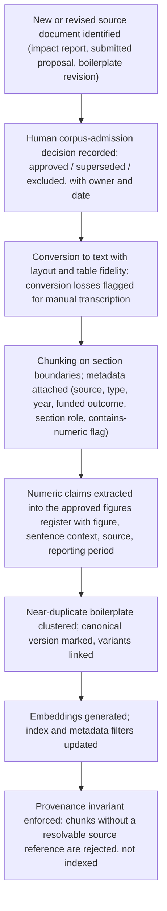
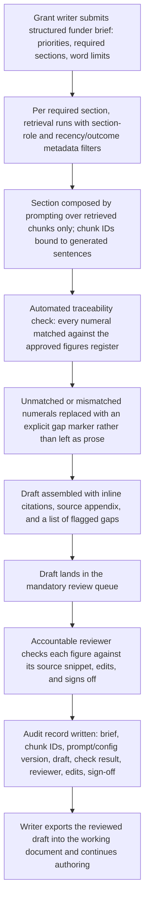
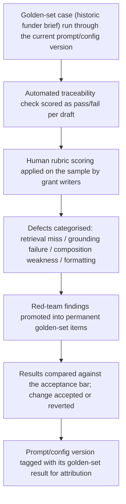

# Build Kickoff Package — Grant proposal first-draft assembly

**Prepared for:** Riverbend Community Trust (placeholder) · Sponsor: Director of Development  
**Prepared by:** Lab Intelligence, LLC  
**Date:** 2026-08-14 · **Plan version:** v2

> **Decision-support, not a guarantee.** This plan was generated by a bounded LLM pipeline from your evaluation inputs. It is a defensible starting point, not a validated design — every estimate is labeled and must be checked against reality. An independent critic audit is attached below and travels with this document; read it alongside the plan. No benchmark, vendor, or ROI figure here should be treated as verified.

---

## 1. Decision & rationale

**Verdict: BUILD** — composite 80/100 · Quick win

Composite 80/100. The case is carried by business value / impact and technical feasibility; the weakest dimension (strategic fit, 3/5) is manageable rather than blocking. Proceed to a scoped pilot against the acceptance bar.

Grant proposal first-draft assembly is a Quick win (composite 80) and clears the build threshold, so we proceed to a one-quarter pilot. The build is a grounded drafting assistant: an approved-source corpus (boilerplate library, five years of submitted proposals with funded/declined outcomes, annual impact reports) is chunked and indexed with provenance metadata; retrieval pulls the relevant mission, governance, and outcome material; direct prompting composes a funder-shaped first draft. Two things define success and shape every design choice: grant writers must rate ≥70% of drafts as a 'usable starting point' across 20 proposals, and every statistic in a draft must be traceable to an approved source. Because a fabricated outcome figure is a fraud exposure rather than a cosmetic error, the numeric-claim path is deliberately narrowed — figures are surfaced as retrieved, cited snippets rather than freely generated prose, and unsupported numbers are stripped or flagged rather than smoothed over. Every draft passes a mandatory human review queue before it leaves the system; that is a launch condition, not a phase-two nicety. Batch latency and low task volume (18 proposals a year) mean throughput engineering is not the problem — corpus quality, citation discipline, and reviewer trust are. Scope is held to the thinnest loop that can be scored against the acceptance bar before any expansion into budget narratives, logic models, or funder-portal formatting.

## 2. Architecture

**Pattern:** Direct prompting grounded with RAG over reference material · **Task shape:** generate

### Architecture — Architecture

**Pattern (from grounding, unchanged): Direct prompting grounded with RAG over reference material.**

Why it fits here: the substance already exists in approved documents. The work is selection and reshaping, not invention. Retrieval injects the correct facts and house style; prompting handles composition.

**Components**

1. **Approved-source corpus** — a curated document store holding only material a grant writer would be willing to cite: the boilerplate library, submitted proposals (tagged funded/declined), and annual impact reports. Anything not admitted to this corpus is invisible to the system. Corpus admission is an explicit human act with a named owner.
2. **Ingestion + chunking service** — converts documents to text, strips headers/footers and funder-specific letterhead, chunks on semantic boundaries (section headings work well for proposal prose), and attaches metadata: source document, document type, publication/submission year, funded outcome, section role (mission / governance / past outcomes / needs statement), and whether the chunk contains a numeric claim.
3. **Retrieval index** — a managed vector store or embedded index (volume is small; heavyweight infrastructure is not warranted) with metadata filters so retrieval can be constrained, e.g. prefer funded proposals, prefer impact-report figures over proposal restatements of figures, exclude documents older than a chosen cutoff for outcome data.
4. **Funder brief input** — the grant writer supplies the funder's stated priorities, word limits, and required sections. This is a structured intake form, not free chat, so the same fields are always present and the run is reproducible.
5. **Section-wise composition** — the draft is generated section by section rather than in one pass. Each section gets its own retrieval call scoped by section role. This keeps grounding tight and makes failures attributable to a specific section.
6. **Citation binding layer** — every generated sentence carries the chunk IDs retrieved for that section; sentences containing numerals are checked against retrieved text for the presence of that figure. Numerals with no supporting retrieved chunk are not silently deleted — they are replaced with an explicit `[FIGURE NEEDED — no approved source]` marker so the reviewer sees the gap instead of inheriting a confident invention.
7. **Review queue** — the mandatory human checkpoint. Drafts land here with inline citations, a list of flagged gaps, and one-click access to the source snippet behind each claim. Nothing exits to a funder document without a reviewer action.
8. **Prompt/config registry** — prompts, retrieval parameters, and the rubric are versioned in the same repository as code, so any metric movement is attributable to a specific change.

**Deliberate non-goals for the pilot:** no budget-table generation, no automatic submission to funder portals, no editing of the approved corpus by the system, no chat-style open-ended revision loop. Each of these is a candidate for post-pilot scope only after the acceptance bar holds.

### Data pipeline — Data pipeline

**Sources (as stated):** boilerplate library; five years of submitted proposals with funded/declined outcomes; annual impact reports. Volume is small, sensitivity is internal, freshness is static — so the pipeline optimises for provenance fidelity, not scale or streaming.

**Stage 1 — Inventory and hand inspection.** Name an owner per source. Confirm how access is granted and where the authoritative copy lives (shared drives typically hold several near-duplicate versions of the same boilerplate; this matters more than any modelling decision). Pull a sample and read it manually. Expect the data-readiness picture to shift after first contact with the actual files — plan for that rather than treating the 4/5 score as settled.

**Stage 2 — Corpus admission.** For each candidate document, a human records: is this approved for external representation? Is it superseded? Are its figures final or draft? Only admitted documents proceed. Declined proposals are admitted but tagged, because their language may still be reusable while their outcome framing should not be treated as validated.

**Stage 3 — Conversion and normalisation.** Convert PDFs/Word to text with layout awareness so tables and figure captions survive. Flag any document where conversion loses numeric tables — those are the highest-risk items for the unsourced-statistics bar and may need manual transcription.

**Stage 4 — Chunking and metadata.** Chunk on section headings with overlap sufficient to keep a claim and its qualifier together. Attach the metadata set listed in Architecture. Critically, run a numeric-claim detector over every chunk and store, per figure: the figure itself, its surrounding sentence, the source document, and the reporting period. This becomes the **approved figures register** — the ground truth for the traceability half of the acceptance bar.

**Stage 5 — Deduplication and canonicalisation.** Boilerplate recurs across dozens of proposals with drift. Cluster near-duplicates and mark one canonical version per boilerplate block, with the rest linked as variants. Without this, retrieval returns five slightly different mission statements and the draft inherits whichever ranked highest.

**Stage 6 — Indexing and refresh.** Build embeddings and the metadata index. Because data is static, refresh is event-driven: a new impact report, a new submitted proposal, or a boilerplate revision triggers re-ingestion of that document only. Make the refresh a scripted, single-command operation from day one — manual refresh is how corpora go stale and how unapproved figures leak in.

**Provenance invariant:** no chunk may enter the index without a resolvable source reference. This is enforced in the pipeline, not left to reviewer diligence.

### Integration — Integration notes

Keep integration light. Intake: a simple structured form for the funder brief rather than a portal integration — funder portals vary too much to be worth automating at 18 proposals a year. Output: export to the document format the writers already edit in, with citations rendered as visible inline markers plus a source appendix that the writer removes before submission. Make citation stripping an explicit, deliberate step so a draft cannot reach a funder with internal markers still embedded — and equally so that a writer cannot strip citations before review.

The review queue should sit wherever writers already work rather than becoming a separate tool they must remember to open; a lightweight queue with links back to source snippets is enough. Source documents should be read from their existing authoritative location via a scripted ingestion step, not copied by hand into a new store. Model access should be provider-swappable behind a thin interface so the choice can change without touching the retrieval or citation layers; capability requirements are long-context composition and instruction-following, both of which several providers meet.

## 3. Workflows

### Corpus ingestion (event-driven refresh)



### Draft assembly and review



### Evaluation loop



## 4. Delivery plan

- **Phase 0 — Bar lock and source inventory** — Confirm the acceptance bar operationally with the owner and grant writers, agree how the 20-proposal sample will be composed (retrospective plus live), inventory and hand-inspect the three source sets, and name owners. _(~2 weeks (estimate))_. **Exit:** Written rubric defining 'usable starting point' signed off by the grant writers; source inventory complete with named owners and a documented revision to the data-readiness picture after hand inspection; the 20-proposal sample composition agreed in writing. · Risk owner: Development lead (bar owner) with grant writers
- **Phase 1 — Approved corpus and figures register** — Stand up the ingestion pipeline, make corpus admission decisions, deduplicate boilerplate, and build the approved figures register that the traceability bar depends on. _(~3 weeks (estimate))_. **Exit:** Every admitted document ingested with resolvable provenance; canonical boilerplate blocks marked; the approved figures register populated and spot-verified by the programme lead against the underlying impact reports; refresh runs as a single scripted command. · Risk owner: Programme lead (owner of the figures register)
- **Phase 2 — Thinnest scoreable draft loop** — Section-wise retrieval plus prompting producing a cited first draft, with the automated traceability check and gap markers in place. No scope beyond what the bar measures. _(~3 weeks (estimate))_. **Exit:** End-to-end draft generated for at least 10 golden-set briefs with inline citations, and the automated traceability check running on every draft with gap markers rendered rather than numerals silently dropped; prompts and config under version control. · Risk owner: Builder
- **Phase 3 — Offline evaluation and red-teaming** — Run the full golden set against both halves of the bar, red-team the enumerated failure modes, categorise defects, and fix by category. _(~3 weeks (estimate))_. **Exit:** Golden-set run shows the usability rubric meeting the ≥70% bar on the human-scored sample and no unsourced or mis-stated figure surviving to a finished draft; every red-team failure mode tested with findings added to the golden set; defect log broken out by category with fixes attributed to specific config versions. · Risk owner: Builder with grant writers as scorers
- **Phase 4 — Shadow mode on live proposals** — System drafts in parallel while writers work as they do today; compare outputs, measure reviewer effort, and check that source-checking behaviour is genuine rather than rubber-stamped. _(~3 weeks (estimate))_. **Exit:** Shadow drafts produced for every live proposal in the window, with side-by-side comparison recorded, reviewer effort per draft measured against the ≈30-hour baseline, and the pre-committed rollback trigger (metric, threshold, window) signed off by the owner. · Risk owner: Development lead
- **Phase 5 — Limited release behind mandatory review** — Writers use system drafts as their real starting point, with every draft passing the review queue and full audit trail written. _(~3 weeks (estimate))_. **Exit:** Live drafts sustain the ≥70% usable rating and no unsourced figure reaches a submitted proposal across the release window; audit trail complete and reconstructable for every draft; reviewer sign-off timing inspected for rubber-stamping. · Risk owner: Accountable reviewer (grant writer) with development lead
- **Phase 6 — Pilot decision review** — Present evidence against the bar and the ≈30-hour baseline; decide continue / narrow / stop and identify the first post-pilot scope candidate if any. _(~1 week (estimate))_. **Exit:** Written decision by the named owner supported by usability rate, traceability defect count, reviewer effort data, and failure-category breakdown; any scope extension (budget narratives, logic models, portal formatting) recorded as a separate case rather than absorbed silently. · Risk owner: Development lead (bar owner)

### Delivery — Delivery

**Shape of the engagement.** A one-quarter pilot funded by an operations grant, sized against a small budget. Low task volume (18 proposals a year) means the pilot will see relatively few live proposals — hence the golden set carries most of the evaluation weight, and the 20-proposal acceptance bar will likely be met partly with retrospective cases plus live drafts. Agree that composition with the owner up front so the bar is not quietly redefined at the end.

**Team.** One builder for pipeline, retrieval, prompting, and the review-queue surface; the grant writers as rubric authors and reviewers; a programme lead as substance authority and owner of the approved figures register. This is a small, low-ceremony build — the risk is scope creep, not staffing.

**Sequencing discipline.** Corpus and figures register before prompting. It is tempting to demo generation early because generation demos well; a draft grounded in an unvetted corpus is the failure mode this case cannot afford. Build the thinnest scoreable loop, measure it, then improve.

**Change control.** Prompts, retrieval parameters, chunking rules, and the rubric are versioned in the repository. No production change without a golden-set run attached.

**Post-pilot decision.** At quarter end, present: usability rate against the bar, traceability defect count, reviewer effort per draft versus the ≈30 hours baseline, and the failure-category breakdown. The decision is continue / narrow scope / stop, made by the named owner. Durations below are planning estimates, not commitments.

## 5. Requirements — PRD starters

One prompt per milestone. Each carries its own grounding, so it can be run standalone in Claude Code against the target repo. The milestone's exit criterion is the PRD's acceptance bar — don't loosen it there.

#### Phase 0 — Bar lock and source inventory — Confirm the acceptance bar operationally with the owner and grant writers, agree how the 20-proposal sample will be composed (retrospective plus live), inventory and hand-inspect the three source sets, and name owners.

**Exit criterion (this is the PRD's acceptance bar):** Written rubric defining 'usable starting point' signed off by the grant writers; source inventory complete with named owners and a documented revision to the data-readiness picture after hand inspection; the 20-proposal sample composition agreed in writing.

<details><summary>PRD starter prompt — paste into Claude Code</summary>

```text
Write a PRD for one milestone of an AI build. Ground everything in the context below and do not invent facts, benchmarks, or vendor requirements.
USE CASE: Grant proposal first-draft assembly
PROBLEM: The development team rewrites the same organizational boilerplate — mission, governance, past outcomes — for every funder, reshaped to each funder's priorities. Deadlines get missed for lack of drafting hours, not lack of fit.
USERS: Grant writers and the programme leads who supply the substance.
PROJECT ACCEPTANCE BAR: Grant writers rate ≥70% of drafts as 'usable starting point' across 20 proposals; zero unsourced statistics — every number traceable to an approved source.
ARCHITECTURE PATTERN: Direct prompting grounded with RAG over reference material
TASK SHAPE: generate
MILESTONE: Phase 0 — Bar lock and source inventory — Confirm the acceptance bar operationally with the owner and grant writers, agree how the 20-proposal sample will be composed (retrospective plus live), inventory and hand-inspect the three source sets, and name owners.
MILESTONE EXIT CRITERION: Written rubric defining 'usable starting point' signed off by the grant writers; source inventory complete with named owners and a documented revision to the data-readiness picture after hand inspection; the 20-proposal sample composition agreed in writing.
RISK OWNER: Development lead (bar owner) with grant writers
ALL MILESTONES (for sequencing context):
  Phase 0 — Bar lock and source inventory: Confirm the acceptance bar operationally with the owner and grant writers, agree how the 20-proposal sample will be composed (retrospective plus live), inventory and hand-inspect the three source sets, and name owners. — exit: Written rubric defining 'usable starting point' signed off by the grant writers; source inventory complete with named owners and a documented revision to the data-readiness picture after hand inspection; the 20-proposal sample composition agreed in writing.
  Phase 1 — Approved corpus and figures register: Stand up the ingestion pipeline, make corpus admission decisions, deduplicate boilerplate, and build the approved figures register that the traceability bar depends on. — exit: Every admitted document ingested with resolvable provenance; canonical boilerplate blocks marked; the approved figures register populated and spot-verified by the programme lead against the underlying impact reports; refresh runs as a single scripted command.
  Phase 2 — Thinnest scoreable draft loop: Section-wise retrieval plus prompting producing a cited first draft, with the automated traceability check and gap markers in place. No scope beyond what the bar measures. — exit: End-to-end draft generated for at least 10 golden-set briefs with inline citations, and the automated traceability check running on every draft with gap markers rendered rather than numerals silently dropped; prompts and config under version control.
  Phase 3 — Offline evaluation and red-teaming: Run the full golden set against both halves of the bar, red-team the enumerated failure modes, categorise defects, and fix by category. — exit: Golden-set run shows the usability rubric meeting the ≥70% bar on the human-scored sample and no unsourced or mis-stated figure surviving to a finished draft; every red-team failure mode tested with findings added to the golden set; defect log broken out by category with fixes attributed to specific config versions.
  Phase 4 — Shadow mode on live proposals: System drafts in parallel while writers work as they do today; compare outputs, measure reviewer effort, and check that source-checking behaviour is genuine rather than rubber-stamped. — exit: Shadow drafts produced for every live proposal in the window, with side-by-side comparison recorded, reviewer effort per draft measured against the ≈30-hour baseline, and the pre-committed rollback trigger (metric, threshold, window) signed off by the owner.
  Phase 5 — Limited release behind mandatory review: Writers use system drafts as their real starting point, with every draft passing the review queue and full audit trail written. — exit: Live drafts sustain the ≥70% usable rating and no unsourced figure reaches a submitted proposal across the release window; audit trail complete and reconstructable for every draft; reviewer sign-off timing inspected for rubber-stamping.
  Phase 6 — Pilot decision review: Present evidence against the bar and the ≈30-hour baseline; decide continue / narrow / stop and identify the first post-pilot scope candidate if any. — exit: Written decision by the named owner supported by usability rate, traceability defect count, reviewer effort data, and failure-category breakdown; any scope extension (budget narratives, logic models, portal formatting) recorded as a separate case rather than absorbed silently.
KNOWN GAPS FROM THE INDEPENDENT AUDIT (address or explicitly defer):
  - Rater independence for the ≥70% usability bar: Grant writers author the rubric, are the reviewers in the queue, and are the scorers of the usability sample (Phase 3 ownerOfRisk: "Builder with grant writers as scorers"). Nothing blinds them to whether a draft came from the system, and they are also the beneficiaries of the tool. The ≥70% figure is therefore measurable in name but contaminated in practice. Add blinded or paired scoring (system draft vs. hand-started draft, source hidden), a minimum number of independent scorers, and an inter-rater agreement floor recorded in Phase 0 alongside the rubric.
  - Non-numeric misrepresentation is unowned: The compliance exposure is "Funder representations must be accurate" — not just numbers. The design controls figures only (figures register, numeral matching, gap markers). An unsourced qualitative claim ("our programme is the largest in the region", "outcomes improved year over year") passes every automated gate and reaches the reviewer as confident prose. Define a check or rubric line item for unsupported qualitative claims, and extend the numeral extractor to spelled-out numbers and model-derived percentages.
  - Base-model knowledge leakage is not addressed: The plan asserts corpus exclusivity but never designs for the fact that the generating model carries its own priors. There is no test that the model refuses to supply facts absent from retrieved chunks — no closed-book control case in the golden set, no measurement of ungrounded-sentence rate. Add a red-team case where retrieval deliberately returns nothing for a section and assert the output is a gap marker, not fluent invention.
ASSUMPTIONS ALREADY LABELED IN THE PLAN (do not silently promote to fact):
  - All phase durations are planning estimates, not commitments; they assume one builder working with part-time access to grant writers and a programme lead.
  - Assumes the operations grant covers the pilot quarter and that infrastructure needs stay modest given small data volume and low task volume — no cost figures are asserted.
  - Assumes grant writers can commit reviewer and rubric-scoring time; if their availability collapses, evaluation stalls before the build does.
  - Assumes the three named sources are accessible and reasonably complete; the data-readiness score of 4/5 is treated as provisional until hand inspection in Phase 0.
  - Assumes the 20-proposal acceptance sample may combine retrospective golden-set cases with live pilot proposals, since annual volume is 18 — the exact composition is to be agreed with the owner rather than presumed.
  - Assumes the approved figures register can be built from the impact reports and prior proposals without new data collection; if figures conflict across sources, the programme lead adjudicates.
Produce: Context · Scope (in/out) · Acceptance criteria (derived from the exit criterion, each independently testable) · Dependencies · Risks and mitigations · Open questions. Mark every estimate as an estimate.
```

</details>

#### Phase 1 — Approved corpus and figures register — Stand up the ingestion pipeline, make corpus admission decisions, deduplicate boilerplate, and build the approved figures register that the traceability bar depends on.

**Exit criterion (this is the PRD's acceptance bar):** Every admitted document ingested with resolvable provenance; canonical boilerplate blocks marked; the approved figures register populated and spot-verified by the programme lead against the underlying impact reports; refresh runs as a single scripted command.

<details><summary>PRD starter prompt — paste into Claude Code</summary>

```text
Write a PRD for one milestone of an AI build. Ground everything in the context below and do not invent facts, benchmarks, or vendor requirements.
USE CASE: Grant proposal first-draft assembly
PROBLEM: The development team rewrites the same organizational boilerplate — mission, governance, past outcomes — for every funder, reshaped to each funder's priorities. Deadlines get missed for lack of drafting hours, not lack of fit.
USERS: Grant writers and the programme leads who supply the substance.
PROJECT ACCEPTANCE BAR: Grant writers rate ≥70% of drafts as 'usable starting point' across 20 proposals; zero unsourced statistics — every number traceable to an approved source.
ARCHITECTURE PATTERN: Direct prompting grounded with RAG over reference material
TASK SHAPE: generate
MILESTONE: Phase 1 — Approved corpus and figures register — Stand up the ingestion pipeline, make corpus admission decisions, deduplicate boilerplate, and build the approved figures register that the traceability bar depends on.
MILESTONE EXIT CRITERION: Every admitted document ingested with resolvable provenance; canonical boilerplate blocks marked; the approved figures register populated and spot-verified by the programme lead against the underlying impact reports; refresh runs as a single scripted command.
RISK OWNER: Programme lead (owner of the figures register)
ALL MILESTONES (for sequencing context):
  Phase 0 — Bar lock and source inventory: Confirm the acceptance bar operationally with the owner and grant writers, agree how the 20-proposal sample will be composed (retrospective plus live), inventory and hand-inspect the three source sets, and name owners. — exit: Written rubric defining 'usable starting point' signed off by the grant writers; source inventory complete with named owners and a documented revision to the data-readiness picture after hand inspection; the 20-proposal sample composition agreed in writing.
  Phase 1 — Approved corpus and figures register: Stand up the ingestion pipeline, make corpus admission decisions, deduplicate boilerplate, and build the approved figures register that the traceability bar depends on. — exit: Every admitted document ingested with resolvable provenance; canonical boilerplate blocks marked; the approved figures register populated and spot-verified by the programme lead against the underlying impact reports; refresh runs as a single scripted command.
  Phase 2 — Thinnest scoreable draft loop: Section-wise retrieval plus prompting producing a cited first draft, with the automated traceability check and gap markers in place. No scope beyond what the bar measures. — exit: End-to-end draft generated for at least 10 golden-set briefs with inline citations, and the automated traceability check running on every draft with gap markers rendered rather than numerals silently dropped; prompts and config under version control.
  Phase 3 — Offline evaluation and red-teaming: Run the full golden set against both halves of the bar, red-team the enumerated failure modes, categorise defects, and fix by category. — exit: Golden-set run shows the usability rubric meeting the ≥70% bar on the human-scored sample and no unsourced or mis-stated figure surviving to a finished draft; every red-team failure mode tested with findings added to the golden set; defect log broken out by category with fixes attributed to specific config versions.
  Phase 4 — Shadow mode on live proposals: System drafts in parallel while writers work as they do today; compare outputs, measure reviewer effort, and check that source-checking behaviour is genuine rather than rubber-stamped. — exit: Shadow drafts produced for every live proposal in the window, with side-by-side comparison recorded, reviewer effort per draft measured against the ≈30-hour baseline, and the pre-committed rollback trigger (metric, threshold, window) signed off by the owner.
  Phase 5 — Limited release behind mandatory review: Writers use system drafts as their real starting point, with every draft passing the review queue and full audit trail written. — exit: Live drafts sustain the ≥70% usable rating and no unsourced figure reaches a submitted proposal across the release window; audit trail complete and reconstructable for every draft; reviewer sign-off timing inspected for rubber-stamping.
  Phase 6 — Pilot decision review: Present evidence against the bar and the ≈30-hour baseline; decide continue / narrow / stop and identify the first post-pilot scope candidate if any. — exit: Written decision by the named owner supported by usability rate, traceability defect count, reviewer effort data, and failure-category breakdown; any scope extension (budget narratives, logic models, portal formatting) recorded as a separate case rather than absorbed silently.
KNOWN GAPS FROM THE INDEPENDENT AUDIT (address or explicitly defer):
  - Rater independence for the ≥70% usability bar: Grant writers author the rubric, are the reviewers in the queue, and are the scorers of the usability sample (Phase 3 ownerOfRisk: "Builder with grant writers as scorers"). Nothing blinds them to whether a draft came from the system, and they are also the beneficiaries of the tool. The ≥70% figure is therefore measurable in name but contaminated in practice. Add blinded or paired scoring (system draft vs. hand-started draft, source hidden), a minimum number of independent scorers, and an inter-rater agreement floor recorded in Phase 0 alongside the rubric.
  - Non-numeric misrepresentation is unowned: The compliance exposure is "Funder representations must be accurate" — not just numbers. The design controls figures only (figures register, numeral matching, gap markers). An unsourced qualitative claim ("our programme is the largest in the region", "outcomes improved year over year") passes every automated gate and reaches the reviewer as confident prose. Define a check or rubric line item for unsupported qualitative claims, and extend the numeral extractor to spelled-out numbers and model-derived percentages.
  - Base-model knowledge leakage is not addressed: The plan asserts corpus exclusivity but never designs for the fact that the generating model carries its own priors. There is no test that the model refuses to supply facts absent from retrieved chunks — no closed-book control case in the golden set, no measurement of ungrounded-sentence rate. Add a red-team case where retrieval deliberately returns nothing for a section and assert the output is a gap marker, not fluent invention.
ASSUMPTIONS ALREADY LABELED IN THE PLAN (do not silently promote to fact):
  - All phase durations are planning estimates, not commitments; they assume one builder working with part-time access to grant writers and a programme lead.
  - Assumes the operations grant covers the pilot quarter and that infrastructure needs stay modest given small data volume and low task volume — no cost figures are asserted.
  - Assumes grant writers can commit reviewer and rubric-scoring time; if their availability collapses, evaluation stalls before the build does.
  - Assumes the three named sources are accessible and reasonably complete; the data-readiness score of 4/5 is treated as provisional until hand inspection in Phase 0.
  - Assumes the 20-proposal acceptance sample may combine retrospective golden-set cases with live pilot proposals, since annual volume is 18 — the exact composition is to be agreed with the owner rather than presumed.
  - Assumes the approved figures register can be built from the impact reports and prior proposals without new data collection; if figures conflict across sources, the programme lead adjudicates.
Produce: Context · Scope (in/out) · Acceptance criteria (derived from the exit criterion, each independently testable) · Dependencies · Risks and mitigations · Open questions. Mark every estimate as an estimate.
```

</details>

#### Phase 2 — Thinnest scoreable draft loop — Section-wise retrieval plus prompting producing a cited first draft, with the automated traceability check and gap markers in place. No scope beyond what the bar measures.

**Exit criterion (this is the PRD's acceptance bar):** End-to-end draft generated for at least 10 golden-set briefs with inline citations, and the automated traceability check running on every draft with gap markers rendered rather than numerals silently dropped; prompts and config under version control.

<details><summary>PRD starter prompt — paste into Claude Code</summary>

```text
Write a PRD for one milestone of an AI build. Ground everything in the context below and do not invent facts, benchmarks, or vendor requirements.
USE CASE: Grant proposal first-draft assembly
PROBLEM: The development team rewrites the same organizational boilerplate — mission, governance, past outcomes — for every funder, reshaped to each funder's priorities. Deadlines get missed for lack of drafting hours, not lack of fit.
USERS: Grant writers and the programme leads who supply the substance.
PROJECT ACCEPTANCE BAR: Grant writers rate ≥70% of drafts as 'usable starting point' across 20 proposals; zero unsourced statistics — every number traceable to an approved source.
ARCHITECTURE PATTERN: Direct prompting grounded with RAG over reference material
TASK SHAPE: generate
MILESTONE: Phase 2 — Thinnest scoreable draft loop — Section-wise retrieval plus prompting producing a cited first draft, with the automated traceability check and gap markers in place. No scope beyond what the bar measures.
MILESTONE EXIT CRITERION: End-to-end draft generated for at least 10 golden-set briefs with inline citations, and the automated traceability check running on every draft with gap markers rendered rather than numerals silently dropped; prompts and config under version control.
RISK OWNER: Builder
ALL MILESTONES (for sequencing context):
  Phase 0 — Bar lock and source inventory: Confirm the acceptance bar operationally with the owner and grant writers, agree how the 20-proposal sample will be composed (retrospective plus live), inventory and hand-inspect the three source sets, and name owners. — exit: Written rubric defining 'usable starting point' signed off by the grant writers; source inventory complete with named owners and a documented revision to the data-readiness picture after hand inspection; the 20-proposal sample composition agreed in writing.
  Phase 1 — Approved corpus and figures register: Stand up the ingestion pipeline, make corpus admission decisions, deduplicate boilerplate, and build the approved figures register that the traceability bar depends on. — exit: Every admitted document ingested with resolvable provenance; canonical boilerplate blocks marked; the approved figures register populated and spot-verified by the programme lead against the underlying impact reports; refresh runs as a single scripted command.
  Phase 2 — Thinnest scoreable draft loop: Section-wise retrieval plus prompting producing a cited first draft, with the automated traceability check and gap markers in place. No scope beyond what the bar measures. — exit: End-to-end draft generated for at least 10 golden-set briefs with inline citations, and the automated traceability check running on every draft with gap markers rendered rather than numerals silently dropped; prompts and config under version control.
  Phase 3 — Offline evaluation and red-teaming: Run the full golden set against both halves of the bar, red-team the enumerated failure modes, categorise defects, and fix by category. — exit: Golden-set run shows the usability rubric meeting the ≥70% bar on the human-scored sample and no unsourced or mis-stated figure surviving to a finished draft; every red-team failure mode tested with findings added to the golden set; defect log broken out by category with fixes attributed to specific config versions.
  Phase 4 — Shadow mode on live proposals: System drafts in parallel while writers work as they do today; compare outputs, measure reviewer effort, and check that source-checking behaviour is genuine rather than rubber-stamped. — exit: Shadow drafts produced for every live proposal in the window, with side-by-side comparison recorded, reviewer effort per draft measured against the ≈30-hour baseline, and the pre-committed rollback trigger (metric, threshold, window) signed off by the owner.
  Phase 5 — Limited release behind mandatory review: Writers use system drafts as their real starting point, with every draft passing the review queue and full audit trail written. — exit: Live drafts sustain the ≥70% usable rating and no unsourced figure reaches a submitted proposal across the release window; audit trail complete and reconstructable for every draft; reviewer sign-off timing inspected for rubber-stamping.
  Phase 6 — Pilot decision review: Present evidence against the bar and the ≈30-hour baseline; decide continue / narrow / stop and identify the first post-pilot scope candidate if any. — exit: Written decision by the named owner supported by usability rate, traceability defect count, reviewer effort data, and failure-category breakdown; any scope extension (budget narratives, logic models, portal formatting) recorded as a separate case rather than absorbed silently.
KNOWN GAPS FROM THE INDEPENDENT AUDIT (address or explicitly defer):
  - Rater independence for the ≥70% usability bar: Grant writers author the rubric, are the reviewers in the queue, and are the scorers of the usability sample (Phase 3 ownerOfRisk: "Builder with grant writers as scorers"). Nothing blinds them to whether a draft came from the system, and they are also the beneficiaries of the tool. The ≥70% figure is therefore measurable in name but contaminated in practice. Add blinded or paired scoring (system draft vs. hand-started draft, source hidden), a minimum number of independent scorers, and an inter-rater agreement floor recorded in Phase 0 alongside the rubric.
  - Non-numeric misrepresentation is unowned: The compliance exposure is "Funder representations must be accurate" — not just numbers. The design controls figures only (figures register, numeral matching, gap markers). An unsourced qualitative claim ("our programme is the largest in the region", "outcomes improved year over year") passes every automated gate and reaches the reviewer as confident prose. Define a check or rubric line item for unsupported qualitative claims, and extend the numeral extractor to spelled-out numbers and model-derived percentages.
  - Base-model knowledge leakage is not addressed: The plan asserts corpus exclusivity but never designs for the fact that the generating model carries its own priors. There is no test that the model refuses to supply facts absent from retrieved chunks — no closed-book control case in the golden set, no measurement of ungrounded-sentence rate. Add a red-team case where retrieval deliberately returns nothing for a section and assert the output is a gap marker, not fluent invention.
ASSUMPTIONS ALREADY LABELED IN THE PLAN (do not silently promote to fact):
  - All phase durations are planning estimates, not commitments; they assume one builder working with part-time access to grant writers and a programme lead.
  - Assumes the operations grant covers the pilot quarter and that infrastructure needs stay modest given small data volume and low task volume — no cost figures are asserted.
  - Assumes grant writers can commit reviewer and rubric-scoring time; if their availability collapses, evaluation stalls before the build does.
  - Assumes the three named sources are accessible and reasonably complete; the data-readiness score of 4/5 is treated as provisional until hand inspection in Phase 0.
  - Assumes the 20-proposal acceptance sample may combine retrospective golden-set cases with live pilot proposals, since annual volume is 18 — the exact composition is to be agreed with the owner rather than presumed.
  - Assumes the approved figures register can be built from the impact reports and prior proposals without new data collection; if figures conflict across sources, the programme lead adjudicates.
Produce: Context · Scope (in/out) · Acceptance criteria (derived from the exit criterion, each independently testable) · Dependencies · Risks and mitigations · Open questions. Mark every estimate as an estimate.
```

</details>

#### Phase 3 — Offline evaluation and red-teaming — Run the full golden set against both halves of the bar, red-team the enumerated failure modes, categorise defects, and fix by category.

**Exit criterion (this is the PRD's acceptance bar):** Golden-set run shows the usability rubric meeting the ≥70% bar on the human-scored sample and no unsourced or mis-stated figure surviving to a finished draft; every red-team failure mode tested with findings added to the golden set; defect log broken out by category with fixes attributed to specific config versions.

<details><summary>PRD starter prompt — paste into Claude Code</summary>

```text
Write a PRD for one milestone of an AI build. Ground everything in the context below and do not invent facts, benchmarks, or vendor requirements.
USE CASE: Grant proposal first-draft assembly
PROBLEM: The development team rewrites the same organizational boilerplate — mission, governance, past outcomes — for every funder, reshaped to each funder's priorities. Deadlines get missed for lack of drafting hours, not lack of fit.
USERS: Grant writers and the programme leads who supply the substance.
PROJECT ACCEPTANCE BAR: Grant writers rate ≥70% of drafts as 'usable starting point' across 20 proposals; zero unsourced statistics — every number traceable to an approved source.
ARCHITECTURE PATTERN: Direct prompting grounded with RAG over reference material
TASK SHAPE: generate
MILESTONE: Phase 3 — Offline evaluation and red-teaming — Run the full golden set against both halves of the bar, red-team the enumerated failure modes, categorise defects, and fix by category.
MILESTONE EXIT CRITERION: Golden-set run shows the usability rubric meeting the ≥70% bar on the human-scored sample and no unsourced or mis-stated figure surviving to a finished draft; every red-team failure mode tested with findings added to the golden set; defect log broken out by category with fixes attributed to specific config versions.
RISK OWNER: Builder with grant writers as scorers
ALL MILESTONES (for sequencing context):
  Phase 0 — Bar lock and source inventory: Confirm the acceptance bar operationally with the owner and grant writers, agree how the 20-proposal sample will be composed (retrospective plus live), inventory and hand-inspect the three source sets, and name owners. — exit: Written rubric defining 'usable starting point' signed off by the grant writers; source inventory complete with named owners and a documented revision to the data-readiness picture after hand inspection; the 20-proposal sample composition agreed in writing.
  Phase 1 — Approved corpus and figures register: Stand up the ingestion pipeline, make corpus admission decisions, deduplicate boilerplate, and build the approved figures register that the traceability bar depends on. — exit: Every admitted document ingested with resolvable provenance; canonical boilerplate blocks marked; the approved figures register populated and spot-verified by the programme lead against the underlying impact reports; refresh runs as a single scripted command.
  Phase 2 — Thinnest scoreable draft loop: Section-wise retrieval plus prompting producing a cited first draft, with the automated traceability check and gap markers in place. No scope beyond what the bar measures. — exit: End-to-end draft generated for at least 10 golden-set briefs with inline citations, and the automated traceability check running on every draft with gap markers rendered rather than numerals silently dropped; prompts and config under version control.
  Phase 3 — Offline evaluation and red-teaming: Run the full golden set against both halves of the bar, red-team the enumerated failure modes, categorise defects, and fix by category. — exit: Golden-set run shows the usability rubric meeting the ≥70% bar on the human-scored sample and no unsourced or mis-stated figure surviving to a finished draft; every red-team failure mode tested with findings added to the golden set; defect log broken out by category with fixes attributed to specific config versions.
  Phase 4 — Shadow mode on live proposals: System drafts in parallel while writers work as they do today; compare outputs, measure reviewer effort, and check that source-checking behaviour is genuine rather than rubber-stamped. — exit: Shadow drafts produced for every live proposal in the window, with side-by-side comparison recorded, reviewer effort per draft measured against the ≈30-hour baseline, and the pre-committed rollback trigger (metric, threshold, window) signed off by the owner.
  Phase 5 — Limited release behind mandatory review: Writers use system drafts as their real starting point, with every draft passing the review queue and full audit trail written. — exit: Live drafts sustain the ≥70% usable rating and no unsourced figure reaches a submitted proposal across the release window; audit trail complete and reconstructable for every draft; reviewer sign-off timing inspected for rubber-stamping.
  Phase 6 — Pilot decision review: Present evidence against the bar and the ≈30-hour baseline; decide continue / narrow / stop and identify the first post-pilot scope candidate if any. — exit: Written decision by the named owner supported by usability rate, traceability defect count, reviewer effort data, and failure-category breakdown; any scope extension (budget narratives, logic models, portal formatting) recorded as a separate case rather than absorbed silently.
KNOWN GAPS FROM THE INDEPENDENT AUDIT (address or explicitly defer):
  - Rater independence for the ≥70% usability bar: Grant writers author the rubric, are the reviewers in the queue, and are the scorers of the usability sample (Phase 3 ownerOfRisk: "Builder with grant writers as scorers"). Nothing blinds them to whether a draft came from the system, and they are also the beneficiaries of the tool. The ≥70% figure is therefore measurable in name but contaminated in practice. Add blinded or paired scoring (system draft vs. hand-started draft, source hidden), a minimum number of independent scorers, and an inter-rater agreement floor recorded in Phase 0 alongside the rubric.
  - Non-numeric misrepresentation is unowned: The compliance exposure is "Funder representations must be accurate" — not just numbers. The design controls figures only (figures register, numeral matching, gap markers). An unsourced qualitative claim ("our programme is the largest in the region", "outcomes improved year over year") passes every automated gate and reaches the reviewer as confident prose. Define a check or rubric line item for unsupported qualitative claims, and extend the numeral extractor to spelled-out numbers and model-derived percentages.
  - Base-model knowledge leakage is not addressed: The plan asserts corpus exclusivity but never designs for the fact that the generating model carries its own priors. There is no test that the model refuses to supply facts absent from retrieved chunks — no closed-book control case in the golden set, no measurement of ungrounded-sentence rate. Add a red-team case where retrieval deliberately returns nothing for a section and assert the output is a gap marker, not fluent invention.
ASSUMPTIONS ALREADY LABELED IN THE PLAN (do not silently promote to fact):
  - All phase durations are planning estimates, not commitments; they assume one builder working with part-time access to grant writers and a programme lead.
  - Assumes the operations grant covers the pilot quarter and that infrastructure needs stay modest given small data volume and low task volume — no cost figures are asserted.
  - Assumes grant writers can commit reviewer and rubric-scoring time; if their availability collapses, evaluation stalls before the build does.
  - Assumes the three named sources are accessible and reasonably complete; the data-readiness score of 4/5 is treated as provisional until hand inspection in Phase 0.
  - Assumes the 20-proposal acceptance sample may combine retrospective golden-set cases with live pilot proposals, since annual volume is 18 — the exact composition is to be agreed with the owner rather than presumed.
  - Assumes the approved figures register can be built from the impact reports and prior proposals without new data collection; if figures conflict across sources, the programme lead adjudicates.
Produce: Context · Scope (in/out) · Acceptance criteria (derived from the exit criterion, each independently testable) · Dependencies · Risks and mitigations · Open questions. Mark every estimate as an estimate.
```

</details>

#### Phase 4 — Shadow mode on live proposals — System drafts in parallel while writers work as they do today; compare outputs, measure reviewer effort, and check that source-checking behaviour is genuine rather than rubber-stamped.

**Exit criterion (this is the PRD's acceptance bar):** Shadow drafts produced for every live proposal in the window, with side-by-side comparison recorded, reviewer effort per draft measured against the ≈30-hour baseline, and the pre-committed rollback trigger (metric, threshold, window) signed off by the owner.

<details><summary>PRD starter prompt — paste into Claude Code</summary>

```text
Write a PRD for one milestone of an AI build. Ground everything in the context below and do not invent facts, benchmarks, or vendor requirements.
USE CASE: Grant proposal first-draft assembly
PROBLEM: The development team rewrites the same organizational boilerplate — mission, governance, past outcomes — for every funder, reshaped to each funder's priorities. Deadlines get missed for lack of drafting hours, not lack of fit.
USERS: Grant writers and the programme leads who supply the substance.
PROJECT ACCEPTANCE BAR: Grant writers rate ≥70% of drafts as 'usable starting point' across 20 proposals; zero unsourced statistics — every number traceable to an approved source.
ARCHITECTURE PATTERN: Direct prompting grounded with RAG over reference material
TASK SHAPE: generate
MILESTONE: Phase 4 — Shadow mode on live proposals — System drafts in parallel while writers work as they do today; compare outputs, measure reviewer effort, and check that source-checking behaviour is genuine rather than rubber-stamped.
MILESTONE EXIT CRITERION: Shadow drafts produced for every live proposal in the window, with side-by-side comparison recorded, reviewer effort per draft measured against the ≈30-hour baseline, and the pre-committed rollback trigger (metric, threshold, window) signed off by the owner.
RISK OWNER: Development lead
ALL MILESTONES (for sequencing context):
  Phase 0 — Bar lock and source inventory: Confirm the acceptance bar operationally with the owner and grant writers, agree how the 20-proposal sample will be composed (retrospective plus live), inventory and hand-inspect the three source sets, and name owners. — exit: Written rubric defining 'usable starting point' signed off by the grant writers; source inventory complete with named owners and a documented revision to the data-readiness picture after hand inspection; the 20-proposal sample composition agreed in writing.
  Phase 1 — Approved corpus and figures register: Stand up the ingestion pipeline, make corpus admission decisions, deduplicate boilerplate, and build the approved figures register that the traceability bar depends on. — exit: Every admitted document ingested with resolvable provenance; canonical boilerplate blocks marked; the approved figures register populated and spot-verified by the programme lead against the underlying impact reports; refresh runs as a single scripted command.
  Phase 2 — Thinnest scoreable draft loop: Section-wise retrieval plus prompting producing a cited first draft, with the automated traceability check and gap markers in place. No scope beyond what the bar measures. — exit: End-to-end draft generated for at least 10 golden-set briefs with inline citations, and the automated traceability check running on every draft with gap markers rendered rather than numerals silently dropped; prompts and config under version control.
  Phase 3 — Offline evaluation and red-teaming: Run the full golden set against both halves of the bar, red-team the enumerated failure modes, categorise defects, and fix by category. — exit: Golden-set run shows the usability rubric meeting the ≥70% bar on the human-scored sample and no unsourced or mis-stated figure surviving to a finished draft; every red-team failure mode tested with findings added to the golden set; defect log broken out by category with fixes attributed to specific config versions.
  Phase 4 — Shadow mode on live proposals: System drafts in parallel while writers work as they do today; compare outputs, measure reviewer effort, and check that source-checking behaviour is genuine rather than rubber-stamped. — exit: Shadow drafts produced for every live proposal in the window, with side-by-side comparison recorded, reviewer effort per draft measured against the ≈30-hour baseline, and the pre-committed rollback trigger (metric, threshold, window) signed off by the owner.
  Phase 5 — Limited release behind mandatory review: Writers use system drafts as their real starting point, with every draft passing the review queue and full audit trail written. — exit: Live drafts sustain the ≥70% usable rating and no unsourced figure reaches a submitted proposal across the release window; audit trail complete and reconstructable for every draft; reviewer sign-off timing inspected for rubber-stamping.
  Phase 6 — Pilot decision review: Present evidence against the bar and the ≈30-hour baseline; decide continue / narrow / stop and identify the first post-pilot scope candidate if any. — exit: Written decision by the named owner supported by usability rate, traceability defect count, reviewer effort data, and failure-category breakdown; any scope extension (budget narratives, logic models, portal formatting) recorded as a separate case rather than absorbed silently.
KNOWN GAPS FROM THE INDEPENDENT AUDIT (address or explicitly defer):
  - Rater independence for the ≥70% usability bar: Grant writers author the rubric, are the reviewers in the queue, and are the scorers of the usability sample (Phase 3 ownerOfRisk: "Builder with grant writers as scorers"). Nothing blinds them to whether a draft came from the system, and they are also the beneficiaries of the tool. The ≥70% figure is therefore measurable in name but contaminated in practice. Add blinded or paired scoring (system draft vs. hand-started draft, source hidden), a minimum number of independent scorers, and an inter-rater agreement floor recorded in Phase 0 alongside the rubric.
  - Non-numeric misrepresentation is unowned: The compliance exposure is "Funder representations must be accurate" — not just numbers. The design controls figures only (figures register, numeral matching, gap markers). An unsourced qualitative claim ("our programme is the largest in the region", "outcomes improved year over year") passes every automated gate and reaches the reviewer as confident prose. Define a check or rubric line item for unsupported qualitative claims, and extend the numeral extractor to spelled-out numbers and model-derived percentages.
  - Base-model knowledge leakage is not addressed: The plan asserts corpus exclusivity but never designs for the fact that the generating model carries its own priors. There is no test that the model refuses to supply facts absent from retrieved chunks — no closed-book control case in the golden set, no measurement of ungrounded-sentence rate. Add a red-team case where retrieval deliberately returns nothing for a section and assert the output is a gap marker, not fluent invention.
ASSUMPTIONS ALREADY LABELED IN THE PLAN (do not silently promote to fact):
  - All phase durations are planning estimates, not commitments; they assume one builder working with part-time access to grant writers and a programme lead.
  - Assumes the operations grant covers the pilot quarter and that infrastructure needs stay modest given small data volume and low task volume — no cost figures are asserted.
  - Assumes grant writers can commit reviewer and rubric-scoring time; if their availability collapses, evaluation stalls before the build does.
  - Assumes the three named sources are accessible and reasonably complete; the data-readiness score of 4/5 is treated as provisional until hand inspection in Phase 0.
  - Assumes the 20-proposal acceptance sample may combine retrospective golden-set cases with live pilot proposals, since annual volume is 18 — the exact composition is to be agreed with the owner rather than presumed.
  - Assumes the approved figures register can be built from the impact reports and prior proposals without new data collection; if figures conflict across sources, the programme lead adjudicates.
Produce: Context · Scope (in/out) · Acceptance criteria (derived from the exit criterion, each independently testable) · Dependencies · Risks and mitigations · Open questions. Mark every estimate as an estimate.
```

</details>

#### Phase 5 — Limited release behind mandatory review — Writers use system drafts as their real starting point, with every draft passing the review queue and full audit trail written.

**Exit criterion (this is the PRD's acceptance bar):** Live drafts sustain the ≥70% usable rating and no unsourced figure reaches a submitted proposal across the release window; audit trail complete and reconstructable for every draft; reviewer sign-off timing inspected for rubber-stamping.

<details><summary>PRD starter prompt — paste into Claude Code</summary>

```text
Write a PRD for one milestone of an AI build. Ground everything in the context below and do not invent facts, benchmarks, or vendor requirements.
USE CASE: Grant proposal first-draft assembly
PROBLEM: The development team rewrites the same organizational boilerplate — mission, governance, past outcomes — for every funder, reshaped to each funder's priorities. Deadlines get missed for lack of drafting hours, not lack of fit.
USERS: Grant writers and the programme leads who supply the substance.
PROJECT ACCEPTANCE BAR: Grant writers rate ≥70% of drafts as 'usable starting point' across 20 proposals; zero unsourced statistics — every number traceable to an approved source.
ARCHITECTURE PATTERN: Direct prompting grounded with RAG over reference material
TASK SHAPE: generate
MILESTONE: Phase 5 — Limited release behind mandatory review — Writers use system drafts as their real starting point, with every draft passing the review queue and full audit trail written.
MILESTONE EXIT CRITERION: Live drafts sustain the ≥70% usable rating and no unsourced figure reaches a submitted proposal across the release window; audit trail complete and reconstructable for every draft; reviewer sign-off timing inspected for rubber-stamping.
RISK OWNER: Accountable reviewer (grant writer) with development lead
ALL MILESTONES (for sequencing context):
  Phase 0 — Bar lock and source inventory: Confirm the acceptance bar operationally with the owner and grant writers, agree how the 20-proposal sample will be composed (retrospective plus live), inventory and hand-inspect the three source sets, and name owners. — exit: Written rubric defining 'usable starting point' signed off by the grant writers; source inventory complete with named owners and a documented revision to the data-readiness picture after hand inspection; the 20-proposal sample composition agreed in writing.
  Phase 1 — Approved corpus and figures register: Stand up the ingestion pipeline, make corpus admission decisions, deduplicate boilerplate, and build the approved figures register that the traceability bar depends on. — exit: Every admitted document ingested with resolvable provenance; canonical boilerplate blocks marked; the approved figures register populated and spot-verified by the programme lead against the underlying impact reports; refresh runs as a single scripted command.
  Phase 2 — Thinnest scoreable draft loop: Section-wise retrieval plus prompting producing a cited first draft, with the automated traceability check and gap markers in place. No scope beyond what the bar measures. — exit: End-to-end draft generated for at least 10 golden-set briefs with inline citations, and the automated traceability check running on every draft with gap markers rendered rather than numerals silently dropped; prompts and config under version control.
  Phase 3 — Offline evaluation and red-teaming: Run the full golden set against both halves of the bar, red-team the enumerated failure modes, categorise defects, and fix by category. — exit: Golden-set run shows the usability rubric meeting the ≥70% bar on the human-scored sample and no unsourced or mis-stated figure surviving to a finished draft; every red-team failure mode tested with findings added to the golden set; defect log broken out by category with fixes attributed to specific config versions.
  Phase 4 — Shadow mode on live proposals: System drafts in parallel while writers work as they do today; compare outputs, measure reviewer effort, and check that source-checking behaviour is genuine rather than rubber-stamped. — exit: Shadow drafts produced for every live proposal in the window, with side-by-side comparison recorded, reviewer effort per draft measured against the ≈30-hour baseline, and the pre-committed rollback trigger (metric, threshold, window) signed off by the owner.
  Phase 5 — Limited release behind mandatory review: Writers use system drafts as their real starting point, with every draft passing the review queue and full audit trail written. — exit: Live drafts sustain the ≥70% usable rating and no unsourced figure reaches a submitted proposal across the release window; audit trail complete and reconstructable for every draft; reviewer sign-off timing inspected for rubber-stamping.
  Phase 6 — Pilot decision review: Present evidence against the bar and the ≈30-hour baseline; decide continue / narrow / stop and identify the first post-pilot scope candidate if any. — exit: Written decision by the named owner supported by usability rate, traceability defect count, reviewer effort data, and failure-category breakdown; any scope extension (budget narratives, logic models, portal formatting) recorded as a separate case rather than absorbed silently.
KNOWN GAPS FROM THE INDEPENDENT AUDIT (address or explicitly defer):
  - Rater independence for the ≥70% usability bar: Grant writers author the rubric, are the reviewers in the queue, and are the scorers of the usability sample (Phase 3 ownerOfRisk: "Builder with grant writers as scorers"). Nothing blinds them to whether a draft came from the system, and they are also the beneficiaries of the tool. The ≥70% figure is therefore measurable in name but contaminated in practice. Add blinded or paired scoring (system draft vs. hand-started draft, source hidden), a minimum number of independent scorers, and an inter-rater agreement floor recorded in Phase 0 alongside the rubric.
  - Non-numeric misrepresentation is unowned: The compliance exposure is "Funder representations must be accurate" — not just numbers. The design controls figures only (figures register, numeral matching, gap markers). An unsourced qualitative claim ("our programme is the largest in the region", "outcomes improved year over year") passes every automated gate and reaches the reviewer as confident prose. Define a check or rubric line item for unsupported qualitative claims, and extend the numeral extractor to spelled-out numbers and model-derived percentages.
  - Base-model knowledge leakage is not addressed: The plan asserts corpus exclusivity but never designs for the fact that the generating model carries its own priors. There is no test that the model refuses to supply facts absent from retrieved chunks — no closed-book control case in the golden set, no measurement of ungrounded-sentence rate. Add a red-team case where retrieval deliberately returns nothing for a section and assert the output is a gap marker, not fluent invention.
ASSUMPTIONS ALREADY LABELED IN THE PLAN (do not silently promote to fact):
  - All phase durations are planning estimates, not commitments; they assume one builder working with part-time access to grant writers and a programme lead.
  - Assumes the operations grant covers the pilot quarter and that infrastructure needs stay modest given small data volume and low task volume — no cost figures are asserted.
  - Assumes grant writers can commit reviewer and rubric-scoring time; if their availability collapses, evaluation stalls before the build does.
  - Assumes the three named sources are accessible and reasonably complete; the data-readiness score of 4/5 is treated as provisional until hand inspection in Phase 0.
  - Assumes the 20-proposal acceptance sample may combine retrospective golden-set cases with live pilot proposals, since annual volume is 18 — the exact composition is to be agreed with the owner rather than presumed.
  - Assumes the approved figures register can be built from the impact reports and prior proposals without new data collection; if figures conflict across sources, the programme lead adjudicates.
Produce: Context · Scope (in/out) · Acceptance criteria (derived from the exit criterion, each independently testable) · Dependencies · Risks and mitigations · Open questions. Mark every estimate as an estimate.
```

</details>

#### Phase 6 — Pilot decision review — Present evidence against the bar and the ≈30-hour baseline; decide continue / narrow / stop and identify the first post-pilot scope candidate if any.

**Exit criterion (this is the PRD's acceptance bar):** Written decision by the named owner supported by usability rate, traceability defect count, reviewer effort data, and failure-category breakdown; any scope extension (budget narratives, logic models, portal formatting) recorded as a separate case rather than absorbed silently.

<details><summary>PRD starter prompt — paste into Claude Code</summary>

```text
Write a PRD for one milestone of an AI build. Ground everything in the context below and do not invent facts, benchmarks, or vendor requirements.
USE CASE: Grant proposal first-draft assembly
PROBLEM: The development team rewrites the same organizational boilerplate — mission, governance, past outcomes — for every funder, reshaped to each funder's priorities. Deadlines get missed for lack of drafting hours, not lack of fit.
USERS: Grant writers and the programme leads who supply the substance.
PROJECT ACCEPTANCE BAR: Grant writers rate ≥70% of drafts as 'usable starting point' across 20 proposals; zero unsourced statistics — every number traceable to an approved source.
ARCHITECTURE PATTERN: Direct prompting grounded with RAG over reference material
TASK SHAPE: generate
MILESTONE: Phase 6 — Pilot decision review — Present evidence against the bar and the ≈30-hour baseline; decide continue / narrow / stop and identify the first post-pilot scope candidate if any.
MILESTONE EXIT CRITERION: Written decision by the named owner supported by usability rate, traceability defect count, reviewer effort data, and failure-category breakdown; any scope extension (budget narratives, logic models, portal formatting) recorded as a separate case rather than absorbed silently.
RISK OWNER: Development lead (bar owner)
ALL MILESTONES (for sequencing context):
  Phase 0 — Bar lock and source inventory: Confirm the acceptance bar operationally with the owner and grant writers, agree how the 20-proposal sample will be composed (retrospective plus live), inventory and hand-inspect the three source sets, and name owners. — exit: Written rubric defining 'usable starting point' signed off by the grant writers; source inventory complete with named owners and a documented revision to the data-readiness picture after hand inspection; the 20-proposal sample composition agreed in writing.
  Phase 1 — Approved corpus and figures register: Stand up the ingestion pipeline, make corpus admission decisions, deduplicate boilerplate, and build the approved figures register that the traceability bar depends on. — exit: Every admitted document ingested with resolvable provenance; canonical boilerplate blocks marked; the approved figures register populated and spot-verified by the programme lead against the underlying impact reports; refresh runs as a single scripted command.
  Phase 2 — Thinnest scoreable draft loop: Section-wise retrieval plus prompting producing a cited first draft, with the automated traceability check and gap markers in place. No scope beyond what the bar measures. — exit: End-to-end draft generated for at least 10 golden-set briefs with inline citations, and the automated traceability check running on every draft with gap markers rendered rather than numerals silently dropped; prompts and config under version control.
  Phase 3 — Offline evaluation and red-teaming: Run the full golden set against both halves of the bar, red-team the enumerated failure modes, categorise defects, and fix by category. — exit: Golden-set run shows the usability rubric meeting the ≥70% bar on the human-scored sample and no unsourced or mis-stated figure surviving to a finished draft; every red-team failure mode tested with findings added to the golden set; defect log broken out by category with fixes attributed to specific config versions.
  Phase 4 — Shadow mode on live proposals: System drafts in parallel while writers work as they do today; compare outputs, measure reviewer effort, and check that source-checking behaviour is genuine rather than rubber-stamped. — exit: Shadow drafts produced for every live proposal in the window, with side-by-side comparison recorded, reviewer effort per draft measured against the ≈30-hour baseline, and the pre-committed rollback trigger (metric, threshold, window) signed off by the owner.
  Phase 5 — Limited release behind mandatory review: Writers use system drafts as their real starting point, with every draft passing the review queue and full audit trail written. — exit: Live drafts sustain the ≥70% usable rating and no unsourced figure reaches a submitted proposal across the release window; audit trail complete and reconstructable for every draft; reviewer sign-off timing inspected for rubber-stamping.
  Phase 6 — Pilot decision review: Present evidence against the bar and the ≈30-hour baseline; decide continue / narrow / stop and identify the first post-pilot scope candidate if any. — exit: Written decision by the named owner supported by usability rate, traceability defect count, reviewer effort data, and failure-category breakdown; any scope extension (budget narratives, logic models, portal formatting) recorded as a separate case rather than absorbed silently.
KNOWN GAPS FROM THE INDEPENDENT AUDIT (address or explicitly defer):
  - Rater independence for the ≥70% usability bar: Grant writers author the rubric, are the reviewers in the queue, and are the scorers of the usability sample (Phase 3 ownerOfRisk: "Builder with grant writers as scorers"). Nothing blinds them to whether a draft came from the system, and they are also the beneficiaries of the tool. The ≥70% figure is therefore measurable in name but contaminated in practice. Add blinded or paired scoring (system draft vs. hand-started draft, source hidden), a minimum number of independent scorers, and an inter-rater agreement floor recorded in Phase 0 alongside the rubric.
  - Non-numeric misrepresentation is unowned: The compliance exposure is "Funder representations must be accurate" — not just numbers. The design controls figures only (figures register, numeral matching, gap markers). An unsourced qualitative claim ("our programme is the largest in the region", "outcomes improved year over year") passes every automated gate and reaches the reviewer as confident prose. Define a check or rubric line item for unsupported qualitative claims, and extend the numeral extractor to spelled-out numbers and model-derived percentages.
  - Base-model knowledge leakage is not addressed: The plan asserts corpus exclusivity but never designs for the fact that the generating model carries its own priors. There is no test that the model refuses to supply facts absent from retrieved chunks — no closed-book control case in the golden set, no measurement of ungrounded-sentence rate. Add a red-team case where retrieval deliberately returns nothing for a section and assert the output is a gap marker, not fluent invention.
ASSUMPTIONS ALREADY LABELED IN THE PLAN (do not silently promote to fact):
  - All phase durations are planning estimates, not commitments; they assume one builder working with part-time access to grant writers and a programme lead.
  - Assumes the operations grant covers the pilot quarter and that infrastructure needs stay modest given small data volume and low task volume — no cost figures are asserted.
  - Assumes grant writers can commit reviewer and rubric-scoring time; if their availability collapses, evaluation stalls before the build does.
  - Assumes the three named sources are accessible and reasonably complete; the data-readiness score of 4/5 is treated as provisional until hand inspection in Phase 0.
  - Assumes the 20-proposal acceptance sample may combine retrospective golden-set cases with live pilot proposals, since annual volume is 18 — the exact composition is to be agreed with the owner rather than presumed.
  - Assumes the approved figures register can be built from the impact reports and prior proposals without new data collection; if figures conflict across sources, the programme lead adjudicates.
Produce: Context · Scope (in/out) · Acceptance criteria (derived from the exit criterion, each independently testable) · Dependencies · Risks and mitigations · Open questions. Mark every estimate as an estimate.
```

</details>

## 6. Evaluation & acceptance

**Project acceptance bar:** Grant writers rate ≥70% of drafts as 'usable starting point' across 20 proposals; zero unsourced statistics — every number traceable to an approved source.

### Evaluation — Evaluation

**The bar is the spine:** grant writers rate ≥70% of drafts as a 'usable starting point' across 20 proposals, and zero unsourced statistics — every number traceable to an approved source. These are evaluated separately because they fail differently.

**Layer 1 — Golden set.** Assemble 50–100 scored items drawn from real history: past funder briefs paired with the proposals that were actually submitted. Cover routine cases (a familiar funder, standard sections), known edge cases (an unusual funder priority with no close precedent, a section where our boilerplate is thin), and deliberately hard cases (a funder asking for outcome data we only have partially, a priority that tempts the model to overclaim). Every candidate prompt or retrieval change runs against this set before it reaches a writer.

**Layer 2 — Rubric scoring for usability.** Free-form drafts need a written rubric applied by humans. Draft the rubric with the grant writers themselves so 'usable starting point' means something operational: structure present, funder priorities addressed, house voice recognisable, less rewriting than starting blank. Score on a sample. LLM-as-judge may be used to scale the rubric later, but only after validating judge–human agreement on a subsample — agreement is an empirical result to be measured, not assumed. If agreement is weak, stay with human scoring; volume here is low enough that this is affordable.

**Layer 3 — Traceability check (automated, gating).** For every draft, extract every numeral and attempt to match it to the approved figures register. Any numeral that cannot be matched to a source, or that appears with a different value or reporting period than its source, is a defect. This check runs on every draft in evaluation and in production, and its result is displayed in the review queue. Note the distinction: an automated check reduces the chance of an unsourced figure reaching a funder, but the reviewer sign-off remains the control of record — we do not claim the check catches everything.

**Layer 4 — Failure categorisation.** Log every defect as retrieval miss (right fact existed, wasn't retrieved), grounding failure (retrieved text contradicted by the draft), composition weakness (accurate but unusable prose), or formatting. Each category has a different fix, and undifferentiated failure counts hide which one to work on.

**Layer 5 — Red-teaming.** Enumerate this case's specific failure modes and test each deliberately: prompts that invite overclaiming ('describe our strongest outcomes'), funder briefs asking for data we lack, figures from declined proposals presented as achieved results, stale figures from an older impact report, and blending two reporting periods into one sentence. Findings become permanent golden-set items.

**Layer 6 — Staged rollout.** Shadow mode (system drafts, writers draft independently, outputs compared) → limited release behind the mandatory review queue → wider use only once the bar holds on live proposals. Track reviewer agreement and reviewer edit effort as ongoing production metrics.

## 7. Governance & risk

### Governance — Governance

**Oversight is required and non-negotiable.** Every draft passes through the review queue before it reaches a funder-facing document. There is no auto-send path, no 'trusted funder' bypass, and no deadline-pressure override. If a deadline forces a shortcut, the shortcut is writing by hand — not skipping review.

**Named accountability.** A single accountable reviewer signs off each draft, recorded with identity and timestamp. Sign-off explicitly attests that every figure was checked against its cited source. This makes the fraud-exposure risk owned by a person, which is the correct place for it.

**Compliance framing.** Funder representations must be accurate; a fabricated outcome figure is a fraud exposure, not a quality defect. Controls follow from that: figures are retrieved rather than generated, gaps are flagged rather than filled, and the approved figures register has a designated owner who is the only route by which a new figure becomes usable. Programme leads remain the source of substance; the system does not invent programme facts.

**Audit trail.** Retain, per draft: the funder brief, retrieved chunk IDs, prompt and config version, the generated draft, the traceability check result, reviewer identity, reviewer edits, and final sign-off. Retention should let the organisation reconstruct, months later, where any submitted number came from.

**Rollback trigger, pre-committed.** Pause the system if (a) any unsourced or mis-stated figure reaches a submitted proposal, or (b) usability ratings fall materially below the agreed bar over a rolling window of drafts, or (c) reviewers begin approving drafts faster than plausible source-checking allows — rubber-stamping is a governance failure even when outputs happen to be correct. The exact window and thresholds are agreed with the owner before limited release.

**Data handling.** Content is internal, not personal-data-heavy, but proposals and impact reports carry reputational weight. Access follows existing internal controls; the corpus is not broadened beyond the named sources without an admission decision. Confirm with the owner what onward data handling is acceptable for any external model provider before processing corpus content through it.

## 8. Assumptions, audit & provenance

**Labeled estimates and assumptions**
- All phase durations are planning estimates, not commitments; they assume one builder working with part-time access to grant writers and a programme lead.
- Assumes the operations grant covers the pilot quarter and that infrastructure needs stay modest given small data volume and low task volume — no cost figures are asserted.
- Assumes grant writers can commit reviewer and rubric-scoring time; if their availability collapses, evaluation stalls before the build does.
- Assumes the three named sources are accessible and reasonably complete; the data-readiness score of 4/5 is treated as provisional until hand inspection in Phase 0.
- Assumes the 20-proposal acceptance sample may combine retrospective golden-set cases with live pilot proposals, since annual volume is 18 — the exact composition is to be agreed with the owner rather than presumed.
- Assumes the approved figures register can be built from the impact reports and prior proposals without new data collection; if figures conflict across sources, the programme lead adjudicates.
- Assumes onward data handling by any external model provider is acceptable for internal-sensitivity content, subject to confirmation before corpus content is processed.
- Assumes the automated traceability check reduces but does not eliminate the chance of an unsupported figure appearing; reviewer sign-off remains the control of record.
- Assumes LLM-as-judge scaling is optional and contingent on measured judge–human agreement; human rubric scoring is the default given low volume.

**Independent critic audit: SHIP WITH FIXES**

Acceptance bar is the spine: yes — The grounding bar is quantified as written — "≥70% of drafts as 'usable starting point' across 20 proposals; zero unsourced statistics" — and the plan carries both halves into gating exit criteria (Phase 3: "the usability rubric meeting the ≥70% bar ... and no unsourced or mis-stated figure surviving to a finished draft"; Phase 5: "Live drafts sustain the ≥70% usable rating and no unsourced figure reaches a submitted proposal"). The one soft spot is that the 20-proposal denominator is renegotiated ("met partly with retrospective cases plus live drafts"), though the plan flags this openly rather than burying it.

**Top fixes before build**
- Reconcile the timeline: ~18 weeks of phases against a stated one-quarter pilot, and fix Phase 4/5 windows that assume more live proposals than 18/year supplies in 3 weeks.
- Close the traceability scope hole and drop the exclusivity overclaims: extend the check beyond numerals (spelled-out figures, derived percentages, unsupported qualitative claims), add a closed-book golden-set case proving the model emits a gap marker when retrieval returns nothing, and rewrite "invisible to the system" and the sentence-level citation claim.
- Move measurement integrity into Phase 0 exit criteria: blinded/paired usability scoring with an inter-rater agreement floor, numeric rollback thresholds and window (replacing "materially below"), plus external-provider data-handling approval as a gate before corpus ingestion.

**Load-bearing gaps**
- **Rater independence for the ≥70% usability bar** — Grant writers author the rubric, are the reviewers in the queue, and are the scorers of the usability sample (Phase 3 ownerOfRisk: "Builder with grant writers as scorers"). Nothing blinds them to whether a draft came from the system, and they are also the beneficiaries of the tool. The ≥70% figure is therefore measurable in name but contaminated in practice. Add blinded or paired scoring (system draft vs. hand-started draft, source hidden), a minimum number of independent scorers, and an inter-rater agreement floor recorded in Phase 0 alongside the rubric.
- **Non-numeric misrepresentation is unowned** — The compliance exposure is "Funder representations must be accurate" — not just numbers. The design controls figures only (figures register, numeral matching, gap markers). An unsourced qualitative claim ("our programme is the largest in the region", "outcomes improved year over year") passes every automated gate and reaches the reviewer as confident prose. Define a check or rubric line item for unsupported qualitative claims, and extend the numeral extractor to spelled-out numbers and model-derived percentages.
- **Base-model knowledge leakage is not addressed** — The plan asserts corpus exclusivity but never designs for the fact that the generating model carries its own priors. There is no test that the model refuses to supply facts absent from retrieved chunks — no closed-book control case in the golden set, no measurement of ungrounded-sentence rate. Add a red-team case where retrieval deliberately returns nothing for a section and assert the output is a gap marker, not fluent invention.
- **No rollback mechanics, only a rollback trigger** — Governance names conditions that "pause the system" but nothing states what pausing means operationally: are in-flight drafts recalled, is the index frozen, who executes the pause, and how does a submitted proposal containing a bad figure get corrected with the funder? Trigger (a) is a post-submission event — a remediation path, not just a pause, is required.
- **External-provider approval is an assumption with no gate** — "Confirm with the owner what onward data handling is acceptable for any external model provider before processing corpus content through it" appears in Governance and in assumptions but is not an exit criterion of any phase. Phase 1 ingests the full approved corpus; if approval fails afterwards the corpus work is stranded. Make it a Phase 0 exit criterion.

**Overclaims flagged**
- "Anything not admitted to this corpus is invisible to the system." False for a prompting-plus-RAG design: the generating model's own parametric knowledge is not gated by corpus admission. Rewrite as a retrieval-scope statement.
- "every generated sentence carries the chunk IDs retrieved for that section" — presented as sentence-level provenance when the design only binds section-level retrieval sets.
- "Provenance invariant: no chunk may enter the index without a resolvable source reference. This is enforced in the pipeline, not left to reviewer diligence." Enforces reference existence, not reference correctness — a chunk can carry a resolvable pointer to the wrong document and pass.
- "Make citation stripping an explicit, deliberate step so a draft cannot reach a funder with internal markers still embedded" — the plan also states output is exported into the writer's own editor, after which the system has no control over the document; "cannot" is not supported.

**Provenance**
- Model: `claude-opus-5`
- Prompt roster: `bk-2-claude`
- Verdict at generation: **BUILD**
- Case version: `sha256:04d85da6842aec1b`

> **Decision-support, not a guarantee.** This plan was generated by a bounded LLM pipeline from your evaluation inputs. It is a defensible starting point, not a validated design — every estimate is labeled and must be checked against reality. An independent critic audit is attached below and travels with this document; read it alongside the plan. No benchmark, vendor, or ROI figure here should be treated as verified.
