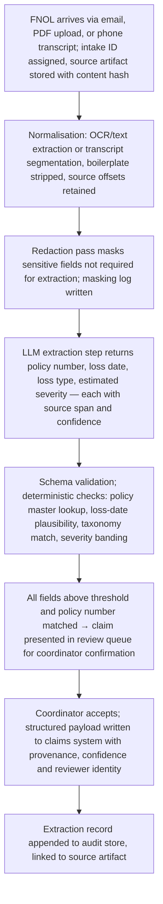
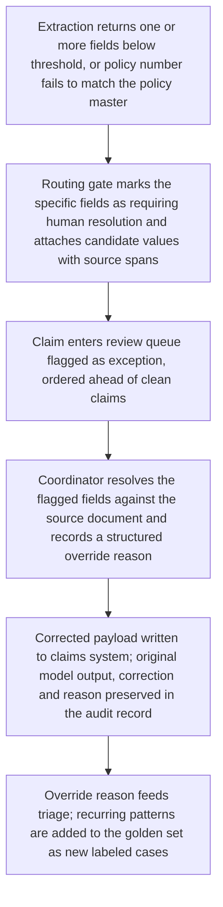
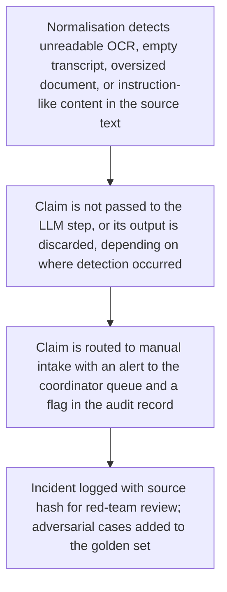
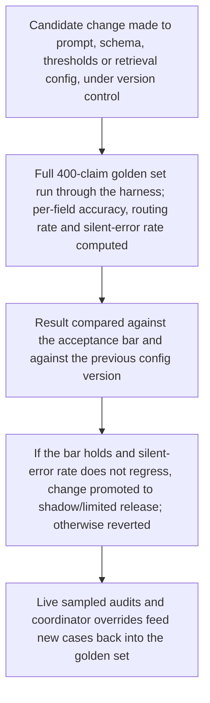

# Build Kickoff Package — Insurance FNOL intake extraction

**Prepared for:** Northbridge Mutual (placeholder) · Sponsor: SVP Claims Operations  
**Prepared by:** Lab Intelligence, LLC  
**Date:** 2026-08-14 · **Plan version:** v2

> **Decision-support, not a guarantee.** This plan was generated by a bounded LLM pipeline from your evaluation inputs. It is a defensible starting point, not a validated design — every estimate is labeled and must be checked against reality. An independent critic audit is attached below and travels with this document; read it alongside the plan. No benchmark, vendor, or ROI figure here should be treated as verified.

---

## 1. Decision & rationale

**Verdict: BUILD** — composite 70/100 · Quick win

Composite 70/100. The case is carried by business value / impact and data readiness; the weakest dimension (technical feasibility, 3/5) is manageable rather than blocking. Proceed to a scoped pilot against the acceptance bar.

FNOL intake extraction is a Quick win (composite 70) and is cleared to build as an orchestrated multi-step workflow: deterministic ingestion, normalisation and validation steps, with LLM calls confined to the interpretive extraction of policy number, loss date, loss type and estimated severity from mixed-channel inputs (phone transcripts, email bodies, PDF forms). Every field carries a confidence score; anything below threshold — plus any policy number that fails validation against the policy master — is routed to a claims-intake review queue. The review queue is a launch condition, not a phase-two nicety, because oversight is stated as required and the data is regulated. The spine of the programme is the acceptance bar: ≥97% field accuracy on a 400-claim labeled set with sub-threshold routing and policy-master validation. Every milestone below ladders toward that bar, and the bar is re-measured on live traffic before any rollout widening. The largest cost line is integration with the claims system and the policy master, not model work, so the plan front-loads connectivity and audit-trail proof rather than model experimentation.

## 2. Architecture

**Pattern:** Orchestrated multi-step workflow (deterministic pipeline with LLM steps where judgment is needed) · **Task shape:** process

### Architecture — Architecture

**Pattern (as grounded): Orchestrated multi-step workflow — deterministic pipeline with LLM steps where judgment is needed.**

Stages, each an explicit checkpoint with persisted state so a claim can be replayed and audited:

1. **Channel intake (deterministic).** Adapters for email, PDF attachment/upload, and phone-call transcript. Each submission gets a claim-intake ID and an immutable copy of the source artifact in a document store, with a content hash.
2. **Normalisation (deterministic).** Text extraction/OCR for PDFs and scans; transcript segmentation for calls; boilerplate/signature stripping for email. Emit a normalised document plus per-segment offsets so every later extraction can point back to a source span.
3. **Redaction/masking pass (deterministic).** Mask sensitive fields not needed for extraction before anything reaches a model, and log what was masked.
4. **Field extraction (LLM step).** A constrained, schema-bound extraction call returning the four target fields plus, for each field, the verbatim source span and a confidence signal. Schema validation is deterministic and rejects malformed output back into a bounded retry.
5. **Deterministic validation.** Policy number checked against the policy master via read-only lookup; loss date checked for plausibility against policy effective dates and submission date; loss type constrained to the claims-system taxonomy; severity mapped to the existing banding.
6. **Confidence gate and routing.** Per-field thresholds. Any field below threshold, any failed policy-master match, and any low-agreement severity estimate routes the claim to the human review queue. Fully clean claims still pass through the review queue during limited release.
7. **Write-back.** Structured payload posted to the claims system only after review disposition, with the extraction record, source spans, model/prompt version and reviewer identity attached.

Supporting capability: retrieval over an indexed corpus of prior FNOL forms and the loss-type taxonomy to ground loss-type and severity interpretation. Use a managed vector store with metadata filters (channel, form version, line of business) plus frequent re-indexing, since forms and taxonomies change. Retrieval is an aid to the LLM step, not a substitute for the deterministic policy-master check.

Explicitly out of scope for v1: auto-closing or auto-triaging claims, adjuster-facing summarisation, and any write path that bypasses the review queue.

### Data pipeline — Data & Integration Pipeline

**Source of truth for labels.** 18 months of FNOL submissions paired with their keyed-in claims-system records. Treat these keyed records as *candidate* ground truth, not verified truth — the stated problem is that rekeying introduces typos, so a portion of the historical labels are themselves wrong. First data task is a hand-adjudication pass: sample the pairs, measure how often the keyed record disagrees with the source document, and correct the labeled set. Without this, the 97% bar is being measured against a noisy ruler.

**Golden set construction.** Build the 400-claim labeled set as a stratified sample across: channel (phone transcript / email / PDF), form version, line of business, and known-hard cases (handwritten or scanned forms, multi-loss submissions, ambiguous loss dates such as 'sometime last week', missing or mistyped policy numbers, third-party reporters). Each of the four fields is labeled independently, with the source span recorded, so accuracy can be reported per field rather than only per claim.

**Access pattern.** Read-only access to the policy master through a service account with least-privilege scope, exposed to the workflow as a defined tool/lookup interface (for example an MCP-style connector) — never raw credentials in prompts. Claims-system write-back through the existing integration channel with idempotency keys so a replayed claim cannot double-post.

**Freshness.** Intake is realtime and interactive, so the pipeline runs per submission, not in batch. The policy master lookup must be live rather than against a stale mirror; if only a replicated copy is available, stamp results with replica lag and treat matches on stale data as sub-threshold.

**Retention and lineage.** Source artifact, normalised text, redaction log, extraction record with prompt/model version, validation outcomes, routing decision, and reviewer action are all retained under state-level retention rules with a documented deletion path. Lineage requirement: from any field in the claims system, an auditor can reach the exact source span in the original document.

**Data quality gates.** Reject-and-route (not silently guess) on: unreadable OCR below a legibility threshold, empty transcript, or documents exceeding a size/page bound.

### Integration — Integration Notes

Two integrations carry the schedule risk.

**Policy master (read).** Needs: a stable lookup by policy number (and ideally fuzzy/candidate search for near-miss numbers, since typo correction is much of the value), a least-privilege read-only service account, a defined tool interface, and clarity on whether the accessible endpoint is live or a replica. Confirm early whether the master exposes policy effective dates and insured names — both materially improve loss-date plausibility checks and mismatch detection.

**Claims system (write).** Needs: a field-level write path for the four target fields plus provenance/confidence metadata, idempotency on retry, and somewhere to store or reference the extraction record so the audit trail survives independently of the pipeline's own storage. If the claims system cannot carry a provenance marker, agree an alternative surface with the adjuster group before launch — adjusters must be able to see which fields were machine-extracted.

**Channel adapters.** Phone submissions depend on an existing transcription capability; confirm whether transcripts are already produced and retained, and their quality on the accents and noise conditions actually present, before assuming phone is in v1 scope. If transcript quality is unproven, ship email and PDF first and add phone as a scoped follow-on — this is the most likely scope cut and should be pre-agreed.

**Review queue UI.** Coordinators need side-by-side source document and extracted fields with the highlighted source span, single-keystroke accept, and a structured override-reason capture. Override reasons are the primary feedback loop into the golden set, so the reason taxonomy is a design decision, not a free-text afterthought.

## 3. Workflows

### Happy path — clean submission



### Exception path — sub-threshold or failed validation



### Untrusted-content / failure path



### Evaluation loop



## 4. Delivery plan

- **Phase 0 — Bar lock, access and label adjudication** — Lock the acceptance bar with the business owner, secure read-only policy-master access and a claims-system write path in a non-production environment, and adjudicate the historical keyed records to establish trustworthy labels. _(2–3 weeks (estimate))_. **Exit:** Signed acceptance bar restating ≥97% field accuracy with sub-threshold routing and policy-master validation; access provisioned and a test lookup plus a test write-back demonstrated; measured disagreement rate between keyed records and source documents documented, with a corrected labeling protocol agreed. · Risk owner: Business owner (claims transformation) with the claims-intake SME
- **Phase 1 — Golden set and audit record** — Build the stratified 400-claim labeled set with per-field labels and source spans, and specify plus implement the extraction audit record schema. _(2–3 weeks (estimate))_. **Exit:** 400-claim golden set complete, stratified across channel, form version, line of business and named hard-case categories, with independent per-field labels and source spans; audit record schema reviewed and accepted by compliance as satisfying source-document traceability. · Risk owner: Claims-intake SME; compliance reviewer for the audit schema
- **Phase 2 — Thin end-to-end pipeline** — Stand up the thinnest complete workflow — intake, normalisation, redaction, schema-bound LLM extraction, deterministic validation, confidence gate, audit record — scored end to end rather than optimised in parts. _(3–5 weeks (estimate))_. **Exit:** Every golden-set claim runs end to end producing a schema-valid extraction, a policy-master validation result, a routing decision and a complete audit record; first per-field accuracy baseline published against the bar with failures categorised. · Risk owner: Delivery engineering lead
- **Phase 3 — Accuracy, calibration and red-team** — Close the gap to the bar, calibrate per-field confidence thresholds so that above-threshold fields are genuinely reliable, and harden against injection via source documents. _(4–6 weeks (estimate))_. **Exit:** Golden set meets ≥97% per-field accuracy; documented threshold calibration showing above- versus below-threshold accuracy and the residual silent-error rate; red-team findings on sensitive-record extraction attempts closed or accepted in writing, with cases added to the golden set. · Risk owner: Evaluation owner with compliance reviewer
- **Phase 4 — Shadow mode** — Run the pipeline on live intake while coordinators continue rekeying, comparing outputs without affecting any claim. _(3–4 weeks (estimate))_. **Exit:** Live-traffic per-field accuracy versus coordinator-keyed values meets the bar on a sampled audit; routing volume shown to be within coordinator capacity; review queue UI validated with coordinators; rollback trigger, its metric, threshold and named owner recorded before any write path is enabled. · Risk owner: Claims intake operations lead
- **Phase 5 — Limited release behind mandatory review** — Enable write-back for a defined intake subset, with every claim passing through the review queue and full audit records in production. _(4–6 weeks (estimate))_. **Exit:** Bar holds on live traffic for the subset across consecutive review periods; reviewer agreement and override-reason distribution reported; zero unresolved cases of a policy-number mismatch reaching the claims system; audit trail exercised successfully in a compliance walkthrough on real claims. · Risk owner: Business owner with compliance reviewer
- **Phase 6 — Widen scope and steady-state operation** — Extend to remaining channels and lines of business, and establish the standing evaluation, triage and threshold-review cadence. _(ongoing (estimate))_. **Exit:** Each newly added channel or line of business independently meets the bar on its own golden-set slice before enablement; weekly golden-set reporting, failure triage and threshold-change review operating with named owners; any proposal to reduce review coverage documented and decided by the business owner on measured silent-error evidence. · Risk owner: Business owner

### Delivery — Delivery

**Shape of the work.** The evaluation flags integration as the dominant cost line, and the scores agree: feasibility, cost and time-to-value all sit at 3 while value and data readiness sit at 4. So sequence the risk accordingly — prove policy-master lookup, claims-system write-back, and the audit record early, and keep the model work thin until the core loop is measurable end to end.

**Team.** A claims-intake SME who owns the labels and the rubric; an engineer for the deterministic pipeline and integrations; an engineer/practitioner for the LLM step, prompts and evaluation harness; a compliance reviewer engaged from Phase 1 rather than consulted at go-live; a named business owner for the acceptance bar and rollback trigger.

**Engineering discipline.** Prompts, schemas, thresholds and retrieval configuration versioned like code; every golden-set run recorded against a config version so a metric movement is attributable. One evaluation harness used by everyone — no local scoring scripts.

**Cadence.** Weekly golden-set run with per-field accuracy and silent-error rate reported to the business owner. Production failures are triaged into categories (extraction miss, OCR/normalisation loss, retrieval miss, validation gap, formatting) because each has a different fix, and each triaged failure becomes a golden-set case.

**Estimates.** All durations in the milestone table are planning estimates for a small dedicated team and are not commitments; they are restated in assumptions. No latency, throughput, cost-per-claim or accuracy figures beyond the stated acceptance bar are asserted anywhere in this plan — those are outputs of Phases 2–4, not inputs.

## 5. Requirements — PRD starters

One prompt per milestone. Each carries its own grounding, so it can be run standalone in Claude Code against the target repo. The milestone's exit criterion is the PRD's acceptance bar — don't loosen it there.

#### Phase 0 — Bar lock, access and label adjudication — Lock the acceptance bar with the business owner, secure read-only policy-master access and a claims-system write path in a non-production environment, and adjudicate the historical keyed records to establish trustworthy labels.

**Exit criterion (this is the PRD's acceptance bar):** Signed acceptance bar restating ≥97% field accuracy with sub-threshold routing and policy-master validation; access provisioned and a test lookup plus a test write-back demonstrated; measured disagreement rate between keyed records and source documents documented, with a corrected labeling protocol agreed.

<details><summary>PRD starter prompt — paste into Claude Code</summary>

```text
Write a PRD for one milestone of an AI build. Ground everything in the context below and do not invent facts, benchmarks, or vendor requirements.
USE CASE: Insurance FNOL intake extraction
PROBLEM: First-notice-of-loss claims arrive by phone, email, and PDF form. Intake staff rekey them into the claims system, and the resulting typos surface days later as mis-triaged claims.
USERS: Claims intake coordinators; adjusters inherit whatever the intake produced.
PROJECT ACCEPTANCE BAR: ≥97% field accuracy on a 400-claim labeled set, with every sub-threshold field routed to review; policy numbers validated against the policy master before acceptance.
ARCHITECTURE PATTERN: Orchestrated multi-step workflow (deterministic pipeline with LLM steps where judgment is needed)
TASK SHAPE: process
MILESTONE: Phase 0 — Bar lock, access and label adjudication — Lock the acceptance bar with the business owner, secure read-only policy-master access and a claims-system write path in a non-production environment, and adjudicate the historical keyed records to establish trustworthy labels.
MILESTONE EXIT CRITERION: Signed acceptance bar restating ≥97% field accuracy with sub-threshold routing and policy-master validation; access provisioned and a test lookup plus a test write-back demonstrated; measured disagreement rate between keyed records and source documents documented, with a corrected labeling protocol agreed.
RISK OWNER: Business owner (claims transformation) with the claims-intake SME
ALL MILESTONES (for sequencing context):
  Phase 0 — Bar lock, access and label adjudication: Lock the acceptance bar with the business owner, secure read-only policy-master access and a claims-system write path in a non-production environment, and adjudicate the historical keyed records to establish trustworthy labels. — exit: Signed acceptance bar restating ≥97% field accuracy with sub-threshold routing and policy-master validation; access provisioned and a test lookup plus a test write-back demonstrated; measured disagreement rate between keyed records and source documents documented, with a corrected labeling protocol agreed.
  Phase 1 — Golden set and audit record: Build the stratified 400-claim labeled set with per-field labels and source spans, and specify plus implement the extraction audit record schema. — exit: 400-claim golden set complete, stratified across channel, form version, line of business and named hard-case categories, with independent per-field labels and source spans; audit record schema reviewed and accepted by compliance as satisfying source-document traceability.
  Phase 2 — Thin end-to-end pipeline: Stand up the thinnest complete workflow — intake, normalisation, redaction, schema-bound LLM extraction, deterministic validation, confidence gate, audit record — scored end to end rather than optimised in parts. — exit: Every golden-set claim runs end to end producing a schema-valid extraction, a policy-master validation result, a routing decision and a complete audit record; first per-field accuracy baseline published against the bar with failures categorised.
  Phase 3 — Accuracy, calibration and red-team: Close the gap to the bar, calibrate per-field confidence thresholds so that above-threshold fields are genuinely reliable, and harden against injection via source documents. — exit: Golden set meets ≥97% per-field accuracy; documented threshold calibration showing above- versus below-threshold accuracy and the residual silent-error rate; red-team findings on sensitive-record extraction attempts closed or accepted in writing, with cases added to the golden set.
  Phase 4 — Shadow mode: Run the pipeline on live intake while coordinators continue rekeying, comparing outputs without affecting any claim. — exit: Live-traffic per-field accuracy versus coordinator-keyed values meets the bar on a sampled audit; routing volume shown to be within coordinator capacity; review queue UI validated with coordinators; rollback trigger, its metric, threshold and named owner recorded before any write path is enabled.
  Phase 5 — Limited release behind mandatory review: Enable write-back for a defined intake subset, with every claim passing through the review queue and full audit records in production. — exit: Bar holds on live traffic for the subset across consecutive review periods; reviewer agreement and override-reason distribution reported; zero unresolved cases of a policy-number mismatch reaching the claims system; audit trail exercised successfully in a compliance walkthrough on real claims.
  Phase 6 — Widen scope and steady-state operation: Extend to remaining channels and lines of business, and establish the standing evaluation, triage and threshold-review cadence. — exit: Each newly added channel or line of business independently meets the bar on its own golden-set slice before enablement; weekly golden-set reporting, failure triage and threshold-change review operating with named owners; any proposal to reduce review coverage documented and decided by the business owner on measured silent-error evidence.
KNOWN GAPS FROM THE INDEPENDENT AUDIT (address or explicitly defer):
  - Interactive latency budget is entirely absent: Grounding sets latency "interactive" and freshness "realtime", and the pipeline stacks OCR, redaction, an LLM call with bounded retry, a live policy-master lookup, and retrieval over a vector index. No phase defines a per-claim latency target or measures it; "the policy master lookup must be live rather than against a stale mirror" adds a synchronous dependency with no timeout/degradation behaviour specified. Add a latency budget and a defined behaviour when the policy-master lookup times out (route to review vs. block intake).
  - No held-out set separate from the tuning set: Thresholds are tuned in Phase 3 on the same 400-claim golden set that defines the acceptance bar, and production/red-team failures are continuously injected into it. Without a frozen hold-out slice, "golden set meets ≥97%" can be an artefact of calibration on the same data. Define a locked evaluation partition and a separate development partition before Phase 3.
  - Net value is never measured, so the review queue can erase the benefit: Current cost is "≈7 minutes of rekeying per claim at 400 claims a week", yet every claim passes through a coordinator review queue in shadow and limited release. No milestone measures handling time per claim versus the 7-minute baseline, so the programme could hit the 97% bar and still deliver no time saving. Add a handling-time / over-routing cost metric to Phase 4 and 5 exit criteria.
ASSUMPTIONS ALREADY LABELED IN THE PLAN (do not silently promote to fact):
  - All phase durations are planning estimates for a small dedicated team, not commitments; they will shift with integration access timelines.
  - The 18 months of FNOL submissions and their keyed-in records are retrievable together as paired artifacts; if pairing is broken, Phase 0 lengthens substantially.
  - Historical keyed records contain some errors (the stated problem is rekeying typos), so they require adjudication before use as ground truth; the disagreement rate is unknown until measured.
  - Read-only policy-master access via a least-privilege service account is obtainable within the programme, and the accessible endpoint is live rather than a materially stale replica.
  - The claims system exposes a field-level write path that can carry provenance and confidence metadata; if not, an alternative provenance surface must be agreed with adjusters.
  - Phone submissions already have a transcription capability of usable quality; if unproven, phone is deferred and v1 covers email and PDF only.
Produce: Context · Scope (in/out) · Acceptance criteria (derived from the exit criterion, each independently testable) · Dependencies · Risks and mitigations · Open questions. Mark every estimate as an estimate.
```

</details>

#### Phase 1 — Golden set and audit record — Build the stratified 400-claim labeled set with per-field labels and source spans, and specify plus implement the extraction audit record schema.

**Exit criterion (this is the PRD's acceptance bar):** 400-claim golden set complete, stratified across channel, form version, line of business and named hard-case categories, with independent per-field labels and source spans; audit record schema reviewed and accepted by compliance as satisfying source-document traceability.

<details><summary>PRD starter prompt — paste into Claude Code</summary>

```text
Write a PRD for one milestone of an AI build. Ground everything in the context below and do not invent facts, benchmarks, or vendor requirements.
USE CASE: Insurance FNOL intake extraction
PROBLEM: First-notice-of-loss claims arrive by phone, email, and PDF form. Intake staff rekey them into the claims system, and the resulting typos surface days later as mis-triaged claims.
USERS: Claims intake coordinators; adjusters inherit whatever the intake produced.
PROJECT ACCEPTANCE BAR: ≥97% field accuracy on a 400-claim labeled set, with every sub-threshold field routed to review; policy numbers validated against the policy master before acceptance.
ARCHITECTURE PATTERN: Orchestrated multi-step workflow (deterministic pipeline with LLM steps where judgment is needed)
TASK SHAPE: process
MILESTONE: Phase 1 — Golden set and audit record — Build the stratified 400-claim labeled set with per-field labels and source spans, and specify plus implement the extraction audit record schema.
MILESTONE EXIT CRITERION: 400-claim golden set complete, stratified across channel, form version, line of business and named hard-case categories, with independent per-field labels and source spans; audit record schema reviewed and accepted by compliance as satisfying source-document traceability.
RISK OWNER: Claims-intake SME; compliance reviewer for the audit schema
ALL MILESTONES (for sequencing context):
  Phase 0 — Bar lock, access and label adjudication: Lock the acceptance bar with the business owner, secure read-only policy-master access and a claims-system write path in a non-production environment, and adjudicate the historical keyed records to establish trustworthy labels. — exit: Signed acceptance bar restating ≥97% field accuracy with sub-threshold routing and policy-master validation; access provisioned and a test lookup plus a test write-back demonstrated; measured disagreement rate between keyed records and source documents documented, with a corrected labeling protocol agreed.
  Phase 1 — Golden set and audit record: Build the stratified 400-claim labeled set with per-field labels and source spans, and specify plus implement the extraction audit record schema. — exit: 400-claim golden set complete, stratified across channel, form version, line of business and named hard-case categories, with independent per-field labels and source spans; audit record schema reviewed and accepted by compliance as satisfying source-document traceability.
  Phase 2 — Thin end-to-end pipeline: Stand up the thinnest complete workflow — intake, normalisation, redaction, schema-bound LLM extraction, deterministic validation, confidence gate, audit record — scored end to end rather than optimised in parts. — exit: Every golden-set claim runs end to end producing a schema-valid extraction, a policy-master validation result, a routing decision and a complete audit record; first per-field accuracy baseline published against the bar with failures categorised.
  Phase 3 — Accuracy, calibration and red-team: Close the gap to the bar, calibrate per-field confidence thresholds so that above-threshold fields are genuinely reliable, and harden against injection via source documents. — exit: Golden set meets ≥97% per-field accuracy; documented threshold calibration showing above- versus below-threshold accuracy and the residual silent-error rate; red-team findings on sensitive-record extraction attempts closed or accepted in writing, with cases added to the golden set.
  Phase 4 — Shadow mode: Run the pipeline on live intake while coordinators continue rekeying, comparing outputs without affecting any claim. — exit: Live-traffic per-field accuracy versus coordinator-keyed values meets the bar on a sampled audit; routing volume shown to be within coordinator capacity; review queue UI validated with coordinators; rollback trigger, its metric, threshold and named owner recorded before any write path is enabled.
  Phase 5 — Limited release behind mandatory review: Enable write-back for a defined intake subset, with every claim passing through the review queue and full audit records in production. — exit: Bar holds on live traffic for the subset across consecutive review periods; reviewer agreement and override-reason distribution reported; zero unresolved cases of a policy-number mismatch reaching the claims system; audit trail exercised successfully in a compliance walkthrough on real claims.
  Phase 6 — Widen scope and steady-state operation: Extend to remaining channels and lines of business, and establish the standing evaluation, triage and threshold-review cadence. — exit: Each newly added channel or line of business independently meets the bar on its own golden-set slice before enablement; weekly golden-set reporting, failure triage and threshold-change review operating with named owners; any proposal to reduce review coverage documented and decided by the business owner on measured silent-error evidence.
KNOWN GAPS FROM THE INDEPENDENT AUDIT (address or explicitly defer):
  - Interactive latency budget is entirely absent: Grounding sets latency "interactive" and freshness "realtime", and the pipeline stacks OCR, redaction, an LLM call with bounded retry, a live policy-master lookup, and retrieval over a vector index. No phase defines a per-claim latency target or measures it; "the policy master lookup must be live rather than against a stale mirror" adds a synchronous dependency with no timeout/degradation behaviour specified. Add a latency budget and a defined behaviour when the policy-master lookup times out (route to review vs. block intake).
  - No held-out set separate from the tuning set: Thresholds are tuned in Phase 3 on the same 400-claim golden set that defines the acceptance bar, and production/red-team failures are continuously injected into it. Without a frozen hold-out slice, "golden set meets ≥97%" can be an artefact of calibration on the same data. Define a locked evaluation partition and a separate development partition before Phase 3.
  - Net value is never measured, so the review queue can erase the benefit: Current cost is "≈7 minutes of rekeying per claim at 400 claims a week", yet every claim passes through a coordinator review queue in shadow and limited release. No milestone measures handling time per claim versus the 7-minute baseline, so the programme could hit the 97% bar and still deliver no time saving. Add a handling-time / over-routing cost metric to Phase 4 and 5 exit criteria.
ASSUMPTIONS ALREADY LABELED IN THE PLAN (do not silently promote to fact):
  - All phase durations are planning estimates for a small dedicated team, not commitments; they will shift with integration access timelines.
  - The 18 months of FNOL submissions and their keyed-in records are retrievable together as paired artifacts; if pairing is broken, Phase 0 lengthens substantially.
  - Historical keyed records contain some errors (the stated problem is rekeying typos), so they require adjudication before use as ground truth; the disagreement rate is unknown until measured.
  - Read-only policy-master access via a least-privilege service account is obtainable within the programme, and the accessible endpoint is live rather than a materially stale replica.
  - The claims system exposes a field-level write path that can carry provenance and confidence metadata; if not, an alternative provenance surface must be agreed with adjusters.
  - Phone submissions already have a transcription capability of usable quality; if unproven, phone is deferred and v1 covers email and PDF only.
Produce: Context · Scope (in/out) · Acceptance criteria (derived from the exit criterion, each independently testable) · Dependencies · Risks and mitigations · Open questions. Mark every estimate as an estimate.
```

</details>

#### Phase 2 — Thin end-to-end pipeline — Stand up the thinnest complete workflow — intake, normalisation, redaction, schema-bound LLM extraction, deterministic validation, confidence gate, audit record — scored end to end rather than optimised in parts.

**Exit criterion (this is the PRD's acceptance bar):** Every golden-set claim runs end to end producing a schema-valid extraction, a policy-master validation result, a routing decision and a complete audit record; first per-field accuracy baseline published against the bar with failures categorised.

<details><summary>PRD starter prompt — paste into Claude Code</summary>

```text
Write a PRD for one milestone of an AI build. Ground everything in the context below and do not invent facts, benchmarks, or vendor requirements.
USE CASE: Insurance FNOL intake extraction
PROBLEM: First-notice-of-loss claims arrive by phone, email, and PDF form. Intake staff rekey them into the claims system, and the resulting typos surface days later as mis-triaged claims.
USERS: Claims intake coordinators; adjusters inherit whatever the intake produced.
PROJECT ACCEPTANCE BAR: ≥97% field accuracy on a 400-claim labeled set, with every sub-threshold field routed to review; policy numbers validated against the policy master before acceptance.
ARCHITECTURE PATTERN: Orchestrated multi-step workflow (deterministic pipeline with LLM steps where judgment is needed)
TASK SHAPE: process
MILESTONE: Phase 2 — Thin end-to-end pipeline — Stand up the thinnest complete workflow — intake, normalisation, redaction, schema-bound LLM extraction, deterministic validation, confidence gate, audit record — scored end to end rather than optimised in parts.
MILESTONE EXIT CRITERION: Every golden-set claim runs end to end producing a schema-valid extraction, a policy-master validation result, a routing decision and a complete audit record; first per-field accuracy baseline published against the bar with failures categorised.
RISK OWNER: Delivery engineering lead
ALL MILESTONES (for sequencing context):
  Phase 0 — Bar lock, access and label adjudication: Lock the acceptance bar with the business owner, secure read-only policy-master access and a claims-system write path in a non-production environment, and adjudicate the historical keyed records to establish trustworthy labels. — exit: Signed acceptance bar restating ≥97% field accuracy with sub-threshold routing and policy-master validation; access provisioned and a test lookup plus a test write-back demonstrated; measured disagreement rate between keyed records and source documents documented, with a corrected labeling protocol agreed.
  Phase 1 — Golden set and audit record: Build the stratified 400-claim labeled set with per-field labels and source spans, and specify plus implement the extraction audit record schema. — exit: 400-claim golden set complete, stratified across channel, form version, line of business and named hard-case categories, with independent per-field labels and source spans; audit record schema reviewed and accepted by compliance as satisfying source-document traceability.
  Phase 2 — Thin end-to-end pipeline: Stand up the thinnest complete workflow — intake, normalisation, redaction, schema-bound LLM extraction, deterministic validation, confidence gate, audit record — scored end to end rather than optimised in parts. — exit: Every golden-set claim runs end to end producing a schema-valid extraction, a policy-master validation result, a routing decision and a complete audit record; first per-field accuracy baseline published against the bar with failures categorised.
  Phase 3 — Accuracy, calibration and red-team: Close the gap to the bar, calibrate per-field confidence thresholds so that above-threshold fields are genuinely reliable, and harden against injection via source documents. — exit: Golden set meets ≥97% per-field accuracy; documented threshold calibration showing above- versus below-threshold accuracy and the residual silent-error rate; red-team findings on sensitive-record extraction attempts closed or accepted in writing, with cases added to the golden set.
  Phase 4 — Shadow mode: Run the pipeline on live intake while coordinators continue rekeying, comparing outputs without affecting any claim. — exit: Live-traffic per-field accuracy versus coordinator-keyed values meets the bar on a sampled audit; routing volume shown to be within coordinator capacity; review queue UI validated with coordinators; rollback trigger, its metric, threshold and named owner recorded before any write path is enabled.
  Phase 5 — Limited release behind mandatory review: Enable write-back for a defined intake subset, with every claim passing through the review queue and full audit records in production. — exit: Bar holds on live traffic for the subset across consecutive review periods; reviewer agreement and override-reason distribution reported; zero unresolved cases of a policy-number mismatch reaching the claims system; audit trail exercised successfully in a compliance walkthrough on real claims.
  Phase 6 — Widen scope and steady-state operation: Extend to remaining channels and lines of business, and establish the standing evaluation, triage and threshold-review cadence. — exit: Each newly added channel or line of business independently meets the bar on its own golden-set slice before enablement; weekly golden-set reporting, failure triage and threshold-change review operating with named owners; any proposal to reduce review coverage documented and decided by the business owner on measured silent-error evidence.
KNOWN GAPS FROM THE INDEPENDENT AUDIT (address or explicitly defer):
  - Interactive latency budget is entirely absent: Grounding sets latency "interactive" and freshness "realtime", and the pipeline stacks OCR, redaction, an LLM call with bounded retry, a live policy-master lookup, and retrieval over a vector index. No phase defines a per-claim latency target or measures it; "the policy master lookup must be live rather than against a stale mirror" adds a synchronous dependency with no timeout/degradation behaviour specified. Add a latency budget and a defined behaviour when the policy-master lookup times out (route to review vs. block intake).
  - No held-out set separate from the tuning set: Thresholds are tuned in Phase 3 on the same 400-claim golden set that defines the acceptance bar, and production/red-team failures are continuously injected into it. Without a frozen hold-out slice, "golden set meets ≥97%" can be an artefact of calibration on the same data. Define a locked evaluation partition and a separate development partition before Phase 3.
  - Net value is never measured, so the review queue can erase the benefit: Current cost is "≈7 minutes of rekeying per claim at 400 claims a week", yet every claim passes through a coordinator review queue in shadow and limited release. No milestone measures handling time per claim versus the 7-minute baseline, so the programme could hit the 97% bar and still deliver no time saving. Add a handling-time / over-routing cost metric to Phase 4 and 5 exit criteria.
ASSUMPTIONS ALREADY LABELED IN THE PLAN (do not silently promote to fact):
  - All phase durations are planning estimates for a small dedicated team, not commitments; they will shift with integration access timelines.
  - The 18 months of FNOL submissions and their keyed-in records are retrievable together as paired artifacts; if pairing is broken, Phase 0 lengthens substantially.
  - Historical keyed records contain some errors (the stated problem is rekeying typos), so they require adjudication before use as ground truth; the disagreement rate is unknown until measured.
  - Read-only policy-master access via a least-privilege service account is obtainable within the programme, and the accessible endpoint is live rather than a materially stale replica.
  - The claims system exposes a field-level write path that can carry provenance and confidence metadata; if not, an alternative provenance surface must be agreed with adjusters.
  - Phone submissions already have a transcription capability of usable quality; if unproven, phone is deferred and v1 covers email and PDF only.
Produce: Context · Scope (in/out) · Acceptance criteria (derived from the exit criterion, each independently testable) · Dependencies · Risks and mitigations · Open questions. Mark every estimate as an estimate.
```

</details>

#### Phase 3 — Accuracy, calibration and red-team — Close the gap to the bar, calibrate per-field confidence thresholds so that above-threshold fields are genuinely reliable, and harden against injection via source documents.

**Exit criterion (this is the PRD's acceptance bar):** Golden set meets ≥97% per-field accuracy; documented threshold calibration showing above- versus below-threshold accuracy and the residual silent-error rate; red-team findings on sensitive-record extraction attempts closed or accepted in writing, with cases added to the golden set.

<details><summary>PRD starter prompt — paste into Claude Code</summary>

```text
Write a PRD for one milestone of an AI build. Ground everything in the context below and do not invent facts, benchmarks, or vendor requirements.
USE CASE: Insurance FNOL intake extraction
PROBLEM: First-notice-of-loss claims arrive by phone, email, and PDF form. Intake staff rekey them into the claims system, and the resulting typos surface days later as mis-triaged claims.
USERS: Claims intake coordinators; adjusters inherit whatever the intake produced.
PROJECT ACCEPTANCE BAR: ≥97% field accuracy on a 400-claim labeled set, with every sub-threshold field routed to review; policy numbers validated against the policy master before acceptance.
ARCHITECTURE PATTERN: Orchestrated multi-step workflow (deterministic pipeline with LLM steps where judgment is needed)
TASK SHAPE: process
MILESTONE: Phase 3 — Accuracy, calibration and red-team — Close the gap to the bar, calibrate per-field confidence thresholds so that above-threshold fields are genuinely reliable, and harden against injection via source documents.
MILESTONE EXIT CRITERION: Golden set meets ≥97% per-field accuracy; documented threshold calibration showing above- versus below-threshold accuracy and the residual silent-error rate; red-team findings on sensitive-record extraction attempts closed or accepted in writing, with cases added to the golden set.
RISK OWNER: Evaluation owner with compliance reviewer
ALL MILESTONES (for sequencing context):
  Phase 0 — Bar lock, access and label adjudication: Lock the acceptance bar with the business owner, secure read-only policy-master access and a claims-system write path in a non-production environment, and adjudicate the historical keyed records to establish trustworthy labels. — exit: Signed acceptance bar restating ≥97% field accuracy with sub-threshold routing and policy-master validation; access provisioned and a test lookup plus a test write-back demonstrated; measured disagreement rate between keyed records and source documents documented, with a corrected labeling protocol agreed.
  Phase 1 — Golden set and audit record: Build the stratified 400-claim labeled set with per-field labels and source spans, and specify plus implement the extraction audit record schema. — exit: 400-claim golden set complete, stratified across channel, form version, line of business and named hard-case categories, with independent per-field labels and source spans; audit record schema reviewed and accepted by compliance as satisfying source-document traceability.
  Phase 2 — Thin end-to-end pipeline: Stand up the thinnest complete workflow — intake, normalisation, redaction, schema-bound LLM extraction, deterministic validation, confidence gate, audit record — scored end to end rather than optimised in parts. — exit: Every golden-set claim runs end to end producing a schema-valid extraction, a policy-master validation result, a routing decision and a complete audit record; first per-field accuracy baseline published against the bar with failures categorised.
  Phase 3 — Accuracy, calibration and red-team: Close the gap to the bar, calibrate per-field confidence thresholds so that above-threshold fields are genuinely reliable, and harden against injection via source documents. — exit: Golden set meets ≥97% per-field accuracy; documented threshold calibration showing above- versus below-threshold accuracy and the residual silent-error rate; red-team findings on sensitive-record extraction attempts closed or accepted in writing, with cases added to the golden set.
  Phase 4 — Shadow mode: Run the pipeline on live intake while coordinators continue rekeying, comparing outputs without affecting any claim. — exit: Live-traffic per-field accuracy versus coordinator-keyed values meets the bar on a sampled audit; routing volume shown to be within coordinator capacity; review queue UI validated with coordinators; rollback trigger, its metric, threshold and named owner recorded before any write path is enabled.
  Phase 5 — Limited release behind mandatory review: Enable write-back for a defined intake subset, with every claim passing through the review queue and full audit records in production. — exit: Bar holds on live traffic for the subset across consecutive review periods; reviewer agreement and override-reason distribution reported; zero unresolved cases of a policy-number mismatch reaching the claims system; audit trail exercised successfully in a compliance walkthrough on real claims.
  Phase 6 — Widen scope and steady-state operation: Extend to remaining channels and lines of business, and establish the standing evaluation, triage and threshold-review cadence. — exit: Each newly added channel or line of business independently meets the bar on its own golden-set slice before enablement; weekly golden-set reporting, failure triage and threshold-change review operating with named owners; any proposal to reduce review coverage documented and decided by the business owner on measured silent-error evidence.
KNOWN GAPS FROM THE INDEPENDENT AUDIT (address or explicitly defer):
  - Interactive latency budget is entirely absent: Grounding sets latency "interactive" and freshness "realtime", and the pipeline stacks OCR, redaction, an LLM call with bounded retry, a live policy-master lookup, and retrieval over a vector index. No phase defines a per-claim latency target or measures it; "the policy master lookup must be live rather than against a stale mirror" adds a synchronous dependency with no timeout/degradation behaviour specified. Add a latency budget and a defined behaviour when the policy-master lookup times out (route to review vs. block intake).
  - No held-out set separate from the tuning set: Thresholds are tuned in Phase 3 on the same 400-claim golden set that defines the acceptance bar, and production/red-team failures are continuously injected into it. Without a frozen hold-out slice, "golden set meets ≥97%" can be an artefact of calibration on the same data. Define a locked evaluation partition and a separate development partition before Phase 3.
  - Net value is never measured, so the review queue can erase the benefit: Current cost is "≈7 minutes of rekeying per claim at 400 claims a week", yet every claim passes through a coordinator review queue in shadow and limited release. No milestone measures handling time per claim versus the 7-minute baseline, so the programme could hit the 97% bar and still deliver no time saving. Add a handling-time / over-routing cost metric to Phase 4 and 5 exit criteria.
ASSUMPTIONS ALREADY LABELED IN THE PLAN (do not silently promote to fact):
  - All phase durations are planning estimates for a small dedicated team, not commitments; they will shift with integration access timelines.
  - The 18 months of FNOL submissions and their keyed-in records are retrievable together as paired artifacts; if pairing is broken, Phase 0 lengthens substantially.
  - Historical keyed records contain some errors (the stated problem is rekeying typos), so they require adjudication before use as ground truth; the disagreement rate is unknown until measured.
  - Read-only policy-master access via a least-privilege service account is obtainable within the programme, and the accessible endpoint is live rather than a materially stale replica.
  - The claims system exposes a field-level write path that can carry provenance and confidence metadata; if not, an alternative provenance surface must be agreed with adjusters.
  - Phone submissions already have a transcription capability of usable quality; if unproven, phone is deferred and v1 covers email and PDF only.
Produce: Context · Scope (in/out) · Acceptance criteria (derived from the exit criterion, each independently testable) · Dependencies · Risks and mitigations · Open questions. Mark every estimate as an estimate.
```

</details>

#### Phase 4 — Shadow mode — Run the pipeline on live intake while coordinators continue rekeying, comparing outputs without affecting any claim.

**Exit criterion (this is the PRD's acceptance bar):** Live-traffic per-field accuracy versus coordinator-keyed values meets the bar on a sampled audit; routing volume shown to be within coordinator capacity; review queue UI validated with coordinators; rollback trigger, its metric, threshold and named owner recorded before any write path is enabled.

<details><summary>PRD starter prompt — paste into Claude Code</summary>

```text
Write a PRD for one milestone of an AI build. Ground everything in the context below and do not invent facts, benchmarks, or vendor requirements.
USE CASE: Insurance FNOL intake extraction
PROBLEM: First-notice-of-loss claims arrive by phone, email, and PDF form. Intake staff rekey them into the claims system, and the resulting typos surface days later as mis-triaged claims.
USERS: Claims intake coordinators; adjusters inherit whatever the intake produced.
PROJECT ACCEPTANCE BAR: ≥97% field accuracy on a 400-claim labeled set, with every sub-threshold field routed to review; policy numbers validated against the policy master before acceptance.
ARCHITECTURE PATTERN: Orchestrated multi-step workflow (deterministic pipeline with LLM steps where judgment is needed)
TASK SHAPE: process
MILESTONE: Phase 4 — Shadow mode — Run the pipeline on live intake while coordinators continue rekeying, comparing outputs without affecting any claim.
MILESTONE EXIT CRITERION: Live-traffic per-field accuracy versus coordinator-keyed values meets the bar on a sampled audit; routing volume shown to be within coordinator capacity; review queue UI validated with coordinators; rollback trigger, its metric, threshold and named owner recorded before any write path is enabled.
RISK OWNER: Claims intake operations lead
ALL MILESTONES (for sequencing context):
  Phase 0 — Bar lock, access and label adjudication: Lock the acceptance bar with the business owner, secure read-only policy-master access and a claims-system write path in a non-production environment, and adjudicate the historical keyed records to establish trustworthy labels. — exit: Signed acceptance bar restating ≥97% field accuracy with sub-threshold routing and policy-master validation; access provisioned and a test lookup plus a test write-back demonstrated; measured disagreement rate between keyed records and source documents documented, with a corrected labeling protocol agreed.
  Phase 1 — Golden set and audit record: Build the stratified 400-claim labeled set with per-field labels and source spans, and specify plus implement the extraction audit record schema. — exit: 400-claim golden set complete, stratified across channel, form version, line of business and named hard-case categories, with independent per-field labels and source spans; audit record schema reviewed and accepted by compliance as satisfying source-document traceability.
  Phase 2 — Thin end-to-end pipeline: Stand up the thinnest complete workflow — intake, normalisation, redaction, schema-bound LLM extraction, deterministic validation, confidence gate, audit record — scored end to end rather than optimised in parts. — exit: Every golden-set claim runs end to end producing a schema-valid extraction, a policy-master validation result, a routing decision and a complete audit record; first per-field accuracy baseline published against the bar with failures categorised.
  Phase 3 — Accuracy, calibration and red-team: Close the gap to the bar, calibrate per-field confidence thresholds so that above-threshold fields are genuinely reliable, and harden against injection via source documents. — exit: Golden set meets ≥97% per-field accuracy; documented threshold calibration showing above- versus below-threshold accuracy and the residual silent-error rate; red-team findings on sensitive-record extraction attempts closed or accepted in writing, with cases added to the golden set.
  Phase 4 — Shadow mode: Run the pipeline on live intake while coordinators continue rekeying, comparing outputs without affecting any claim. — exit: Live-traffic per-field accuracy versus coordinator-keyed values meets the bar on a sampled audit; routing volume shown to be within coordinator capacity; review queue UI validated with coordinators; rollback trigger, its metric, threshold and named owner recorded before any write path is enabled.
  Phase 5 — Limited release behind mandatory review: Enable write-back for a defined intake subset, with every claim passing through the review queue and full audit records in production. — exit: Bar holds on live traffic for the subset across consecutive review periods; reviewer agreement and override-reason distribution reported; zero unresolved cases of a policy-number mismatch reaching the claims system; audit trail exercised successfully in a compliance walkthrough on real claims.
  Phase 6 — Widen scope and steady-state operation: Extend to remaining channels and lines of business, and establish the standing evaluation, triage and threshold-review cadence. — exit: Each newly added channel or line of business independently meets the bar on its own golden-set slice before enablement; weekly golden-set reporting, failure triage and threshold-change review operating with named owners; any proposal to reduce review coverage documented and decided by the business owner on measured silent-error evidence.
KNOWN GAPS FROM THE INDEPENDENT AUDIT (address or explicitly defer):
  - Interactive latency budget is entirely absent: Grounding sets latency "interactive" and freshness "realtime", and the pipeline stacks OCR, redaction, an LLM call with bounded retry, a live policy-master lookup, and retrieval over a vector index. No phase defines a per-claim latency target or measures it; "the policy master lookup must be live rather than against a stale mirror" adds a synchronous dependency with no timeout/degradation behaviour specified. Add a latency budget and a defined behaviour when the policy-master lookup times out (route to review vs. block intake).
  - No held-out set separate from the tuning set: Thresholds are tuned in Phase 3 on the same 400-claim golden set that defines the acceptance bar, and production/red-team failures are continuously injected into it. Without a frozen hold-out slice, "golden set meets ≥97%" can be an artefact of calibration on the same data. Define a locked evaluation partition and a separate development partition before Phase 3.
  - Net value is never measured, so the review queue can erase the benefit: Current cost is "≈7 minutes of rekeying per claim at 400 claims a week", yet every claim passes through a coordinator review queue in shadow and limited release. No milestone measures handling time per claim versus the 7-minute baseline, so the programme could hit the 97% bar and still deliver no time saving. Add a handling-time / over-routing cost metric to Phase 4 and 5 exit criteria.
ASSUMPTIONS ALREADY LABELED IN THE PLAN (do not silently promote to fact):
  - All phase durations are planning estimates for a small dedicated team, not commitments; they will shift with integration access timelines.
  - The 18 months of FNOL submissions and their keyed-in records are retrievable together as paired artifacts; if pairing is broken, Phase 0 lengthens substantially.
  - Historical keyed records contain some errors (the stated problem is rekeying typos), so they require adjudication before use as ground truth; the disagreement rate is unknown until measured.
  - Read-only policy-master access via a least-privilege service account is obtainable within the programme, and the accessible endpoint is live rather than a materially stale replica.
  - The claims system exposes a field-level write path that can carry provenance and confidence metadata; if not, an alternative provenance surface must be agreed with adjusters.
  - Phone submissions already have a transcription capability of usable quality; if unproven, phone is deferred and v1 covers email and PDF only.
Produce: Context · Scope (in/out) · Acceptance criteria (derived from the exit criterion, each independently testable) · Dependencies · Risks and mitigations · Open questions. Mark every estimate as an estimate.
```

</details>

#### Phase 5 — Limited release behind mandatory review — Enable write-back for a defined intake subset, with every claim passing through the review queue and full audit records in production.

**Exit criterion (this is the PRD's acceptance bar):** Bar holds on live traffic for the subset across consecutive review periods; reviewer agreement and override-reason distribution reported; zero unresolved cases of a policy-number mismatch reaching the claims system; audit trail exercised successfully in a compliance walkthrough on real claims.

<details><summary>PRD starter prompt — paste into Claude Code</summary>

```text
Write a PRD for one milestone of an AI build. Ground everything in the context below and do not invent facts, benchmarks, or vendor requirements.
USE CASE: Insurance FNOL intake extraction
PROBLEM: First-notice-of-loss claims arrive by phone, email, and PDF form. Intake staff rekey them into the claims system, and the resulting typos surface days later as mis-triaged claims.
USERS: Claims intake coordinators; adjusters inherit whatever the intake produced.
PROJECT ACCEPTANCE BAR: ≥97% field accuracy on a 400-claim labeled set, with every sub-threshold field routed to review; policy numbers validated against the policy master before acceptance.
ARCHITECTURE PATTERN: Orchestrated multi-step workflow (deterministic pipeline with LLM steps where judgment is needed)
TASK SHAPE: process
MILESTONE: Phase 5 — Limited release behind mandatory review — Enable write-back for a defined intake subset, with every claim passing through the review queue and full audit records in production.
MILESTONE EXIT CRITERION: Bar holds on live traffic for the subset across consecutive review periods; reviewer agreement and override-reason distribution reported; zero unresolved cases of a policy-number mismatch reaching the claims system; audit trail exercised successfully in a compliance walkthrough on real claims.
RISK OWNER: Business owner with compliance reviewer
ALL MILESTONES (for sequencing context):
  Phase 0 — Bar lock, access and label adjudication: Lock the acceptance bar with the business owner, secure read-only policy-master access and a claims-system write path in a non-production environment, and adjudicate the historical keyed records to establish trustworthy labels. — exit: Signed acceptance bar restating ≥97% field accuracy with sub-threshold routing and policy-master validation; access provisioned and a test lookup plus a test write-back demonstrated; measured disagreement rate between keyed records and source documents documented, with a corrected labeling protocol agreed.
  Phase 1 — Golden set and audit record: Build the stratified 400-claim labeled set with per-field labels and source spans, and specify plus implement the extraction audit record schema. — exit: 400-claim golden set complete, stratified across channel, form version, line of business and named hard-case categories, with independent per-field labels and source spans; audit record schema reviewed and accepted by compliance as satisfying source-document traceability.
  Phase 2 — Thin end-to-end pipeline: Stand up the thinnest complete workflow — intake, normalisation, redaction, schema-bound LLM extraction, deterministic validation, confidence gate, audit record — scored end to end rather than optimised in parts. — exit: Every golden-set claim runs end to end producing a schema-valid extraction, a policy-master validation result, a routing decision and a complete audit record; first per-field accuracy baseline published against the bar with failures categorised.
  Phase 3 — Accuracy, calibration and red-team: Close the gap to the bar, calibrate per-field confidence thresholds so that above-threshold fields are genuinely reliable, and harden against injection via source documents. — exit: Golden set meets ≥97% per-field accuracy; documented threshold calibration showing above- versus below-threshold accuracy and the residual silent-error rate; red-team findings on sensitive-record extraction attempts closed or accepted in writing, with cases added to the golden set.
  Phase 4 — Shadow mode: Run the pipeline on live intake while coordinators continue rekeying, comparing outputs without affecting any claim. — exit: Live-traffic per-field accuracy versus coordinator-keyed values meets the bar on a sampled audit; routing volume shown to be within coordinator capacity; review queue UI validated with coordinators; rollback trigger, its metric, threshold and named owner recorded before any write path is enabled.
  Phase 5 — Limited release behind mandatory review: Enable write-back for a defined intake subset, with every claim passing through the review queue and full audit records in production. — exit: Bar holds on live traffic for the subset across consecutive review periods; reviewer agreement and override-reason distribution reported; zero unresolved cases of a policy-number mismatch reaching the claims system; audit trail exercised successfully in a compliance walkthrough on real claims.
  Phase 6 — Widen scope and steady-state operation: Extend to remaining channels and lines of business, and establish the standing evaluation, triage and threshold-review cadence. — exit: Each newly added channel or line of business independently meets the bar on its own golden-set slice before enablement; weekly golden-set reporting, failure triage and threshold-change review operating with named owners; any proposal to reduce review coverage documented and decided by the business owner on measured silent-error evidence.
KNOWN GAPS FROM THE INDEPENDENT AUDIT (address or explicitly defer):
  - Interactive latency budget is entirely absent: Grounding sets latency "interactive" and freshness "realtime", and the pipeline stacks OCR, redaction, an LLM call with bounded retry, a live policy-master lookup, and retrieval over a vector index. No phase defines a per-claim latency target or measures it; "the policy master lookup must be live rather than against a stale mirror" adds a synchronous dependency with no timeout/degradation behaviour specified. Add a latency budget and a defined behaviour when the policy-master lookup times out (route to review vs. block intake).
  - No held-out set separate from the tuning set: Thresholds are tuned in Phase 3 on the same 400-claim golden set that defines the acceptance bar, and production/red-team failures are continuously injected into it. Without a frozen hold-out slice, "golden set meets ≥97%" can be an artefact of calibration on the same data. Define a locked evaluation partition and a separate development partition before Phase 3.
  - Net value is never measured, so the review queue can erase the benefit: Current cost is "≈7 minutes of rekeying per claim at 400 claims a week", yet every claim passes through a coordinator review queue in shadow and limited release. No milestone measures handling time per claim versus the 7-minute baseline, so the programme could hit the 97% bar and still deliver no time saving. Add a handling-time / over-routing cost metric to Phase 4 and 5 exit criteria.
ASSUMPTIONS ALREADY LABELED IN THE PLAN (do not silently promote to fact):
  - All phase durations are planning estimates for a small dedicated team, not commitments; they will shift with integration access timelines.
  - The 18 months of FNOL submissions and their keyed-in records are retrievable together as paired artifacts; if pairing is broken, Phase 0 lengthens substantially.
  - Historical keyed records contain some errors (the stated problem is rekeying typos), so they require adjudication before use as ground truth; the disagreement rate is unknown until measured.
  - Read-only policy-master access via a least-privilege service account is obtainable within the programme, and the accessible endpoint is live rather than a materially stale replica.
  - The claims system exposes a field-level write path that can carry provenance and confidence metadata; if not, an alternative provenance surface must be agreed with adjusters.
  - Phone submissions already have a transcription capability of usable quality; if unproven, phone is deferred and v1 covers email and PDF only.
Produce: Context · Scope (in/out) · Acceptance criteria (derived from the exit criterion, each independently testable) · Dependencies · Risks and mitigations · Open questions. Mark every estimate as an estimate.
```

</details>

#### Phase 6 — Widen scope and steady-state operation — Extend to remaining channels and lines of business, and establish the standing evaluation, triage and threshold-review cadence.

**Exit criterion (this is the PRD's acceptance bar):** Each newly added channel or line of business independently meets the bar on its own golden-set slice before enablement; weekly golden-set reporting, failure triage and threshold-change review operating with named owners; any proposal to reduce review coverage documented and decided by the business owner on measured silent-error evidence.

<details><summary>PRD starter prompt — paste into Claude Code</summary>

```text
Write a PRD for one milestone of an AI build. Ground everything in the context below and do not invent facts, benchmarks, or vendor requirements.
USE CASE: Insurance FNOL intake extraction
PROBLEM: First-notice-of-loss claims arrive by phone, email, and PDF form. Intake staff rekey them into the claims system, and the resulting typos surface days later as mis-triaged claims.
USERS: Claims intake coordinators; adjusters inherit whatever the intake produced.
PROJECT ACCEPTANCE BAR: ≥97% field accuracy on a 400-claim labeled set, with every sub-threshold field routed to review; policy numbers validated against the policy master before acceptance.
ARCHITECTURE PATTERN: Orchestrated multi-step workflow (deterministic pipeline with LLM steps where judgment is needed)
TASK SHAPE: process
MILESTONE: Phase 6 — Widen scope and steady-state operation — Extend to remaining channels and lines of business, and establish the standing evaluation, triage and threshold-review cadence.
MILESTONE EXIT CRITERION: Each newly added channel or line of business independently meets the bar on its own golden-set slice before enablement; weekly golden-set reporting, failure triage and threshold-change review operating with named owners; any proposal to reduce review coverage documented and decided by the business owner on measured silent-error evidence.
RISK OWNER: Business owner
ALL MILESTONES (for sequencing context):
  Phase 0 — Bar lock, access and label adjudication: Lock the acceptance bar with the business owner, secure read-only policy-master access and a claims-system write path in a non-production environment, and adjudicate the historical keyed records to establish trustworthy labels. — exit: Signed acceptance bar restating ≥97% field accuracy with sub-threshold routing and policy-master validation; access provisioned and a test lookup plus a test write-back demonstrated; measured disagreement rate between keyed records and source documents documented, with a corrected labeling protocol agreed.
  Phase 1 — Golden set and audit record: Build the stratified 400-claim labeled set with per-field labels and source spans, and specify plus implement the extraction audit record schema. — exit: 400-claim golden set complete, stratified across channel, form version, line of business and named hard-case categories, with independent per-field labels and source spans; audit record schema reviewed and accepted by compliance as satisfying source-document traceability.
  Phase 2 — Thin end-to-end pipeline: Stand up the thinnest complete workflow — intake, normalisation, redaction, schema-bound LLM extraction, deterministic validation, confidence gate, audit record — scored end to end rather than optimised in parts. — exit: Every golden-set claim runs end to end producing a schema-valid extraction, a policy-master validation result, a routing decision and a complete audit record; first per-field accuracy baseline published against the bar with failures categorised.
  Phase 3 — Accuracy, calibration and red-team: Close the gap to the bar, calibrate per-field confidence thresholds so that above-threshold fields are genuinely reliable, and harden against injection via source documents. — exit: Golden set meets ≥97% per-field accuracy; documented threshold calibration showing above- versus below-threshold accuracy and the residual silent-error rate; red-team findings on sensitive-record extraction attempts closed or accepted in writing, with cases added to the golden set.
  Phase 4 — Shadow mode: Run the pipeline on live intake while coordinators continue rekeying, comparing outputs without affecting any claim. — exit: Live-traffic per-field accuracy versus coordinator-keyed values meets the bar on a sampled audit; routing volume shown to be within coordinator capacity; review queue UI validated with coordinators; rollback trigger, its metric, threshold and named owner recorded before any write path is enabled.
  Phase 5 — Limited release behind mandatory review: Enable write-back for a defined intake subset, with every claim passing through the review queue and full audit records in production. — exit: Bar holds on live traffic for the subset across consecutive review periods; reviewer agreement and override-reason distribution reported; zero unresolved cases of a policy-number mismatch reaching the claims system; audit trail exercised successfully in a compliance walkthrough on real claims.
  Phase 6 — Widen scope and steady-state operation: Extend to remaining channels and lines of business, and establish the standing evaluation, triage and threshold-review cadence. — exit: Each newly added channel or line of business independently meets the bar on its own golden-set slice before enablement; weekly golden-set reporting, failure triage and threshold-change review operating with named owners; any proposal to reduce review coverage documented and decided by the business owner on measured silent-error evidence.
KNOWN GAPS FROM THE INDEPENDENT AUDIT (address or explicitly defer):
  - Interactive latency budget is entirely absent: Grounding sets latency "interactive" and freshness "realtime", and the pipeline stacks OCR, redaction, an LLM call with bounded retry, a live policy-master lookup, and retrieval over a vector index. No phase defines a per-claim latency target or measures it; "the policy master lookup must be live rather than against a stale mirror" adds a synchronous dependency with no timeout/degradation behaviour specified. Add a latency budget and a defined behaviour when the policy-master lookup times out (route to review vs. block intake).
  - No held-out set separate from the tuning set: Thresholds are tuned in Phase 3 on the same 400-claim golden set that defines the acceptance bar, and production/red-team failures are continuously injected into it. Without a frozen hold-out slice, "golden set meets ≥97%" can be an artefact of calibration on the same data. Define a locked evaluation partition and a separate development partition before Phase 3.
  - Net value is never measured, so the review queue can erase the benefit: Current cost is "≈7 minutes of rekeying per claim at 400 claims a week", yet every claim passes through a coordinator review queue in shadow and limited release. No milestone measures handling time per claim versus the 7-minute baseline, so the programme could hit the 97% bar and still deliver no time saving. Add a handling-time / over-routing cost metric to Phase 4 and 5 exit criteria.
ASSUMPTIONS ALREADY LABELED IN THE PLAN (do not silently promote to fact):
  - All phase durations are planning estimates for a small dedicated team, not commitments; they will shift with integration access timelines.
  - The 18 months of FNOL submissions and their keyed-in records are retrievable together as paired artifacts; if pairing is broken, Phase 0 lengthens substantially.
  - Historical keyed records contain some errors (the stated problem is rekeying typos), so they require adjudication before use as ground truth; the disagreement rate is unknown until measured.
  - Read-only policy-master access via a least-privilege service account is obtainable within the programme, and the accessible endpoint is live rather than a materially stale replica.
  - The claims system exposes a field-level write path that can carry provenance and confidence metadata; if not, an alternative provenance surface must be agreed with adjusters.
  - Phone submissions already have a transcription capability of usable quality; if unproven, phone is deferred and v1 covers email and PDF only.
Produce: Context · Scope (in/out) · Acceptance criteria (derived from the exit criterion, each independently testable) · Dependencies · Risks and mitigations · Open questions. Mark every estimate as an estimate.
```

</details>

## 6. Evaluation & acceptance

**Project acceptance bar:** ≥97% field accuracy on a 400-claim labeled set, with every sub-threshold field routed to review; policy numbers validated against the policy master before acceptance.

### Evaluation — Evaluation

**Pass/fail is the acceptance bar, unmodified:** ≥97% field accuracy on the 400-claim labeled set, every sub-threshold field routed to review, and policy numbers validated against the policy master before acceptance. All three clauses must hold; high accuracy with a broken routing path is a fail.

**Layer 1 — Offline evaluation.** Every candidate change (prompt, model, threshold, chunking, retrieval config) runs the full golden set. Report per-field accuracy for policy number, loss date, loss type and severity separately, plus overall. Policy number and loss date are exact-match; loss type is taxonomy-match; severity is band-match. Also report routing metrics: what share of claims were routed to review, and how many routed claims were in fact correct (over-routing burns the coordinators' time even when accuracy passes).

**Layer 2 — Scoring method.** Exact/taxonomy matching covers three fields deterministically. Severity is the judgment-laden field: apply a written rubric scored by claims staff on a sample. If LLM-as-judge is used to scale severity scoring, first validate judge–human agreement on a subsample and report that agreement figure; do not assume it.

**Layer 3 — Confidence calibration.** The confidence gate is only as good as its calibration. Measure, on the golden set, the accuracy of fields above threshold versus below. The key diagnostic is the silent-error rate: fields that passed the gate but were wrong. Tune thresholds to drive that number down before optimising review volume.

**Layer 4 — Red-teaming.** Targeted adversarial testing against the identified risk of prompt-borne attempts to extract sensitive records: submissions containing injected instructions in email bodies, PDF text layers, or transcript text; submissions probing for other claimants' data; malformed policy numbers crafted to match a different policy. Findings become golden-set cases.

**Layer 5 — Staged rollout.** Shadow mode (system extracts, coordinators keep rekeying, outputs compared) → limited release with the mandatory review queue on a subset of intake → wider rollout only after the bar holds on live traffic. Track reviewer agreement and reviewer override reasons continuously as the production proxy for the offline bar.

**Pre-committed rollback trigger.** Pause automated extraction and revert to manual rekeying if live per-field accuracy on the sampled audit falls below the bar for two consecutive review periods, if any silent policy-number mismatch reaches the claims system, or if review-queue backlog exceeds the coordinators' capacity to clear it within the intake SLA. Owner of the trigger is named at kickoff.

## 7. Governance & risk

### Governance — Governance & Risk

**Oversight is a launch condition.** Every extraction passes through the claims-intake review queue before write-back during shadow and limited release. Any later reduction in review coverage must be a deliberate, documented decision by the claims owner, justified by measured silent-error rates — never a default that emerges from throughput pressure.

**Auditability.** The compliance requirement is that every automated extraction is traceable back to its source document. Implement as an append-only extraction record per claim containing: source artifact hash, normalised-text span for each field, prompt and model version, retrieval context identifiers, validation results, threshold values in force, routing decision, reviewer identity and disposition, and timestamps. This record is the artifact an examiner reads; treat it as a product surface, not a log.

**Data protection.** Regulated claimant data: redaction pass before model calls, least-privilege read-only service account for the policy master, no persistence of raw PII in model-provider logs where the provider's configuration allows opting out, encryption in transit and at rest, and state-level retention rules encoded as retention policies per artifact class with a documented deletion path.

**Prompt-injection containment.** Source documents are untrusted input. The LLM step has no write authority and no ability to invoke the policy-master lookup with attacker-controlled scope; validation and write-back are deterministic code paths outside the model's control. Extraction output is schema-constrained, and any instruction-like content detected in a source document flags the claim for review.

**Accountability.** Named owners at kickoff for: the acceptance bar, the confidence thresholds, the rollback trigger, the golden set, and the audit record schema. Threshold changes are versioned and reviewed, not tuned ad hoc in production.

**Failure posture.** On any pipeline failure the claim falls back to manual intake with an alert — degraded manual handling is the safe state, silent partial extraction is not. Adjusters inherit whatever intake produced, so a visible provenance marker on machine-extracted fields should appear in the claims-system record.

## 8. Assumptions, audit & provenance

**Labeled estimates and assumptions**
- All phase durations are planning estimates for a small dedicated team, not commitments; they will shift with integration access timelines.
- The 18 months of FNOL submissions and their keyed-in records are retrievable together as paired artifacts; if pairing is broken, Phase 0 lengthens substantially.
- Historical keyed records contain some errors (the stated problem is rekeying typos), so they require adjudication before use as ground truth; the disagreement rate is unknown until measured.
- Read-only policy-master access via a least-privilege service account is obtainable within the programme, and the accessible endpoint is live rather than a materially stale replica.
- The claims system exposes a field-level write path that can carry provenance and confidence metadata; if not, an alternative provenance surface must be agreed with adjusters.
- Phone submissions already have a transcription capability of usable quality; if unproven, phone is deferred and v1 covers email and PDF only.
- The loss-type taxonomy and severity banding used by the claims system are documented and stable enough to serve as extraction targets.
- Claims-intake coordinator capacity is available to label the golden set, staff the review queue, and score the severity rubric alongside their existing workload.
- Model-provider configuration permitting non-retention of submitted content is available and acceptable to compliance for regulated claimant data.
- No latency, throughput, cost-per-claim or accuracy figures are asserted in this plan beyond the stated acceptance bar; all such figures are outputs of Phases 2–4.

**Independent critic audit: SHIP WITH FIXES**

Acceptance bar is the spine: yes — The grounding bar states a measurable threshold as written: "≥97% field accuracy on a 400-claim labeled set, with every sub-threshold field routed to review; policy numbers validated against the policy master before acceptance." The plan carries it verbatim as pass/fail ("All three clauses must hold; high accuracy with a broken routing path is a fail") and gates Phases 3, 4, 5 and 6 on it.

**Top fixes before build**
- Fix the evaluation-set integrity: freeze a hold-out partition for bar measurement, keep tuned/red-team/production-failure cases in a separate development partition, and state the size and agreement gate for the Phase 0 label adjudication.
-  Add the missing interactive-latency and dependency-failure design: a per-claim latency budget, policy-master lookup timeout behaviour, and an exit criterion that measures it in Phase 2/4 — instead of the blanket "no latency ... figures are asserted anywhere in this plan".
- Correct attribution and softened absolutes: stop citing "The evaluation flags" (flags are empty — cite the budget field), restate "zero unresolved cases of a policy-number mismatch" as a measured audit result with a sampling method, and downgrade the prompt-injection containment claim to parameter-constrained lookup plus a net-value (handling-time vs. 7-minute baseline) metric in Phases 4–5.

**Load-bearing gaps**
- **Interactive latency budget is entirely absent** — Grounding sets latency "interactive" and freshness "realtime", and the pipeline stacks OCR, redaction, an LLM call with bounded retry, a live policy-master lookup, and retrieval over a vector index. No phase defines a per-claim latency target or measures it; "the policy master lookup must be live rather than against a stale mirror" adds a synchronous dependency with no timeout/degradation behaviour specified. Add a latency budget and a defined behaviour when the policy-master lookup times out (route to review vs. block intake).
- **No held-out set separate from the tuning set** — Thresholds are tuned in Phase 3 on the same 400-claim golden set that defines the acceptance bar, and production/red-team failures are continuously injected into it. Without a frozen hold-out slice, "golden set meets ≥97%" can be an artefact of calibration on the same data. Define a locked evaluation partition and a separate development partition before Phase 3.
- **Net value is never measured, so the review queue can erase the benefit** — Current cost is "≈7 minutes of rekeying per claim at 400 claims a week", yet every claim passes through a coordinator review queue in shadow and limited release. No milestone measures handling time per claim versus the 7-minute baseline, so the programme could hit the 97% bar and still deliver no time saving. Add a handling-time / over-routing cost metric to Phase 4 and 5 exit criteria.
- **Label adjudication scope is undefined** — Phase 0 promises to "adjudicate the historical keyed records", but there is no stated sample size, adjudicator count, inter-annotator agreement target, or decision rule for what happens if the disagreement rate is high enough that the 400-claim set cannot be trusted. Without a numeric gate, this exit criterion can be signed off with a token sample.

**Overclaims flagged**
- "The LLM step has no write authority and no ability to invoke the policy-master lookup with attacker-controlled scope" — the policy number extracted from an untrusted document is the lookup input, so attacker-influenced values do reach the lookup; the containment claim is stronger than the design supports and should be restated as parameter-constrained, single-record lookup with no free-form query.
- "an auditor can reach the exact source span in the original document" — stated as a delivered property, but for OCR'd scans and phone transcripts exact span fidelity depends on unproven OCR/transcription offset accuracy; this is a requirement to be proven in Phase 2, not a property.
- "any instruction-like content detected in a source document flags the claim for review" — implies a reliable injection detector; no detection method, precision/recall expectation, or fallback for undetected injection is described.
- "Every milestone below ladders toward that bar" — Phase 6 widening and steady-state operation include activities (new lines of business, threshold-review cadence) whose exit criteria are only partly bar-derived; the blanket claim is broader than the table.

**Provenance**
- Model: `claude-opus-5`
- Prompt roster: `bk-2-claude`
- Verdict at generation: **BUILD**
- Case version: `sha256:8b68710cab6f193c`

> **Decision-support, not a guarantee.** This plan was generated by a bounded LLM pipeline from your evaluation inputs. It is a defensible starting point, not a validated design — every estimate is labeled and must be checked against reality. An independent critic audit is attached below and travels with this document; read it alongside the plan. No benchmark, vendor, or ROI figure here should be treated as verified.
