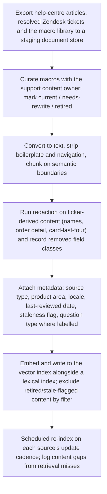
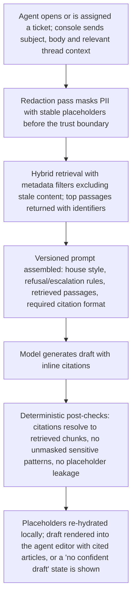
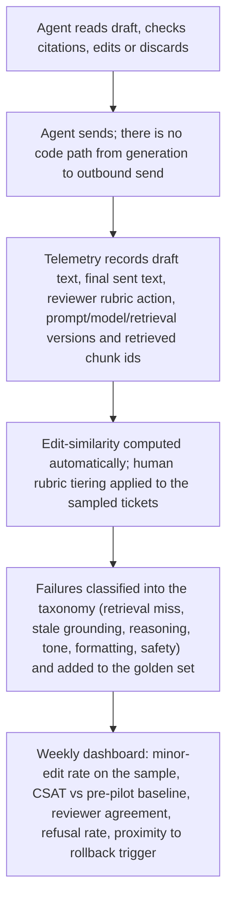

# Build Kickoff Package — Support ticket deflection & reply drafting

**Prepared for:** Acme Corp · Sponsor: VP Customer Operations  
**Prepared by:** Lab Intelligence, LLC  
**Date:** 2026-08-14 · **Plan version:** v1

> **Decision-support, not a guarantee.** This plan was generated by a bounded LLM pipeline from your evaluation inputs. It is a defensible starting point, not a validated design — every estimate is labeled and must be checked against reality. An independent critic audit is attached below and travels with this document; read it alongside the plan. No benchmark, vendor, or ROI figure here should be treated as verified.

---

## 1. Decision & rationale

**Verdict: BUILD** — composite 77/100 · Quick win

Composite 77/100. The case is carried by business value / impact and technical feasibility; the weakest dimension (risk & governance, 3/5) is manageable rather than blocking. Proceed to a scoped pilot against the acceptance bar.

Tier-1 agents answer roughly 40 recurring question types by hand from a drifted macro library. The build delivers a grounded draft-reply assistant inside the agent console: retrieval over the help centre, curated resolved-ticket exemplars and the surviving macros injects the correct facts and house style; direct prompting composes the reply with inline citations. Every draft lands in the agent's editor — never auto-sent — which satisfies the stated oversight and compliance constraints and doubles as the measurement instrument. The spine of delivery is the acceptance bar: ≥80% of drafts sent with only minor edits across 300 sampled tickets over four weeks, with CSAT not dropping against the pre-pilot baseline. Milestones are sequenced so that the edit-distance/reviewer-rating instrumentation exists before the model does, because without it the bar cannot be measured and the pilot cannot be judged. Redaction of names, order history and card-last-four happens before any text reaches a model, and the macro-library clean-up is treated as an explicit corpus curation task rather than an assumed input — stale macros are the root cause of the current inconsistency and would otherwise be reproduced at scale. Scope discipline: the thinnest scoreable loop first, then staged rollout (shadow → limited with review queue → full) with a pre-committed rollback trigger.

## 2. Architecture

**Pattern:** Direct prompting grounded with RAG over reference material · **Task shape:** generate

### Architecture — Architecture

**Pattern (from grounding): Direct prompting grounded with RAG over reference material.** Drafting needs grounding — retrieval supplies the correct facts and house style, prompting handles composition. The plan expands this pattern; it does not substitute another.

**Request path (interactive, in-console):**
1. Agent opens a ticket, or the console pre-fetches on assignment. Ticket body + subject + relevant thread history form the query.
2. **Redaction pass** runs first: customer names, order identifiers, and card-last-four patterns are masked with stable placeholders before any text leaves the trust boundary. Placeholders are re-hydrated locally in the rendered draft where the agent needs the real value.
3. **Retrieval:** hybrid lexical + embedding search over the indexed corpus, with metadata filters (source type, product area, locale, last-reviewed date). Filter out help-centre and macro chunks flagged stale so the drifted library cannot leak back into drafts.
4. **Prompt assembly:** a versioned template carrying house-style rules, refusal/escalation instructions, the retrieved passages with their identifiers, and a required citation format.
5. **Generation:** a general-purpose instruction-following model appropriate for interactive drafting. The model is a swappable component behind an internal interface — no vendor lock in the design.
6. **Post-checks (deterministic, cheap):** citation identifiers must resolve to retrieved chunks; unresolvable or absent citations downgrade the draft to a "low-confidence, unverified" state. Placeholder leakage and unmasked card-like patterns are checked before render.
7. **Render into the agent console editor.** Draft is pre-populated, cited articles listed alongside, and an explicit "no confident draft" state is shown rather than a guessed answer.

**Human-in-the-loop (launch condition, not an option):** every output passes through the agent as reviewer before it reaches a customer. Auto-send is not implemented — there is no code path from generation to outbound message. Reviewer actions (sent as-is, minor edit, major rewrite, discarded, escalated) are captured as first-class telemetry because they are the acceptance-bar measurement.

**Question-type coverage:** start with a prioritised subset of the ~40 recurring types (the highest-volume, lowest-ambiguity ones) rather than all of them. Out-of-scope types route to the existing manual flow with no draft shown.

**Non-goals for v1:** taking actions on customer accounts, autonomous deflection to customers without an agent, multi-turn conversation handling beyond the current ticket.

### Data pipeline — Data pipeline

**Sources (as stated):** three years of resolved Zendesk tickets, the public help centre, the current macro library.

**Ingestion:** document store → ingestion pipeline → vector index (embeddings) with metadata filters, synced on each source's update cadence (freshness requirement is periodic, so scheduled batch sync is sufficient; no streaming needed).

**Per-source treatment — these are deliberately different:**
- *Help centre (public, authoritative):* the primary grounding corpus. Convert to text, strip navigation/boilerplate, chunk on semantic headings, attach product-area and last-updated metadata. Public content carries no PII.
- *Macro library (drifted, untrusted):* do **not** ingest wholesale. This is a curation task with a named owner from support: each macro is marked current, needs-rewrite, or retired. Only current macros are indexed, and they are indexed primarily as *style and structure* exemplars. Retired macros are excluded by metadata filter. Reproducing the drift at machine speed is the main content risk in this case.
- *Resolved tickets (PII-bearing):* the richest source of real phrasing and edge cases, and the source of the golden set. Redact before indexing — names, addresses, order history detail, card-last-four. Keep a record of what class of field was removed per document for audit. Prefer agent-authored resolution replies over full threads to reduce noise and PII surface.

**Redaction as an engineered component, not a prompt instruction:** pattern-based detection for card-like and order-like tokens plus name detection, applied at ingestion (corpus) and at request time (live ticket). Measure it: hold back a manually annotated sample of tickets and report detection misses per class. Report residual misses honestly rather than claiming completeness; route high-sensitivity ticket categories away from the assistant entirely if miss rates are unacceptable to the compliance owner.

**Chunking and metadata:** metadata is decided before indexing because retrieval quality depends on it — source type, product area, locale, last-reviewed date, staleness flag, and for ticket exemplars the resolved question type. Question-type labelling on a sample enables per-type evaluation and per-type rollout gating.

**Refresh and drift:** scheduled re-index on help-centre publication cadence; a quarterly macro/help-centre review owned by support keeps staleness flags meaningful. Log retrieval misses (queries returning nothing above threshold) as a content-gap backlog — this is a durable side benefit that improves the help centre itself.

**Data volume note:** volume is large but the corpus is bounded reference material, so index size is manageable with a managed vector store or a self-hosted index; the choice is an implementation detail, not an architectural one.

### Integration — Integration notes

**Console surface:** the draft must appear where the agent already works, pre-populated in the reply editor with cited articles adjacent. A separate tab or external tool will not be used under time pressure and will silently kill adoption — and adoption is what the acceptance bar measures.

**Telemetry contract:** the integration must reliably emit (a) the draft text at render, (b) the final sent text, (c) the reviewer's rubric action, (d) whether a draft was shown at all. Without (a) and (b) as a matched pair, edit-similarity cannot be computed and the four-week measurement collapses into manual review. Validate this contract before model work begins.

**Latency:** interactive expectation. Pre-fetch on ticket assignment where the platform allows so retrieval and generation overlap the agent's reading time; show a clear pending state rather than blocking the editor. No latency figures are committed here — measure actual end-to-end time in shadow mode and set an internal target from observed data.

**Ticket-platform coupling:** keep retrieval, prompt assembly and generation behind an internal service interface so the console app is a thin client. This keeps the model and vector-store choices swappable and keeps a platform migration from becoming a rebuild.

**Content-system feedback loop:** retrieval misses and stale-flag hits should file into the help-centre content backlog automatically. This is where the drifted-macro root cause actually gets fixed.

**Volume:** high task volume (~1,100 tickets/week stated) with a bounded reference corpus; capacity planning should be based on measured per-draft cost observed in shadow mode rather than pre-committed estimates.

## 3. Workflows

### Corpus ingestion & indexing



### Draft generation at ticket open



### Human review & acceptance-bar measurement



## 4. Delivery plan

- **Phase 1 — Frame, access and first contact with the data** — Lock the acceptance bar with the owner, secure source access, inspect real samples by hand, and answer the compliance gating question on model exposure to redacted ticket text. _(~2 weeks (estimate))_. **Exit:** Written edit rubric (sent-as-is / minor / major / discarded) signed off by the support lead; prioritised question-type subset agreed; sample of resolved tickets, help-centre articles and macros manually inspected with quality findings documented; compliance owner has stated in writing what inference on redacted ticket text is permitted. · Risk owner: Support lead (rubric & scope) with compliance owner (data permission)
- **Phase 2 — Corpus curation, redaction and index** — Build the grounding corpus that is actually trustworthy: curated macros, cleaned help centre, redacted ticket exemplars, all indexed with the metadata retrieval will filter on. _(~3 weeks (estimate))_. **Exit:** Macro library triaged into current/needs-rewrite/retired by the content owner; index live with staleness filters enforced; redaction measured against a manually annotated hold-out sample with per-class miss rates reported to and accepted by the compliance owner; retrieval spot-checked on the prioritised question types. · Risk owner: Builder (pipeline) with support content owner (macro triage)
- **Phase 3 — Thinnest scoreable loop + golden set** — Retrieval + versioned prompt + deterministic post-checks producing cited drafts, scored offline against the bar before any agent sees it. _(~3 weeks (estimate))_. **Exit:** Golden set of a few hundred labelled tickets covering routine, edge and deliberately hard cases (including must-refuse/escalate) is running on every change; offline rubric scoring reported against the ≥80% minor-edit definition; failure taxonomy populated; prompts and config under version control with change-to-metric attribution. · Risk owner: Builder
- **Phase 4 — Console integration and shadow mode** — Draft-into-editor integration plus the matched draft/sent telemetry pair; run in shadow so drafts are scored without influencing customer replies. _(~3 weeks (estimate))_. **Exit:** Telemetry reliably emits draft text, final sent text and reviewer action for every ticket in scope; edit-similarity signal calibrated against the human rubric on a labelled sample; reviewer agreement measured across agents; observed end-to-end latency recorded and an internal interactive target set from that data; red-team findings on sensitive-record extraction and content-borne injection triaged into the golden set. · Risk owner: Builder with support lead (agent scoring time)
- **Phase 5 — Limited release behind the mandatory review queue** — Volunteer agent cohort uses drafts for real on the prioritised question types, with no auto-send path and the rollback trigger armed. _(~2 weeks (estimate))_. **Exit:** Rollback trigger (metric + threshold, including CSAT-vs-baseline and any confirmed PII or fabricated-policy incident) documented and agreed before release; audit trail verified end to end on live tickets; minor-edit rate and CSAT trending on the live dashboard with no rollback trigger breached. · Risk owner: Support lead with compliance owner
- **Phase 6 — Four-week acceptance measurement and go/stop decision** — Measure the stated bar on live traffic and decide, on evidence, whether to expand question-type coverage, iterate, or stop. _(~4 weeks (estimate))_. **Exit:** ≥80% of drafts sent with only minor edits across 300 sampled tickets over four weeks, with CSAT not dropped versus the pre-pilot baseline, reported with the rubric and reviewer-agreement evidence; if the bar is missed, failure-taxonomy counts drive a documented iterate-or-stop decision with the support owner. · Risk owner: Support lead (accountable owner of the bar)

### Delivery — Delivery

**Resourcing (as stated):** one builder for a quarter plus agent review time. That constraint drives the sequencing — no parallel workstreams, no speculative scope. Agent review time must be booked explicitly (rubric calibration, golden-set labelling, shadow-mode scoring); if it is not calendared, evaluation stalls and the quarter is spent building something unmeasurable.

**Sequencing principle:** measurement first, thinnest scoreable loop second, breadth last. The edit rubric and the console telemetry that captures reviewer actions are prerequisites to the model work, because the acceptance bar is a measurement of agent behaviour, not of model output in isolation.

**Scope control:** launch on a prioritised subset of the ~40 question types. Expanding type coverage is the reward for holding the bar, not a launch requirement. Out-of-scope types show no draft.

**Known critical path risks:**
- *Macro curation stalls.* It needs support-team hours and is the input to everything. Start it in week one and treat it as a tracked deliverable with a named owner, not background work.
- *Redaction evidence is unacceptable to compliance.* Surface this in Phase 1 with a measured sample, not at rollout.
- *Console integration effort is underestimated.* Ticketing-platform app surfaces constrain what UI is possible; validate the draft-into-editor and telemetry-capture path early with a stub rather than assuming it.
- *Rubric disagreement between agents.* Measure reviewer agreement; if it is low, the 80% number is noise. Fix the rubric before trusting the metric.

**Durations in the milestone table are estimates for a single builder and are listed in assumptions; treat them as planning inputs to be revised after Phase 1 data contact.**

**Definition of done for the quarter:** the bar has been measured on live traffic over four weeks with the review queue in place, the result is documented with the failure taxonomy, and a go/expand-or-stop decision has been taken with the support owner — regardless of which way it goes.

## 5. Requirements — PRD starters

One prompt per milestone. Each carries its own grounding, so it can be run standalone in Claude Code against the target repo. The milestone's exit criterion is the PRD's acceptance bar — don't loosen it there.

#### Phase 1 — Frame, access and first contact with the data — Lock the acceptance bar with the owner, secure source access, inspect real samples by hand, and answer the compliance gating question on model exposure to redacted ticket text.
**Exit criterion (this is the PRD's acceptance bar):** Written edit rubric (sent-as-is / minor / major / discarded) signed off by the support lead; prioritised question-type subset agreed; sample of resolved tickets, help-centre articles and macros manually inspected with quality findings documented; compliance owner has stated in writing what inference on redacted ticket text is permitted.
<details><summary>PRD starter prompt — paste into Claude Code</summary>
```text
Write a PRD for one milestone of an AI build. Ground everything in the context below and do not invent facts, benchmarks, or vendor requirements.
USE CASE: Support ticket deflection & reply drafting
PROBLEM: Tier-1 support answers the same 40-odd question types by hand. Agents copy from a macro library that has drifted out of date, so replies are inconsistent and the macro list itself is no longer trusted.
USERS: Tier-1 support agents; end customers see the resulting reply.
PROJECT ACCEPTANCE BAR: ≥80% of drafts sent with only minor edits, measured on 300 sampled tickets over four weeks; CSAT must not drop versus the pre-pilot baseline.
ARCHITECTURE PATTERN: Direct prompting grounded with RAG over reference material
TASK SHAPE: generate
MILESTONE: Phase 1 — Frame, access and first contact with the data — Lock the acceptance bar with the owner, secure source access, inspect real samples by hand, and answer the compliance gating question on model exposure to redacted ticket text.
MILESTONE EXIT CRITERION: Written edit rubric (sent-as-is / minor / major / discarded) signed off by the support lead; prioritised question-type subset agreed; sample of resolved tickets, help-centre articles and macros manually inspected with quality findings documented; compliance owner has stated in writing what inference on redacted ticket text is permitted.
RISK OWNER: Support lead (rubric & scope) with compliance owner (data permission)
ALL MILESTONES (for sequencing context):
  Phase 1 — Frame, access and first contact with the data: Lock the acceptance bar with the owner, secure source access, inspect real samples by hand, and answer the compliance gating question on model exposure to redacted ticket text. — exit: Written edit rubric (sent-as-is / minor / major / discarded) signed off by the support lead; prioritised question-type subset agreed; sample of resolved tickets, help-centre articles and macros manually inspected with quality findings documented; compliance owner has stated in writing what inference on redacted ticket text is permitted.
  Phase 2 — Corpus curation, redaction and index: Build the grounding corpus that is actually trustworthy: curated macros, cleaned help centre, redacted ticket exemplars, all indexed with the metadata retrieval will filter on. — exit: Macro library triaged into current/needs-rewrite/retired by the content owner; index live with staleness filters enforced; redaction measured against a manually annotated hold-out sample with per-class miss rates reported to and accepted by the compliance owner; retrieval spot-checked on the prioritised question types.
  Phase 3 — Thinnest scoreable loop + golden set: Retrieval + versioned prompt + deterministic post-checks producing cited drafts, scored offline against the bar before any agent sees it. — exit: Golden set of a few hundred labelled tickets covering routine, edge and deliberately hard cases (including must-refuse/escalate) is running on every change; offline rubric scoring reported against the ≥80% minor-edit definition; failure taxonomy populated; prompts and config under version control with change-to-metric attribution.
  Phase 4 — Console integration and shadow mode: Draft-into-editor integration plus the matched draft/sent telemetry pair; run in shadow so drafts are scored without influencing customer replies. — exit: Telemetry reliably emits draft text, final sent text and reviewer action for every ticket in scope; edit-similarity signal calibrated against the human rubric on a labelled sample; reviewer agreement measured across agents; observed end-to-end latency recorded and an internal interactive target set from that data; red-team findings on sensitive-record extraction and content-borne injection triaged into the golden set.
  Phase 5 — Limited release behind the mandatory review queue: Volunteer agent cohort uses drafts for real on the prioritised question types, with no auto-send path and the rollback trigger armed. — exit: Rollback trigger (metric + threshold, including CSAT-vs-baseline and any confirmed PII or fabricated-policy incident) documented and agreed before release; audit trail verified end to end on live tickets; minor-edit rate and CSAT trending on the live dashboard with no rollback trigger breached.
  Phase 6 — Four-week acceptance measurement and go/stop decision: Measure the stated bar on live traffic and decide, on evidence, whether to expand question-type coverage, iterate, or stop. — exit: ≥80% of drafts sent with only minor edits across 300 sampled tickets over four weeks, with CSAT not dropped versus the pre-pilot baseline, reported with the rubric and reviewer-agreement evidence; if the bar is missed, failure-taxonomy counts drive a documented iterate-or-stop decision with the support owner.
KNOWN GAPS FROM THE INDEPENDENT AUDIT (address or explicitly defer):
  - Rollback is a trigger, not a procedure: The plan repeatedly pre-commits 'the metric and threshold that pauses the assistant' but never specifies what pausing means operationally: feature-flag kill switch, who can pull it, whether in-flight drafts are withdrawn, whether agents revert to the (still-drifted) macro library, and what re-entry criteria apply. Add a named kill switch, an on-call owner, and a documented re-entry gate.
  - No cost or unit-economics guardrail: Cost scored 4 and the budget is a support-tooling line, yet the plan explicitly refuses any cost estimate ('capacity planning should be based on measured per-draft cost observed in shadow mode'). At ~1,100 tickets/week with pre-fetch on assignment (drafts generated even for tickets agents never use), there is no ceiling, no budget alert, and no decision rule if per-draft cost exceeds the 9-minute-median saving. Add a measured cost gate in Phase 4 with a threshold that forces scope reduction.
  - Unhandled failure mode: retrieval/model unavailability and post-check false negatives: The design has a 'no confident draft' state for low confidence, but no stated behaviour when retrieval or the inference provider is down or slow past the interactive expectation, and no handling of the case where deterministic post-checks pass but the draft is confidently wrong (citation resolves yet does not support the claim). Specify degradation behaviour and a claim-support check or explicit agent prompt to verify facts.
ASSUMPTIONS ALREADY LABELED IN THE PLAN (do not silently promote to fact):
  - All phase durations are planning estimates for one builder over a quarter, not commitments; they should be revised after Phase 1 contact with the real data.
  - Agent review time for rubric calibration, golden-set labelling and shadow-mode scoring is explicitly calendared; if it is not, the evaluation timeline slips regardless of build progress.
  - A named support content owner is available to triage the drifted macro library within Phase 2; this is treated as a tracked deliverable, not background work.
  - Export or API access to three years of resolved Zendesk tickets, the help centre and the macro library can be granted within Phase 1.
  - The ticketing console permits an app surface that pre-populates the reply editor and emits both the rendered draft and the final sent text; this must be validated with a stub in Phase 4 rather than assumed.
  - Sending redacted ticket text to a third-party inference provider is permissible, or an equivalent self-hosted option is available; this is a Phase 1 gating question, not an assumption to carry forward.
Produce: Context · Scope (in/out) · Acceptance criteria (derived from the exit criterion, each independently testable) · Dependencies · Risks and mitigations · Open questions. Mark every estimate as an estimate.
```
</details>

#### Phase 2 — Corpus curation, redaction and index — Build the grounding corpus that is actually trustworthy: curated macros, cleaned help centre, redacted ticket exemplars, all indexed with the metadata retrieval will filter on.
**Exit criterion (this is the PRD's acceptance bar):** Macro library triaged into current/needs-rewrite/retired by the content owner; index live with staleness filters enforced; redaction measured against a manually annotated hold-out sample with per-class miss rates reported to and accepted by the compliance owner; retrieval spot-checked on the prioritised question types.
<details><summary>PRD starter prompt — paste into Claude Code</summary>
```text
Write a PRD for one milestone of an AI build. Ground everything in the context below and do not invent facts, benchmarks, or vendor requirements.
USE CASE: Support ticket deflection & reply drafting
PROBLEM: Tier-1 support answers the same 40-odd question types by hand. Agents copy from a macro library that has drifted out of date, so replies are inconsistent and the macro list itself is no longer trusted.
USERS: Tier-1 support agents; end customers see the resulting reply.
PROJECT ACCEPTANCE BAR: ≥80% of drafts sent with only minor edits, measured on 300 sampled tickets over four weeks; CSAT must not drop versus the pre-pilot baseline.
ARCHITECTURE PATTERN: Direct prompting grounded with RAG over reference material
TASK SHAPE: generate
MILESTONE: Phase 2 — Corpus curation, redaction and index — Build the grounding corpus that is actually trustworthy: curated macros, cleaned help centre, redacted ticket exemplars, all indexed with the metadata retrieval will filter on.
MILESTONE EXIT CRITERION: Macro library triaged into current/needs-rewrite/retired by the content owner; index live with staleness filters enforced; redaction measured against a manually annotated hold-out sample with per-class miss rates reported to and accepted by the compliance owner; retrieval spot-checked on the prioritised question types.
RISK OWNER: Builder (pipeline) with support content owner (macro triage)
ALL MILESTONES (for sequencing context):
  Phase 1 — Frame, access and first contact with the data: Lock the acceptance bar with the owner, secure source access, inspect real samples by hand, and answer the compliance gating question on model exposure to redacted ticket text. — exit: Written edit rubric (sent-as-is / minor / major / discarded) signed off by the support lead; prioritised question-type subset agreed; sample of resolved tickets, help-centre articles and macros manually inspected with quality findings documented; compliance owner has stated in writing what inference on redacted ticket text is permitted.
  Phase 2 — Corpus curation, redaction and index: Build the grounding corpus that is actually trustworthy: curated macros, cleaned help centre, redacted ticket exemplars, all indexed with the metadata retrieval will filter on. — exit: Macro library triaged into current/needs-rewrite/retired by the content owner; index live with staleness filters enforced; redaction measured against a manually annotated hold-out sample with per-class miss rates reported to and accepted by the compliance owner; retrieval spot-checked on the prioritised question types.
  Phase 3 — Thinnest scoreable loop + golden set: Retrieval + versioned prompt + deterministic post-checks producing cited drafts, scored offline against the bar before any agent sees it. — exit: Golden set of a few hundred labelled tickets covering routine, edge and deliberately hard cases (including must-refuse/escalate) is running on every change; offline rubric scoring reported against the ≥80% minor-edit definition; failure taxonomy populated; prompts and config under version control with change-to-metric attribution.
  Phase 4 — Console integration and shadow mode: Draft-into-editor integration plus the matched draft/sent telemetry pair; run in shadow so drafts are scored without influencing customer replies. — exit: Telemetry reliably emits draft text, final sent text and reviewer action for every ticket in scope; edit-similarity signal calibrated against the human rubric on a labelled sample; reviewer agreement measured across agents; observed end-to-end latency recorded and an internal interactive target set from that data; red-team findings on sensitive-record extraction and content-borne injection triaged into the golden set.
  Phase 5 — Limited release behind the mandatory review queue: Volunteer agent cohort uses drafts for real on the prioritised question types, with no auto-send path and the rollback trigger armed. — exit: Rollback trigger (metric + threshold, including CSAT-vs-baseline and any confirmed PII or fabricated-policy incident) documented and agreed before release; audit trail verified end to end on live tickets; minor-edit rate and CSAT trending on the live dashboard with no rollback trigger breached.
  Phase 6 — Four-week acceptance measurement and go/stop decision: Measure the stated bar on live traffic and decide, on evidence, whether to expand question-type coverage, iterate, or stop. — exit: ≥80% of drafts sent with only minor edits across 300 sampled tickets over four weeks, with CSAT not dropped versus the pre-pilot baseline, reported with the rubric and reviewer-agreement evidence; if the bar is missed, failure-taxonomy counts drive a documented iterate-or-stop decision with the support owner.
KNOWN GAPS FROM THE INDEPENDENT AUDIT (address or explicitly defer):
  - Rollback is a trigger, not a procedure: The plan repeatedly pre-commits 'the metric and threshold that pauses the assistant' but never specifies what pausing means operationally: feature-flag kill switch, who can pull it, whether in-flight drafts are withdrawn, whether agents revert to the (still-drifted) macro library, and what re-entry criteria apply. Add a named kill switch, an on-call owner, and a documented re-entry gate.
  - No cost or unit-economics guardrail: Cost scored 4 and the budget is a support-tooling line, yet the plan explicitly refuses any cost estimate ('capacity planning should be based on measured per-draft cost observed in shadow mode'). At ~1,100 tickets/week with pre-fetch on assignment (drafts generated even for tickets agents never use), there is no ceiling, no budget alert, and no decision rule if per-draft cost exceeds the 9-minute-median saving. Add a measured cost gate in Phase 4 with a threshold that forces scope reduction.
  - Unhandled failure mode: retrieval/model unavailability and post-check false negatives: The design has a 'no confident draft' state for low confidence, but no stated behaviour when retrieval or the inference provider is down or slow past the interactive expectation, and no handling of the case where deterministic post-checks pass but the draft is confidently wrong (citation resolves yet does not support the claim). Specify degradation behaviour and a claim-support check or explicit agent prompt to verify facts.
ASSUMPTIONS ALREADY LABELED IN THE PLAN (do not silently promote to fact):
  - All phase durations are planning estimates for one builder over a quarter, not commitments; they should be revised after Phase 1 contact with the real data.
  - Agent review time for rubric calibration, golden-set labelling and shadow-mode scoring is explicitly calendared; if it is not, the evaluation timeline slips regardless of build progress.
  - A named support content owner is available to triage the drifted macro library within Phase 2; this is treated as a tracked deliverable, not background work.
  - Export or API access to three years of resolved Zendesk tickets, the help centre and the macro library can be granted within Phase 1.
  - The ticketing console permits an app surface that pre-populates the reply editor and emits both the rendered draft and the final sent text; this must be validated with a stub in Phase 4 rather than assumed.
  - Sending redacted ticket text to a third-party inference provider is permissible, or an equivalent self-hosted option is available; this is a Phase 1 gating question, not an assumption to carry forward.
Produce: Context · Scope (in/out) · Acceptance criteria (derived from the exit criterion, each independently testable) · Dependencies · Risks and mitigations · Open questions. Mark every estimate as an estimate.
```
</details>

#### Phase 3 — Thinnest scoreable loop + golden set — Retrieval + versioned prompt + deterministic post-checks producing cited drafts, scored offline against the bar before any agent sees it.
**Exit criterion (this is the PRD's acceptance bar):** Golden set of a few hundred labelled tickets covering routine, edge and deliberately hard cases (including must-refuse/escalate) is running on every change; offline rubric scoring reported against the ≥80% minor-edit definition; failure taxonomy populated; prompts and config under version control with change-to-metric attribution.
<details><summary>PRD starter prompt — paste into Claude Code</summary>
```text
Write a PRD for one milestone of an AI build. Ground everything in the context below and do not invent facts, benchmarks, or vendor requirements.
USE CASE: Support ticket deflection & reply drafting
PROBLEM: Tier-1 support answers the same 40-odd question types by hand. Agents copy from a macro library that has drifted out of date, so replies are inconsistent and the macro list itself is no longer trusted.
USERS: Tier-1 support agents; end customers see the resulting reply.
PROJECT ACCEPTANCE BAR: ≥80% of drafts sent with only minor edits, measured on 300 sampled tickets over four weeks; CSAT must not drop versus the pre-pilot baseline.
ARCHITECTURE PATTERN: Direct prompting grounded with RAG over reference material
TASK SHAPE: generate
MILESTONE: Phase 3 — Thinnest scoreable loop + golden set — Retrieval + versioned prompt + deterministic post-checks producing cited drafts, scored offline against the bar before any agent sees it.
MILESTONE EXIT CRITERION: Golden set of a few hundred labelled tickets covering routine, edge and deliberately hard cases (including must-refuse/escalate) is running on every change; offline rubric scoring reported against the ≥80% minor-edit definition; failure taxonomy populated; prompts and config under version control with change-to-metric attribution.
RISK OWNER: Builder
ALL MILESTONES (for sequencing context):
  Phase 1 — Frame, access and first contact with the data: Lock the acceptance bar with the owner, secure source access, inspect real samples by hand, and answer the compliance gating question on model exposure to redacted ticket text. — exit: Written edit rubric (sent-as-is / minor / major / discarded) signed off by the support lead; prioritised question-type subset agreed; sample of resolved tickets, help-centre articles and macros manually inspected with quality findings documented; compliance owner has stated in writing what inference on redacted ticket text is permitted.
  Phase 2 — Corpus curation, redaction and index: Build the grounding corpus that is actually trustworthy: curated macros, cleaned help centre, redacted ticket exemplars, all indexed with the metadata retrieval will filter on. — exit: Macro library triaged into current/needs-rewrite/retired by the content owner; index live with staleness filters enforced; redaction measured against a manually annotated hold-out sample with per-class miss rates reported to and accepted by the compliance owner; retrieval spot-checked on the prioritised question types.
  Phase 3 — Thinnest scoreable loop + golden set: Retrieval + versioned prompt + deterministic post-checks producing cited drafts, scored offline against the bar before any agent sees it. — exit: Golden set of a few hundred labelled tickets covering routine, edge and deliberately hard cases (including must-refuse/escalate) is running on every change; offline rubric scoring reported against the ≥80% minor-edit definition; failure taxonomy populated; prompts and config under version control with change-to-metric attribution.
  Phase 4 — Console integration and shadow mode: Draft-into-editor integration plus the matched draft/sent telemetry pair; run in shadow so drafts are scored without influencing customer replies. — exit: Telemetry reliably emits draft text, final sent text and reviewer action for every ticket in scope; edit-similarity signal calibrated against the human rubric on a labelled sample; reviewer agreement measured across agents; observed end-to-end latency recorded and an internal interactive target set from that data; red-team findings on sensitive-record extraction and content-borne injection triaged into the golden set.
  Phase 5 — Limited release behind the mandatory review queue: Volunteer agent cohort uses drafts for real on the prioritised question types, with no auto-send path and the rollback trigger armed. — exit: Rollback trigger (metric + threshold, including CSAT-vs-baseline and any confirmed PII or fabricated-policy incident) documented and agreed before release; audit trail verified end to end on live tickets; minor-edit rate and CSAT trending on the live dashboard with no rollback trigger breached.
  Phase 6 — Four-week acceptance measurement and go/stop decision: Measure the stated bar on live traffic and decide, on evidence, whether to expand question-type coverage, iterate, or stop. — exit: ≥80% of drafts sent with only minor edits across 300 sampled tickets over four weeks, with CSAT not dropped versus the pre-pilot baseline, reported with the rubric and reviewer-agreement evidence; if the bar is missed, failure-taxonomy counts drive a documented iterate-or-stop decision with the support owner.
KNOWN GAPS FROM THE INDEPENDENT AUDIT (address or explicitly defer):
  - Rollback is a trigger, not a procedure: The plan repeatedly pre-commits 'the metric and threshold that pauses the assistant' but never specifies what pausing means operationally: feature-flag kill switch, who can pull it, whether in-flight drafts are withdrawn, whether agents revert to the (still-drifted) macro library, and what re-entry criteria apply. Add a named kill switch, an on-call owner, and a documented re-entry gate.
  - No cost or unit-economics guardrail: Cost scored 4 and the budget is a support-tooling line, yet the plan explicitly refuses any cost estimate ('capacity planning should be based on measured per-draft cost observed in shadow mode'). At ~1,100 tickets/week with pre-fetch on assignment (drafts generated even for tickets agents never use), there is no ceiling, no budget alert, and no decision rule if per-draft cost exceeds the 9-minute-median saving. Add a measured cost gate in Phase 4 with a threshold that forces scope reduction.
  - Unhandled failure mode: retrieval/model unavailability and post-check false negatives: The design has a 'no confident draft' state for low confidence, but no stated behaviour when retrieval or the inference provider is down or slow past the interactive expectation, and no handling of the case where deterministic post-checks pass but the draft is confidently wrong (citation resolves yet does not support the claim). Specify degradation behaviour and a claim-support check or explicit agent prompt to verify facts.
ASSUMPTIONS ALREADY LABELED IN THE PLAN (do not silently promote to fact):
  - All phase durations are planning estimates for one builder over a quarter, not commitments; they should be revised after Phase 1 contact with the real data.
  - Agent review time for rubric calibration, golden-set labelling and shadow-mode scoring is explicitly calendared; if it is not, the evaluation timeline slips regardless of build progress.
  - A named support content owner is available to triage the drifted macro library within Phase 2; this is treated as a tracked deliverable, not background work.
  - Export or API access to three years of resolved Zendesk tickets, the help centre and the macro library can be granted within Phase 1.
  - The ticketing console permits an app surface that pre-populates the reply editor and emits both the rendered draft and the final sent text; this must be validated with a stub in Phase 4 rather than assumed.
  - Sending redacted ticket text to a third-party inference provider is permissible, or an equivalent self-hosted option is available; this is a Phase 1 gating question, not an assumption to carry forward.
Produce: Context · Scope (in/out) · Acceptance criteria (derived from the exit criterion, each independently testable) · Dependencies · Risks and mitigations · Open questions. Mark every estimate as an estimate.
```
</details>

#### Phase 4 — Console integration and shadow mode — Draft-into-editor integration plus the matched draft/sent telemetry pair; run in shadow so drafts are scored without influencing customer replies.
**Exit criterion (this is the PRD's acceptance bar):** Telemetry reliably emits draft text, final sent text and reviewer action for every ticket in scope; edit-similarity signal calibrated against the human rubric on a labelled sample; reviewer agreement measured across agents; observed end-to-end latency recorded and an internal interactive target set from that data; red-team findings on sensitive-record extraction and content-borne injection triaged into the golden set.
<details><summary>PRD starter prompt — paste into Claude Code</summary>
```text
Write a PRD for one milestone of an AI build. Ground everything in the context below and do not invent facts, benchmarks, or vendor requirements.
USE CASE: Support ticket deflection & reply drafting
PROBLEM: Tier-1 support answers the same 40-odd question types by hand. Agents copy from a macro library that has drifted out of date, so replies are inconsistent and the macro list itself is no longer trusted.
USERS: Tier-1 support agents; end customers see the resulting reply.
PROJECT ACCEPTANCE BAR: ≥80% of drafts sent with only minor edits, measured on 300 sampled tickets over four weeks; CSAT must not drop versus the pre-pilot baseline.
ARCHITECTURE PATTERN: Direct prompting grounded with RAG over reference material
TASK SHAPE: generate
MILESTONE: Phase 4 — Console integration and shadow mode — Draft-into-editor integration plus the matched draft/sent telemetry pair; run in shadow so drafts are scored without influencing customer replies.
MILESTONE EXIT CRITERION: Telemetry reliably emits draft text, final sent text and reviewer action for every ticket in scope; edit-similarity signal calibrated against the human rubric on a labelled sample; reviewer agreement measured across agents; observed end-to-end latency recorded and an internal interactive target set from that data; red-team findings on sensitive-record extraction and content-borne injection triaged into the golden set.
RISK OWNER: Builder with support lead (agent scoring time)
ALL MILESTONES (for sequencing context):
  Phase 1 — Frame, access and first contact with the data: Lock the acceptance bar with the owner, secure source access, inspect real samples by hand, and answer the compliance gating question on model exposure to redacted ticket text. — exit: Written edit rubric (sent-as-is / minor / major / discarded) signed off by the support lead; prioritised question-type subset agreed; sample of resolved tickets, help-centre articles and macros manually inspected with quality findings documented; compliance owner has stated in writing what inference on redacted ticket text is permitted.
  Phase 2 — Corpus curation, redaction and index: Build the grounding corpus that is actually trustworthy: curated macros, cleaned help centre, redacted ticket exemplars, all indexed with the metadata retrieval will filter on. — exit: Macro library triaged into current/needs-rewrite/retired by the content owner; index live with staleness filters enforced; redaction measured against a manually annotated hold-out sample with per-class miss rates reported to and accepted by the compliance owner; retrieval spot-checked on the prioritised question types.
  Phase 3 — Thinnest scoreable loop + golden set: Retrieval + versioned prompt + deterministic post-checks producing cited drafts, scored offline against the bar before any agent sees it. — exit: Golden set of a few hundred labelled tickets covering routine, edge and deliberately hard cases (including must-refuse/escalate) is running on every change; offline rubric scoring reported against the ≥80% minor-edit definition; failure taxonomy populated; prompts and config under version control with change-to-metric attribution.
  Phase 4 — Console integration and shadow mode: Draft-into-editor integration plus the matched draft/sent telemetry pair; run in shadow so drafts are scored without influencing customer replies. — exit: Telemetry reliably emits draft text, final sent text and reviewer action for every ticket in scope; edit-similarity signal calibrated against the human rubric on a labelled sample; reviewer agreement measured across agents; observed end-to-end latency recorded and an internal interactive target set from that data; red-team findings on sensitive-record extraction and content-borne injection triaged into the golden set.
  Phase 5 — Limited release behind the mandatory review queue: Volunteer agent cohort uses drafts for real on the prioritised question types, with no auto-send path and the rollback trigger armed. — exit: Rollback trigger (metric + threshold, including CSAT-vs-baseline and any confirmed PII or fabricated-policy incident) documented and agreed before release; audit trail verified end to end on live tickets; minor-edit rate and CSAT trending on the live dashboard with no rollback trigger breached.
  Phase 6 — Four-week acceptance measurement and go/stop decision: Measure the stated bar on live traffic and decide, on evidence, whether to expand question-type coverage, iterate, or stop. — exit: ≥80% of drafts sent with only minor edits across 300 sampled tickets over four weeks, with CSAT not dropped versus the pre-pilot baseline, reported with the rubric and reviewer-agreement evidence; if the bar is missed, failure-taxonomy counts drive a documented iterate-or-stop decision with the support owner.
KNOWN GAPS FROM THE INDEPENDENT AUDIT (address or explicitly defer):
  - Rollback is a trigger, not a procedure: The plan repeatedly pre-commits 'the metric and threshold that pauses the assistant' but never specifies what pausing means operationally: feature-flag kill switch, who can pull it, whether in-flight drafts are withdrawn, whether agents revert to the (still-drifted) macro library, and what re-entry criteria apply. Add a named kill switch, an on-call owner, and a documented re-entry gate.
  - No cost or unit-economics guardrail: Cost scored 4 and the budget is a support-tooling line, yet the plan explicitly refuses any cost estimate ('capacity planning should be based on measured per-draft cost observed in shadow mode'). At ~1,100 tickets/week with pre-fetch on assignment (drafts generated even for tickets agents never use), there is no ceiling, no budget alert, and no decision rule if per-draft cost exceeds the 9-minute-median saving. Add a measured cost gate in Phase 4 with a threshold that forces scope reduction.
  - Unhandled failure mode: retrieval/model unavailability and post-check false negatives: The design has a 'no confident draft' state for low confidence, but no stated behaviour when retrieval or the inference provider is down or slow past the interactive expectation, and no handling of the case where deterministic post-checks pass but the draft is confidently wrong (citation resolves yet does not support the claim). Specify degradation behaviour and a claim-support check or explicit agent prompt to verify facts.
ASSUMPTIONS ALREADY LABELED IN THE PLAN (do not silently promote to fact):
  - All phase durations are planning estimates for one builder over a quarter, not commitments; they should be revised after Phase 1 contact with the real data.
  - Agent review time for rubric calibration, golden-set labelling and shadow-mode scoring is explicitly calendared; if it is not, the evaluation timeline slips regardless of build progress.
  - A named support content owner is available to triage the drifted macro library within Phase 2; this is treated as a tracked deliverable, not background work.
  - Export or API access to three years of resolved Zendesk tickets, the help centre and the macro library can be granted within Phase 1.
  - The ticketing console permits an app surface that pre-populates the reply editor and emits both the rendered draft and the final sent text; this must be validated with a stub in Phase 4 rather than assumed.
  - Sending redacted ticket text to a third-party inference provider is permissible, or an equivalent self-hosted option is available; this is a Phase 1 gating question, not an assumption to carry forward.
Produce: Context · Scope (in/out) · Acceptance criteria (derived from the exit criterion, each independently testable) · Dependencies · Risks and mitigations · Open questions. Mark every estimate as an estimate.
```
</details>

#### Phase 5 — Limited release behind the mandatory review queue — Volunteer agent cohort uses drafts for real on the prioritised question types, with no auto-send path and the rollback trigger armed.
**Exit criterion (this is the PRD's acceptance bar):** Rollback trigger (metric + threshold, including CSAT-vs-baseline and any confirmed PII or fabricated-policy incident) documented and agreed before release; audit trail verified end to end on live tickets; minor-edit rate and CSAT trending on the live dashboard with no rollback trigger breached.
<details><summary>PRD starter prompt — paste into Claude Code</summary>
```text
Write a PRD for one milestone of an AI build. Ground everything in the context below and do not invent facts, benchmarks, or vendor requirements.
USE CASE: Support ticket deflection & reply drafting
PROBLEM: Tier-1 support answers the same 40-odd question types by hand. Agents copy from a macro library that has drifted out of date, so replies are inconsistent and the macro list itself is no longer trusted.
USERS: Tier-1 support agents; end customers see the resulting reply.
PROJECT ACCEPTANCE BAR: ≥80% of drafts sent with only minor edits, measured on 300 sampled tickets over four weeks; CSAT must not drop versus the pre-pilot baseline.
ARCHITECTURE PATTERN: Direct prompting grounded with RAG over reference material
TASK SHAPE: generate
MILESTONE: Phase 5 — Limited release behind the mandatory review queue — Volunteer agent cohort uses drafts for real on the prioritised question types, with no auto-send path and the rollback trigger armed.
MILESTONE EXIT CRITERION: Rollback trigger (metric + threshold, including CSAT-vs-baseline and any confirmed PII or fabricated-policy incident) documented and agreed before release; audit trail verified end to end on live tickets; minor-edit rate and CSAT trending on the live dashboard with no rollback trigger breached.
RISK OWNER: Support lead with compliance owner
ALL MILESTONES (for sequencing context):
  Phase 1 — Frame, access and first contact with the data: Lock the acceptance bar with the owner, secure source access, inspect real samples by hand, and answer the compliance gating question on model exposure to redacted ticket text. — exit: Written edit rubric (sent-as-is / minor / major / discarded) signed off by the support lead; prioritised question-type subset agreed; sample of resolved tickets, help-centre articles and macros manually inspected with quality findings documented; compliance owner has stated in writing what inference on redacted ticket text is permitted.
  Phase 2 — Corpus curation, redaction and index: Build the grounding corpus that is actually trustworthy: curated macros, cleaned help centre, redacted ticket exemplars, all indexed with the metadata retrieval will filter on. — exit: Macro library triaged into current/needs-rewrite/retired by the content owner; index live with staleness filters enforced; redaction measured against a manually annotated hold-out sample with per-class miss rates reported to and accepted by the compliance owner; retrieval spot-checked on the prioritised question types.
  Phase 3 — Thinnest scoreable loop + golden set: Retrieval + versioned prompt + deterministic post-checks producing cited drafts, scored offline against the bar before any agent sees it. — exit: Golden set of a few hundred labelled tickets covering routine, edge and deliberately hard cases (including must-refuse/escalate) is running on every change; offline rubric scoring reported against the ≥80% minor-edit definition; failure taxonomy populated; prompts and config under version control with change-to-metric attribution.
  Phase 4 — Console integration and shadow mode: Draft-into-editor integration plus the matched draft/sent telemetry pair; run in shadow so drafts are scored without influencing customer replies. — exit: Telemetry reliably emits draft text, final sent text and reviewer action for every ticket in scope; edit-similarity signal calibrated against the human rubric on a labelled sample; reviewer agreement measured across agents; observed end-to-end latency recorded and an internal interactive target set from that data; red-team findings on sensitive-record extraction and content-borne injection triaged into the golden set.
  Phase 5 — Limited release behind the mandatory review queue: Volunteer agent cohort uses drafts for real on the prioritised question types, with no auto-send path and the rollback trigger armed. — exit: Rollback trigger (metric + threshold, including CSAT-vs-baseline and any confirmed PII or fabricated-policy incident) documented and agreed before release; audit trail verified end to end on live tickets; minor-edit rate and CSAT trending on the live dashboard with no rollback trigger breached.
  Phase 6 — Four-week acceptance measurement and go/stop decision: Measure the stated bar on live traffic and decide, on evidence, whether to expand question-type coverage, iterate, or stop. — exit: ≥80% of drafts sent with only minor edits across 300 sampled tickets over four weeks, with CSAT not dropped versus the pre-pilot baseline, reported with the rubric and reviewer-agreement evidence; if the bar is missed, failure-taxonomy counts drive a documented iterate-or-stop decision with the support owner.
KNOWN GAPS FROM THE INDEPENDENT AUDIT (address or explicitly defer):
  - Rollback is a trigger, not a procedure: The plan repeatedly pre-commits 'the metric and threshold that pauses the assistant' but never specifies what pausing means operationally: feature-flag kill switch, who can pull it, whether in-flight drafts are withdrawn, whether agents revert to the (still-drifted) macro library, and what re-entry criteria apply. Add a named kill switch, an on-call owner, and a documented re-entry gate.
  - No cost or unit-economics guardrail: Cost scored 4 and the budget is a support-tooling line, yet the plan explicitly refuses any cost estimate ('capacity planning should be based on measured per-draft cost observed in shadow mode'). At ~1,100 tickets/week with pre-fetch on assignment (drafts generated even for tickets agents never use), there is no ceiling, no budget alert, and no decision rule if per-draft cost exceeds the 9-minute-median saving. Add a measured cost gate in Phase 4 with a threshold that forces scope reduction.
  - Unhandled failure mode: retrieval/model unavailability and post-check false negatives: The design has a 'no confident draft' state for low confidence, but no stated behaviour when retrieval or the inference provider is down or slow past the interactive expectation, and no handling of the case where deterministic post-checks pass but the draft is confidently wrong (citation resolves yet does not support the claim). Specify degradation behaviour and a claim-support check or explicit agent prompt to verify facts.
ASSUMPTIONS ALREADY LABELED IN THE PLAN (do not silently promote to fact):
  - All phase durations are planning estimates for one builder over a quarter, not commitments; they should be revised after Phase 1 contact with the real data.
  - Agent review time for rubric calibration, golden-set labelling and shadow-mode scoring is explicitly calendared; if it is not, the evaluation timeline slips regardless of build progress.
  - A named support content owner is available to triage the drifted macro library within Phase 2; this is treated as a tracked deliverable, not background work.
  - Export or API access to three years of resolved Zendesk tickets, the help centre and the macro library can be granted within Phase 1.
  - The ticketing console permits an app surface that pre-populates the reply editor and emits both the rendered draft and the final sent text; this must be validated with a stub in Phase 4 rather than assumed.
  - Sending redacted ticket text to a third-party inference provider is permissible, or an equivalent self-hosted option is available; this is a Phase 1 gating question, not an assumption to carry forward.
Produce: Context · Scope (in/out) · Acceptance criteria (derived from the exit criterion, each independently testable) · Dependencies · Risks and mitigations · Open questions. Mark every estimate as an estimate.
```
</details>

#### Phase 6 — Four-week acceptance measurement and go/stop decision — Measure the stated bar on live traffic and decide, on evidence, whether to expand question-type coverage, iterate, or stop.
**Exit criterion (this is the PRD's acceptance bar):** ≥80% of drafts sent with only minor edits across 300 sampled tickets over four weeks, with CSAT not dropped versus the pre-pilot baseline, reported with the rubric and reviewer-agreement evidence; if the bar is missed, failure-taxonomy counts drive a documented iterate-or-stop decision with the support owner.
<details><summary>PRD starter prompt — paste into Claude Code</summary>
```text
Write a PRD for one milestone of an AI build. Ground everything in the context below and do not invent facts, benchmarks, or vendor requirements.
USE CASE: Support ticket deflection & reply drafting
PROBLEM: Tier-1 support answers the same 40-odd question types by hand. Agents copy from a macro library that has drifted out of date, so replies are inconsistent and the macro list itself is no longer trusted.
USERS: Tier-1 support agents; end customers see the resulting reply.
PROJECT ACCEPTANCE BAR: ≥80% of drafts sent with only minor edits, measured on 300 sampled tickets over four weeks; CSAT must not drop versus the pre-pilot baseline.
ARCHITECTURE PATTERN: Direct prompting grounded with RAG over reference material
TASK SHAPE: generate
MILESTONE: Phase 6 — Four-week acceptance measurement and go/stop decision — Measure the stated bar on live traffic and decide, on evidence, whether to expand question-type coverage, iterate, or stop.
MILESTONE EXIT CRITERION: ≥80% of drafts sent with only minor edits across 300 sampled tickets over four weeks, with CSAT not dropped versus the pre-pilot baseline, reported with the rubric and reviewer-agreement evidence; if the bar is missed, failure-taxonomy counts drive a documented iterate-or-stop decision with the support owner.
RISK OWNER: Support lead (accountable owner of the bar)
ALL MILESTONES (for sequencing context):
  Phase 1 — Frame, access and first contact with the data: Lock the acceptance bar with the owner, secure source access, inspect real samples by hand, and answer the compliance gating question on model exposure to redacted ticket text. — exit: Written edit rubric (sent-as-is / minor / major / discarded) signed off by the support lead; prioritised question-type subset agreed; sample of resolved tickets, help-centre articles and macros manually inspected with quality findings documented; compliance owner has stated in writing what inference on redacted ticket text is permitted.
  Phase 2 — Corpus curation, redaction and index: Build the grounding corpus that is actually trustworthy: curated macros, cleaned help centre, redacted ticket exemplars, all indexed with the metadata retrieval will filter on. — exit: Macro library triaged into current/needs-rewrite/retired by the content owner; index live with staleness filters enforced; redaction measured against a manually annotated hold-out sample with per-class miss rates reported to and accepted by the compliance owner; retrieval spot-checked on the prioritised question types.
  Phase 3 — Thinnest scoreable loop + golden set: Retrieval + versioned prompt + deterministic post-checks producing cited drafts, scored offline against the bar before any agent sees it. — exit: Golden set of a few hundred labelled tickets covering routine, edge and deliberately hard cases (including must-refuse/escalate) is running on every change; offline rubric scoring reported against the ≥80% minor-edit definition; failure taxonomy populated; prompts and config under version control with change-to-metric attribution.
  Phase 4 — Console integration and shadow mode: Draft-into-editor integration plus the matched draft/sent telemetry pair; run in shadow so drafts are scored without influencing customer replies. — exit: Telemetry reliably emits draft text, final sent text and reviewer action for every ticket in scope; edit-similarity signal calibrated against the human rubric on a labelled sample; reviewer agreement measured across agents; observed end-to-end latency recorded and an internal interactive target set from that data; red-team findings on sensitive-record extraction and content-borne injection triaged into the golden set.
  Phase 5 — Limited release behind the mandatory review queue: Volunteer agent cohort uses drafts for real on the prioritised question types, with no auto-send path and the rollback trigger armed. — exit: Rollback trigger (metric + threshold, including CSAT-vs-baseline and any confirmed PII or fabricated-policy incident) documented and agreed before release; audit trail verified end to end on live tickets; minor-edit rate and CSAT trending on the live dashboard with no rollback trigger breached.
  Phase 6 — Four-week acceptance measurement and go/stop decision: Measure the stated bar on live traffic and decide, on evidence, whether to expand question-type coverage, iterate, or stop. — exit: ≥80% of drafts sent with only minor edits across 300 sampled tickets over four weeks, with CSAT not dropped versus the pre-pilot baseline, reported with the rubric and reviewer-agreement evidence; if the bar is missed, failure-taxonomy counts drive a documented iterate-or-stop decision with the support owner.
KNOWN GAPS FROM THE INDEPENDENT AUDIT (address or explicitly defer):
  - Rollback is a trigger, not a procedure: The plan repeatedly pre-commits 'the metric and threshold that pauses the assistant' but never specifies what pausing means operationally: feature-flag kill switch, who can pull it, whether in-flight drafts are withdrawn, whether agents revert to the (still-drifted) macro library, and what re-entry criteria apply. Add a named kill switch, an on-call owner, and a documented re-entry gate.
  - No cost or unit-economics guardrail: Cost scored 4 and the budget is a support-tooling line, yet the plan explicitly refuses any cost estimate ('capacity planning should be based on measured per-draft cost observed in shadow mode'). At ~1,100 tickets/week with pre-fetch on assignment (drafts generated even for tickets agents never use), there is no ceiling, no budget alert, and no decision rule if per-draft cost exceeds the 9-minute-median saving. Add a measured cost gate in Phase 4 with a threshold that forces scope reduction.
  - Unhandled failure mode: retrieval/model unavailability and post-check false negatives: The design has a 'no confident draft' state for low confidence, but no stated behaviour when retrieval or the inference provider is down or slow past the interactive expectation, and no handling of the case where deterministic post-checks pass but the draft is confidently wrong (citation resolves yet does not support the claim). Specify degradation behaviour and a claim-support check or explicit agent prompt to verify facts.
ASSUMPTIONS ALREADY LABELED IN THE PLAN (do not silently promote to fact):
  - All phase durations are planning estimates for one builder over a quarter, not commitments; they should be revised after Phase 1 contact with the real data.
  - Agent review time for rubric calibration, golden-set labelling and shadow-mode scoring is explicitly calendared; if it is not, the evaluation timeline slips regardless of build progress.
  - A named support content owner is available to triage the drifted macro library within Phase 2; this is treated as a tracked deliverable, not background work.
  - Export or API access to three years of resolved Zendesk tickets, the help centre and the macro library can be granted within Phase 1.
  - The ticketing console permits an app surface that pre-populates the reply editor and emits both the rendered draft and the final sent text; this must be validated with a stub in Phase 4 rather than assumed.
  - Sending redacted ticket text to a third-party inference provider is permissible, or an equivalent self-hosted option is available; this is a Phase 1 gating question, not an assumption to carry forward.
Produce: Context · Scope (in/out) · Acceptance criteria (derived from the exit criterion, each independently testable) · Dependencies · Risks and mitigations · Open questions. Mark every estimate as an estimate.
```
</details>

## 6. Evaluation & acceptance

**Project acceptance bar:** ≥80% of drafts sent with only minor edits, measured on 300 sampled tickets over four weeks; CSAT must not drop versus the pre-pilot baseline.

### Evaluation — Evaluation

**The bar (verbatim):** ≥80% of drafts sent with only minor edits, measured on 300 sampled tickets over four weeks; CSAT must not drop versus the pre-pilot baseline.

**Operationalise "minor edit" before writing any prompt.** This is the single highest-leverage early task. Define it as a written rubric agreed with the support lead — e.g. tiers for sent-as-is, minor (wording/personalisation only, facts and resolution unchanged), major (facts or resolution changed), discarded. Pair the human tier with an automatic edit-similarity signal between draft and sent text so the four-week measurement is not purely manual. Calibrate the two: agree how the automatic signal maps to tiers on a labelled sample, and report the human rubric as the authoritative number.

**Layer 1 — Offline golden set.** A few hundred labelled tickets drawn from the resolved-ticket history, redacted, covering: routine high-volume types, known edge cases, and deliberately hard cases (ambiguous requests, multi-issue tickets, out-of-scope requests that must trigger a refusal/escalation rather than a guess). Every prompt, retrieval or model change runs against it. Grow it with production failures.

**Layer 2 — Scoring method.** Free-form drafts require rubric scoring by humans on a sample. An LLM-as-judge may scale this, but only after judge–human agreement is measured on a subsample and reported; agreement is an empirical result, not an assumption. If agreement is weak, stay with human scoring on smaller samples.

**Failure taxonomy — log every failure into one of:** retrieval miss (right answer existed, not retrieved), stale grounding (retrieved content was out of date), reasoning/synthesis error, tone/house-style miss, formatting/citation error, safety or PII issue. Each has a different fix and mixing them hides which lever to pull.

**Layer 3 — Red-teaming.** Targeted adversarial testing against this case's named risk: prompts engineered to extract sensitive records via the ticket body (e.g. a customer or malicious sender instructing the assistant to reveal other accounts' data or dump retrieved context). Also test prompt-injection through help-centre or macro content. Findings become golden-set cases.

**Layer 4 — Staged rollout.** Shadow mode (system drafts, agents work as normal, drafts scored but hidden or clearly non-binding) → limited release to a volunteer agent cohort with the mandatory review queue → full rollout only after the bar holds on live traffic.

**Companion metrics (guardrails, not the bar):** reviewer agreement across agents on the edit rubric, CSAT against the pre-pilot baseline on matched ticket types, handle time on drafted vs non-drafted tickets, refusal/no-draft rate, citation-resolution rate, escalation rate.

**Pre-committed rollback trigger:** the specific metric and threshold that pauses the assistant — a defined drop in CSAT versus baseline on drafted tickets, or any confirmed PII exposure or fabricated-policy incident. Agreed and written down with the support and compliance owners before limited release, not after an incident.

## 7. Governance & risk

### Governance — Governance

**Non-negotiables from the case:** drafts must never be auto-sent; oversight is required; tickets contain PII including occasional card-last-four.

**Enforcement by design, not policy:** no code path exists from the generation service to the outbound message API. The assistant writes to the agent's editor only. Any future auto-send proposal is a new change with its own review — not a configuration toggle.

**PII handling:** redaction before model exposure, with placeholder re-hydration confined to the console. Card-last-four is treated as never-needed-by-the-model and masked in all paths. Retention of prompts/responses is minimised and time-bounded; document what is logged, where it lives, who can read it, and how long it is kept. Confirm with the data owner whether third-party model inference on redacted ticket text is permitted, and what training-on-data terms apply — this is a gating question for Phase 1, not a launch-week discovery.

**Audit trail:** for every draft, record prompt version, retrieved chunk identifiers, model/config version, redaction summary, the reviewer's action and the final sent text. This makes "why did it say that" answerable when a customer disputes a reply.

**Named owners:** a support lead owning the edit rubric and the acceptance-bar judgement; a content owner for help-centre and macro currency; a compliance/privacy reviewer signing off the redaction evidence and retention design before shadow mode ends; the builder owning prompts, retrieval and evaluation.

**Agent-facing framing matters.** Agents are accountable for what they send. The console must make that explicit: drafts labelled as drafts, citations clickable so facts are checkable in seconds, and a friction-free path to discard. Over-trust is the realistic failure mode for a plausible-sounding wrong draft, so avoid presenting confidence in ways the system cannot justify, and preserve an obvious "no confident draft" state.

**Change control:** prompts, retrieval configuration and the staleness rules are versioned like code and cannot ship without a golden-set run attached. Content changes (macro retirement, help-centre edits) follow the support content process and trigger re-index.

**Standing review:** a short monthly review of failure-category counts, rollback-trigger proximity and the content-gap backlog, so drift is caught by process rather than by a complaint.

## 8. Assumptions, audit & provenance

**Labeled estimates and assumptions**
- All phase durations are planning estimates for one builder over a quarter, not commitments; they should be revised after Phase 1 contact with the real data.
- Agent review time for rubric calibration, golden-set labelling and shadow-mode scoring is explicitly calendared; if it is not, the evaluation timeline slips regardless of build progress.
- A named support content owner is available to triage the drifted macro library within Phase 2; this is treated as a tracked deliverable, not background work.
- Export or API access to three years of resolved Zendesk tickets, the help centre and the macro library can be granted within Phase 1.
- The ticketing console permits an app surface that pre-populates the reply editor and emits both the rendered draft and the final sent text; this must be validated with a stub in Phase 4 rather than assumed.
- Sending redacted ticket text to a third-party inference provider is permissible, or an equivalent self-hosted option is available; this is a Phase 1 gating question, not an assumption to carry forward.
- A pre-pilot CSAT baseline exists or can be established on comparable ticket types before limited release.
- Volume figures (~1,100 tickets/week, median 9 minutes) are taken from the case as stated and are not independently verified here.
- No latency, accuracy, cost or throughput targets are asserted in this plan; all such figures are to be measured in shadow mode and set from observed data.
- Redaction is measured and reported with residual miss rates; no claim of complete PII removal is made, and high-sensitivity ticket categories may be excluded from the assistant on the compliance owner's judgement.

**Independent critic audit: SHIP WITH FIXES**

Acceptance bar is the spine: yes — The bar is quoted verbatim in Evaluation, drives the 'measurement first' sequencing (rubric in Phase 1, telemetry pair in Phase 4), and is the literal exit criterion of Phase 6 ('≥80% of drafts sent with only minor edits across 300 sampled tickets over four weeks, with CSAT not dropped').

**Top fixes before build**
- Reconcile the schedule with the budget: the six phases total ~17 weeks against 'one builder for a quarter'. Either compress (e.g. overlap console-stub work into Phases 2–3, shorten limited release) or state explicitly that the four-week acceptance measurement lands outside the quarter and get that accepted by the support owner.
- Separate the offline proxy from the live bar: rewrite the Phase 3 exit criterion so it names its own proxy threshold (rubric-scored draft acceptability on the golden set) and states plainly that the ≥80%-sent-with-minor-edits bar can only be measured on live traffic in Phase 6. Add establishing the pre-pilot CSAT baseline as an explicit Phase 1/2 deliverable with an owner.
- Add a rollback procedure and a cost gate: name the kill switch, its owner, the fallback agent workflow, and re-entry criteria; and add a measured per-draft cost threshold in shadow mode with a pre-agreed action if it is exceeded. Simultaneously soften or evidence the unsupported assertions ('will silently kill adoption', 'no vendor lock', 'Public content carries no PII', 'masked in all paths').

**Load-bearing gaps**
- **Rollback is a trigger, not a procedure** — The plan repeatedly pre-commits 'the metric and threshold that pauses the assistant' but never specifies what pausing means operationally: feature-flag kill switch, who can pull it, whether in-flight drafts are withdrawn, whether agents revert to the (still-drifted) macro library, and what re-entry criteria apply. Add a named kill switch, an on-call owner, and a documented re-entry gate.
- **No cost or unit-economics guardrail** — Cost scored 4 and the budget is a support-tooling line, yet the plan explicitly refuses any cost estimate ('capacity planning should be based on measured per-draft cost observed in shadow mode'). At ~1,100 tickets/week with pre-fetch on assignment (drafts generated even for tickets agents never use), there is no ceiling, no budget alert, and no decision rule if per-draft cost exceeds the 9-minute-median saving. Add a measured cost gate in Phase 4 with a threshold that forces scope reduction.
- **Unhandled failure mode: retrieval/model unavailability and post-check false negatives** — The design has a 'no confident draft' state for low confidence, but no stated behaviour when retrieval or the inference provider is down or slow past the interactive expectation, and no handling of the case where deterministic post-checks pass but the draft is confidently wrong (citation resolves yet does not support the claim). Specify degradation behaviour and a claim-support check or explicit agent prompt to verify facts.
- **Golden-set label validity and CSAT confounding not addressed** — The golden set is drawn from historical resolved tickets whose 'correct' replies were produced against the drifted macro library; the plan never says how gold labels avoid encoding that drift. Likewise CSAT is compared 'on matched ticket types' but there is no stated method for controlling agent-cohort self-selection (volunteers) or seasonality over the four-week window.

**Overclaims flagged**
- 'A separate tab or external tool will not be used under time pressure and will silently kill adoption' — an unevidenced behavioural certainty about agents, stated as fact.
- 'no vendor lock in the design' / 'keeps the model and vector-store choices swappable' — an interface boundary reduces but does not eliminate coupling (embeddings, prompt behaviour and index features are model/store-specific); the claim is stronger than the design shows.
- 'Card-last-four is treated as never-needed-by-the-model and masked in all paths' combined with 'Placeholders are re-hydrated locally' promises airtight masking, while the assumptions correctly admit residual miss rates — the Governance wording overstates what the measured redaction can guarantee.
- 'This makes "why did it say that" answerable when a customer disputes a reply' — logging prompt, chunks and versions supports reconstruction, not explanation of generation; stated more strongly than the design supports.

**Provenance**
- Model: `claude-opus-5`
- Prompt roster: `bk-1-claude`
- Verdict at generation: **BUILD**
- Case version: `live`

> **Decision-support, not a guarantee.** This plan was generated by a bounded LLM pipeline from your evaluation inputs. It is a defensible starting point, not a validated design — every estimate is labeled and must be checked against reality. An independent critic audit is attached below and travels with this document; read it alongside the plan. No benchmark, vendor, or ROI figure here should be treated as verified.
